Lately there has been a lot of research in area of volumetric effects. One interesting enhancement to volumes is rendertime displacement. It is not that difficult to set up and results are great. You can achieve high resolution volume with low res input volume. In this post I will show how it can be set up with Arnold and Houdini.

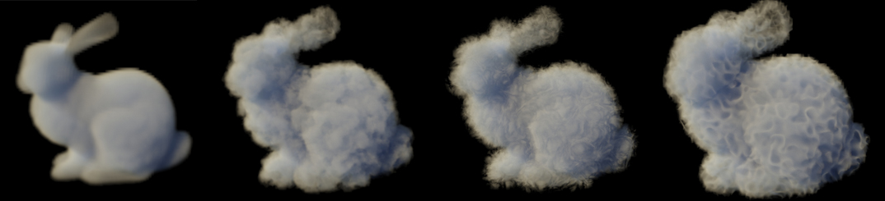

A bit of theory at first. If you know this stuff I recommend you to skip it and check the setup at the end of this post. Also if you find any mistakes or you know about better ways how to do it please let me know and I will correct this post.

When we are displacing polygonal meshes we usually take vertex of geometry, generate a vector (direction) in which we want vertex to displace and move vertex by this vector. Vectors can be defined by a function, for example noise.

\[caption id="attachment\_204" align="alignnone" width="1152"\]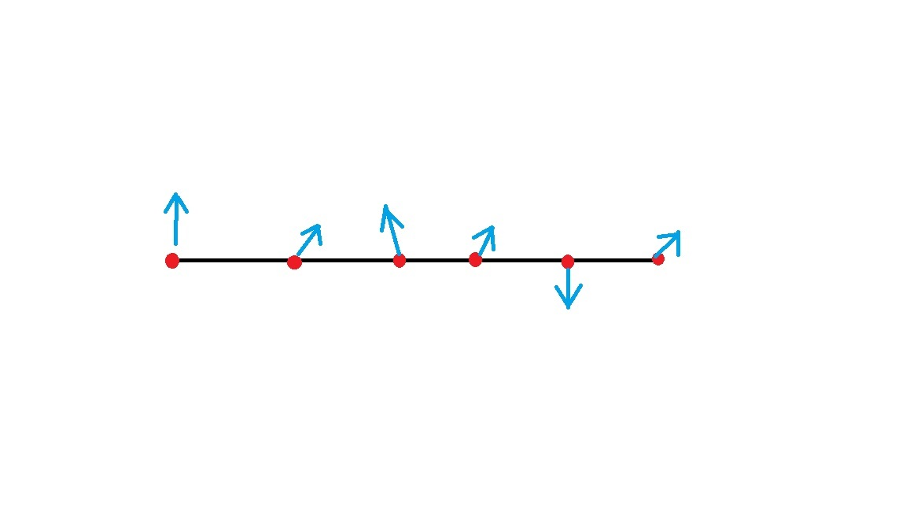 mesh with displacement vectors\[/caption\]

\[caption id="attachment\_205" align="alignnone" width="1152"\]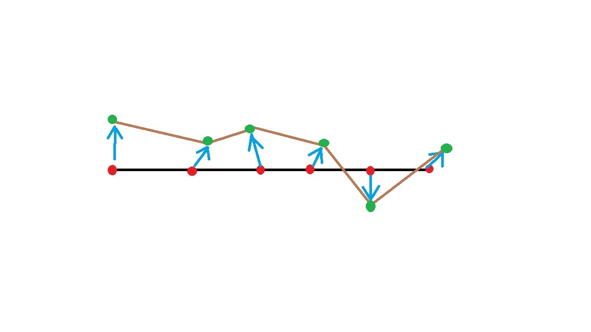 displaced mesh\[/caption\]

But when we are dealing with volumes it's a bit different. Volumetric data are represented by 3d grid. Every cell of this grid has assigned value (float - density, or vector - velocity or color for example) And the thing is, that we cannot move those voxels. Their position is fixed. But what we can do is to move their values. That process is called resampling. When we are resampling volumes we need to know sampling position. If we used original position and we resampled volume we would just duplicate it. But if we modify sampling position, we can move  its values (displace).

\[caption id="attachment\_223" align="alignnone" width="1152"\]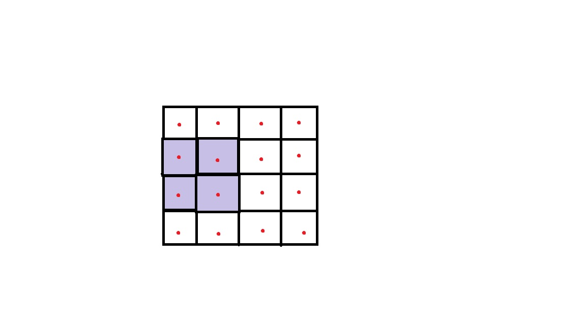 if every voxel samples it's own position then we are not modifying volume\[/caption\]

\[caption id="attachment\_222" align="alignnone" width="1152"\]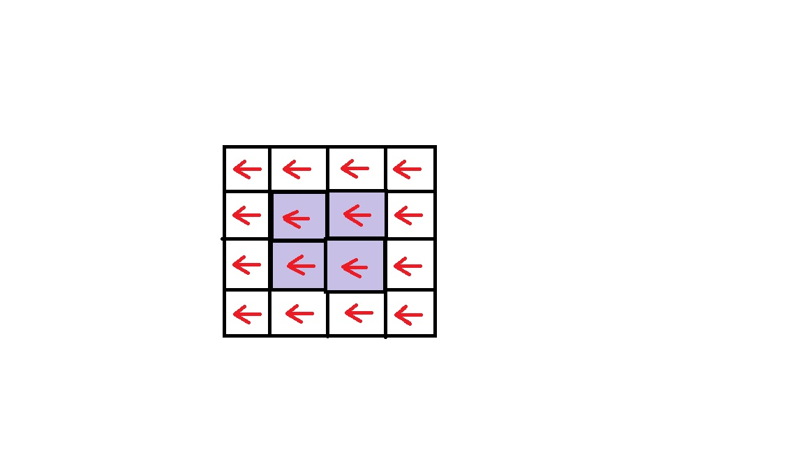 but if every voxel grabs value of it's left neigbor then we move values between voxels\[/caption\]

Notice that if we want to move data to the right we need to offset sampling positions in opposite direction.

Now that we know how to displace volumes we can move on. The only thing that we need to generate are sampling offset vectors. We can generate vector field that will contain those directions. But how can we do it? We can generate pure noise and it will work but results will not be that nice. So if we generate it cleverly we can replicate for example clouds.

One thing that we will need is to know "normal" direction of volume. But in volumes we cannot compute it the same way as for polygons. What we can use is to generate Signed Distance Field which is basically volume that tells us for each voxel how far it is from volume's "surface". What we can do is to use Houdini's functions to generate vector field that for each voxel it will compute direction to volume's surface (gradient of SDF). Then we need to normalize this field so that voxels near surface doesn't have small magnitude of vector.

\[caption id="attachment\_251" align="alignnone" width="1152"\]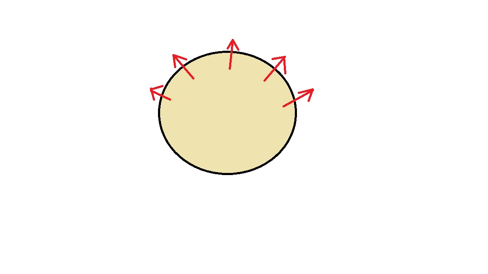 volume with vector field\[/caption\]

\[caption id="attachment\_252" align="alignnone" width="1152"\]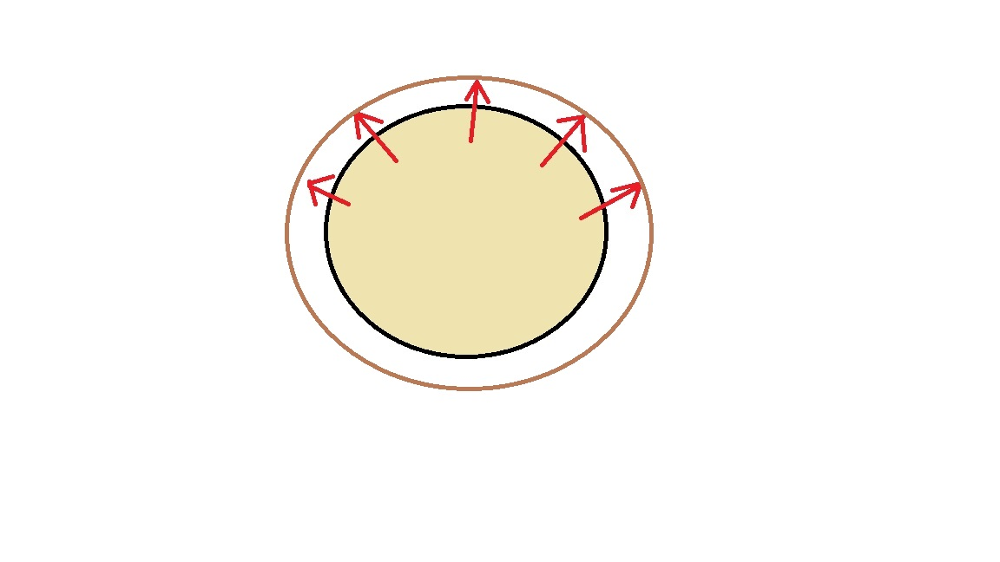 displaced volume (sampling direction is opposite as displacing direction - red arrows)\[/caption\]

But if we used only normalized vectors to displace volume we would just "inflate" it. What we can do is to make those red arrows length random.

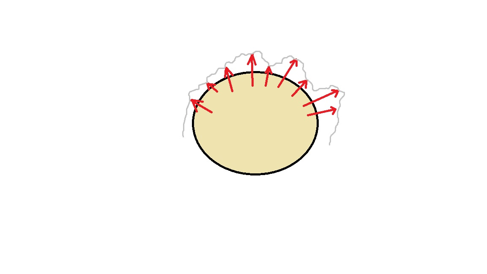

But not just random but we can compute absolute value of it and use power function to smooth "valleys". Or you can process noise function in your own way to create new looks :) Also type of noise function that is used will determine displaced volume's shape.

Now that we know all things needed we can create setup for it.

We can create the two needed volumes (shape and displacement direction) in Houdini. For this I will use OpenVDB tools which are fast and efficient.

\[caption id="attachment\_286" align="alignnone" width="897"\]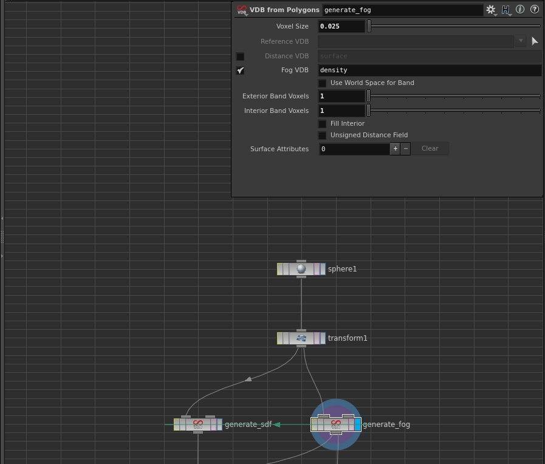 convert input geometry to two OpenVDB volumes - Fog and Distance (SDF)\[/caption\]

\[caption id="attachment\_285" align="alignnone" width="751"\]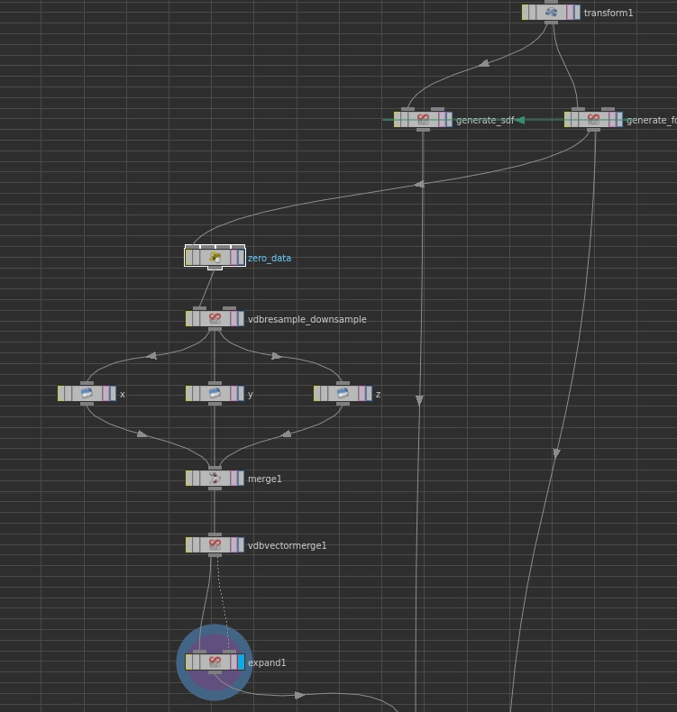 this part creates empty vector volume with same resolution as Fog volume\[/caption\]

\[caption id="attachment\_279" align="alignnone" width="513"\]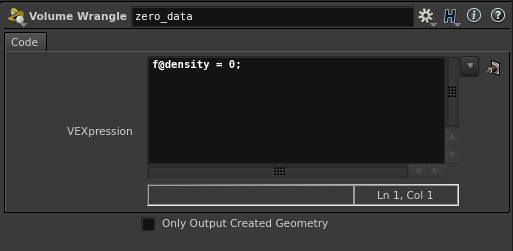 zero out values\[/caption\]

\[caption id="attachment\_284" align="alignnone" width="526"\]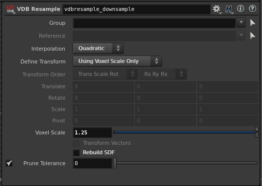 you can reduce volume's resolution\[/caption\]

\[caption id="attachment\_282" align="alignnone" width="530"\]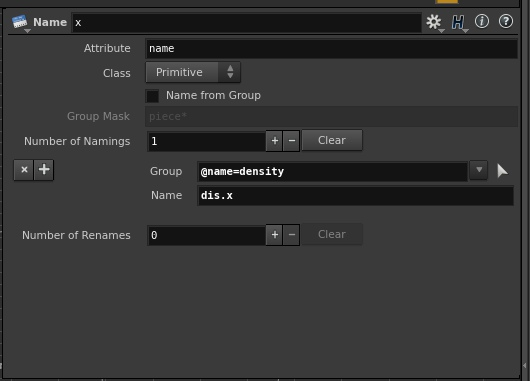 rename three branches to dis.x dis.y dis.z and merge them\[/caption\]

\[caption id="attachment\_280" align="alignnone" width="520"\]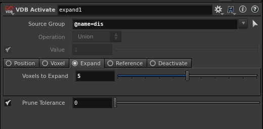 we need to expand edge values of volume so that we can displace it to them (OpenVDB volumes are sparse, areas without values are not used)\[/caption\]

\[caption id="attachment\_283" align="alignnone" width="846"\]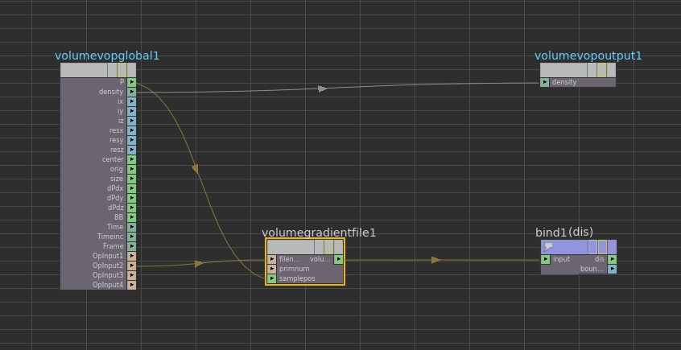 compute gradient from SDF and output result to dis vector volume\[/caption\]

\[caption id="attachment\_281" align="alignnone" width="551"\]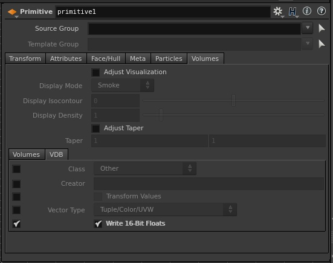 and finally convert it to 16-bit floats as this will reduce volume's size on disk (we don't need 32-bit precision which is default)\[/caption\]

Then export volume to disk, load it into _Arnold Volume_ object (shading is same in Houdini and Maya and other packages supporting Arnold as well). One thing you may ask is why we don't displace volumes in Houdini in _Volume VOP_ or use _Cloud Noise_ asset. We can do it but then final resolution of displaced volume would be limited by resolution of original volume. Great thing about noise is that it is continuous function in space and we can sample it's value in arbitrary location in space. Because of that if we sample noise function during rendertime, volumes will be voxel resolution independent (gridless displacement).

\[caption id="attachment\_340" align="alignnone" width="555"\]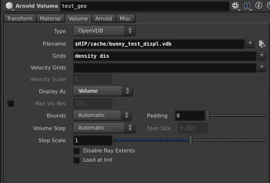 load volume with _Arnold Volume, also note that if you get clipping artifacts at volume boundaries you may need to increase_ _Padding_ parameter\[/caption\]

\[caption id="attachment\_313" align="alignnone" width="1374"\]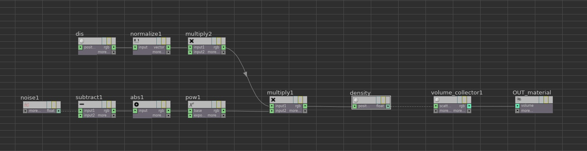 shading setup\[/caption\]

In this shading setup we are going to put things that I talked about before together.

\[caption id="attachment\_318" align="alignnone" width="480"\]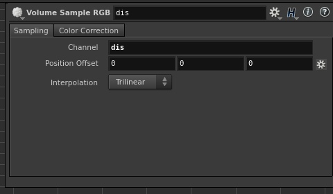 sample vector volume (dis), I recommend setting _Interpolation_ method to _Closest_ at first and if you see artifacts ("stairs" from voxels) then use _Trilinear_ which is a bit slower\[/caption\]

\[caption id="attachment\_320" align="alignnone" width="391"\]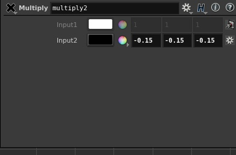 add multiply strength of displacement and reverse it\[/caption\]

\[caption id="attachment\_321" align="alignnone" width="403"\]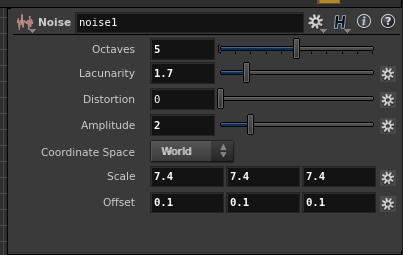 add noise\[/caption\]

\[caption id="attachment\_322" align="alignnone" width="397"\]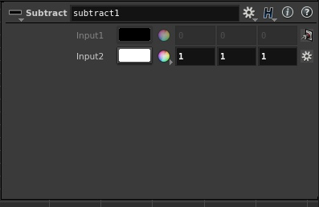 subtract 1 (noise with amplitude 1 is in range 0..1, with amplitude 2 is in range 0..2) after subtraction it is in range -1..1\[/caption\]

\[caption id="attachment\_323" align="alignnone" width="397"\]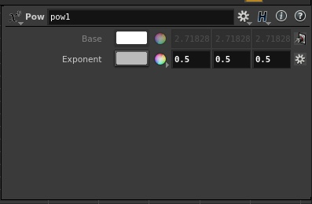 set exponent to your taste\[/caption\]

\[caption id="attachment\_319" align="alignnone" width="387"\]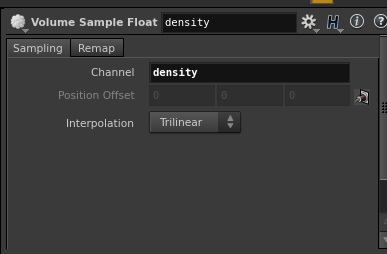 sample _density_ volume and offset position is set to output of previous nodes, you can check other interpolation methods: _Closest_ is fastest but produces different results and _Tricubic_ is much slower with similar result as _Trilinear_\[/caption\]

\[caption id="attachment\_324" align="alignnone" width="485"\]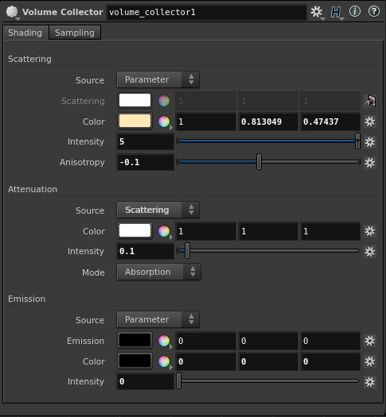 set appearance of volume\[/caption\]

And finally here are results. I also tried _alFlowNoise_ and _alGaborNoise_ which produced interesting looks. Those and more great shaders can be [downloaded here](http://anderslanglands.com/).

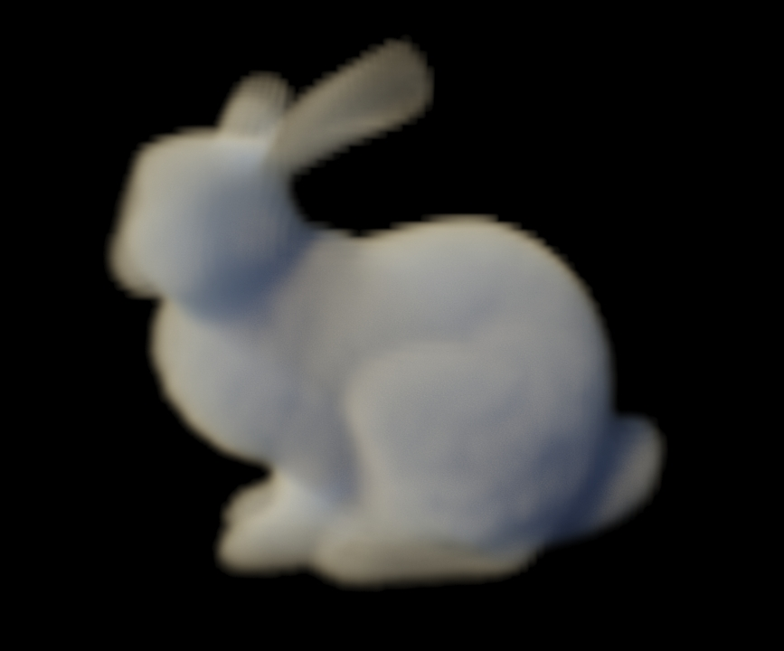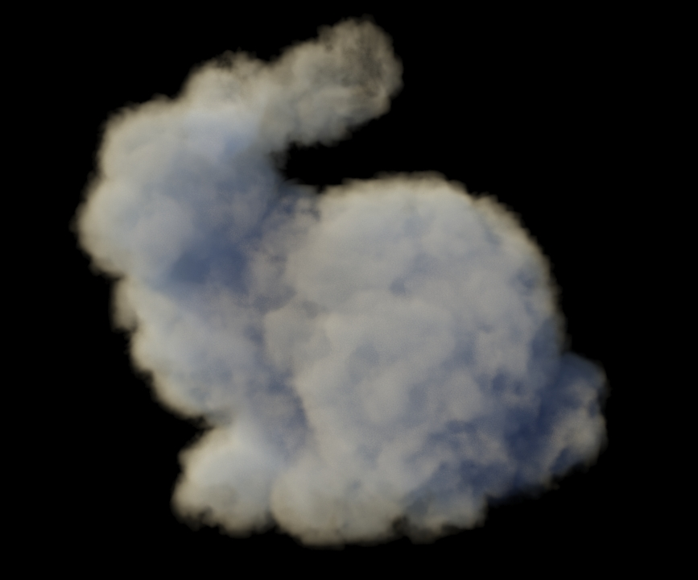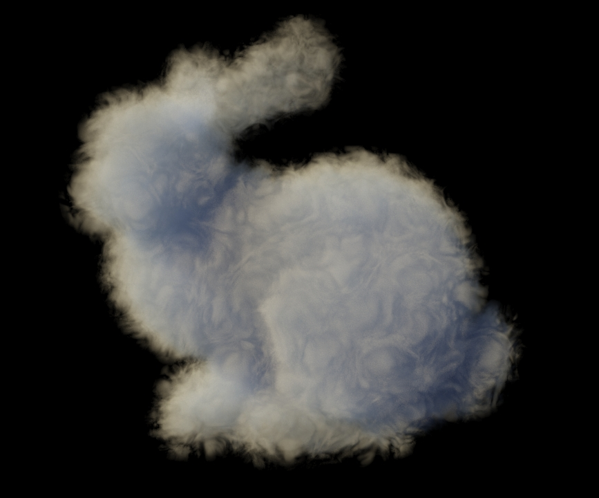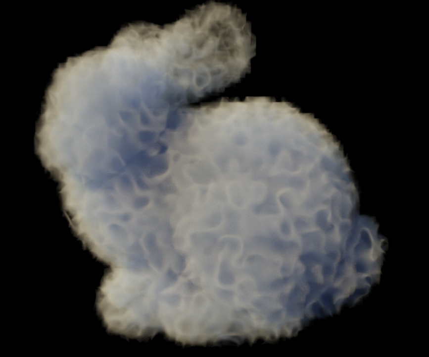
