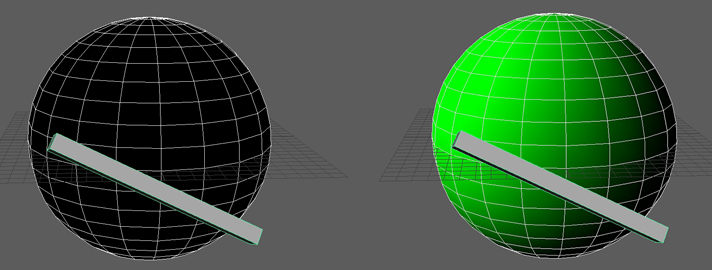
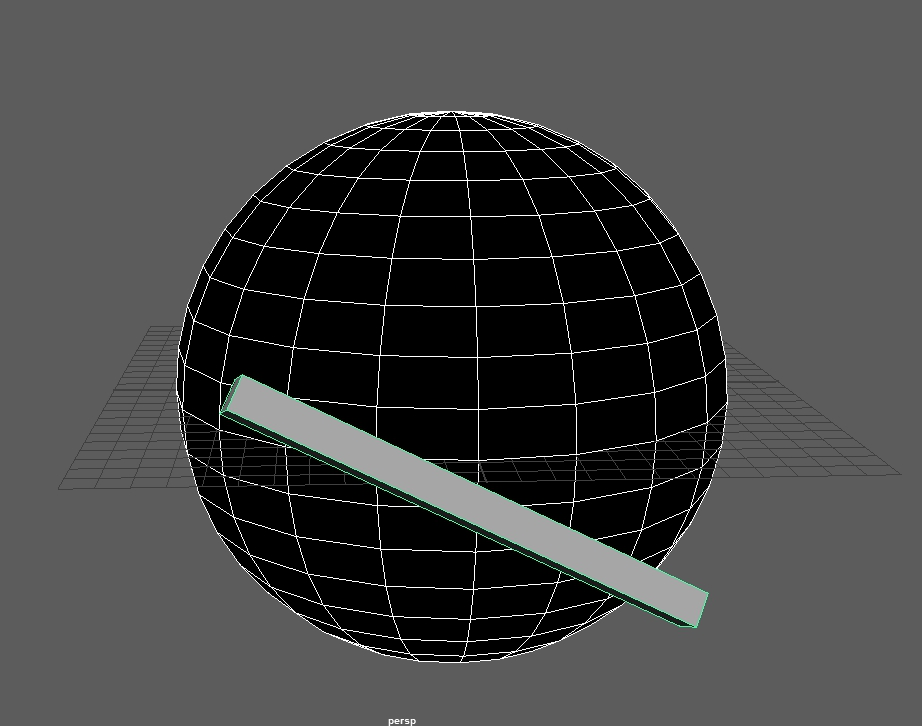
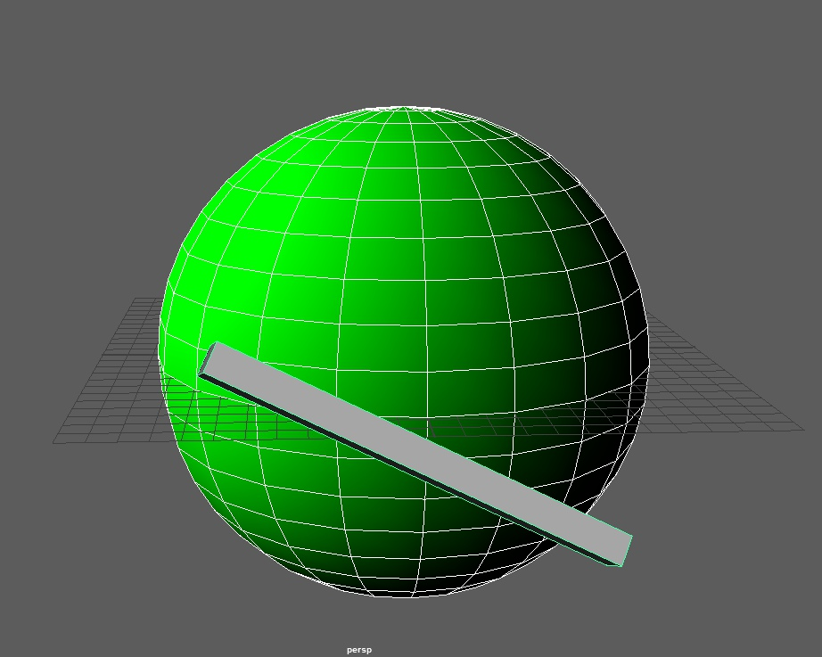

So I found myself in situation where I was asked to convert my setup from Houdini to Maya. In this post I will share simple MEL script that I managed to put together. It basically computes facing ratio of polygonal object to light and sets it as vertex colors.

I am a bit scared of Maya as often I have no idea how data is flowing in this software. But with included MEL script I managed to replicate simple VEX code from Houdini. However when iterating over many points it is much slower than same operation in VEX. On my first try on high res geometry it used all my memory while using only one cpu thread, froze Maya and then whole computer. So I guess this kind of operation isn't suitable for MEL. (possible solution - to perform this script on low res geometry and then transfer vertex colors to high res geometry) But I am not experienced Maya user so probably it isn't most efficient way of doing it. If you know how to do it better please let me know :)

Task is very simple - to compute dot product between vertex normal and light orientation vectors. Then value is clamped and assigned to vertex colors (green channel in this example). However it took some time to figure out how to do it in Maya. I then use this vertex colors as masks in shading.

Usage: at first save script in your project _scripts_ directory. Then select geometry you want to color and then select geometry (light) you want to compute facing ratio to.

Then type _jt\_facing;_ in your script editor, or in MEL command line, or add it to shelf and click on it :)

 

\[code language="php"\] global proc jt\_facing(){ // facing ratio to vertex color // selection order: geometry, light // by Juraj Tomori float $start = \`timerX\`; // start timer string $prevTool = \`currentCtx\`; // record current tool string $sel\[\] = \`ls -sl\`; // selection to array int $nvtx\[\] = \`polyEvaluate -v $sel\[0\]\`; // number of vertices float $xform\[\] = \`xform -q -m -ws $sel\[1\]\`; // xform mtx from light vector $light = <<0,0,1>>; // init light vector var $light = pointMatrixMult($light,$xform); // mult with xform mtx $light = unit($light); // mormalize for ($i = 0 ; $i < $nvtx\[0\] ; $i++) { // iterate over all vertices string $vtx = $sel\[0\] + ".vtx\[" + $i + "\]"; // current vertex float $N\_array\[\] = \`polyNormalPerVertex -q -normalXYZ $vtx\`; // return array of normals vector $N = <<$N\_array\[0\] , $N\_array\[1\] , $N\_array\[2\]>>; // save first normal to vector var float $factor = clamp(0,1,dot($N,$light)); // compute angle between N and light vector polyColorPerVertex -g $factor $vtx; // assign vertex color }

select -r $sel\[0\]; // select colored object string $pVtxTool = \`artAttrColorPerVertexToolScript 4\`; // initialize the paintVertex tool artAttrPaintVertexCtx -e -sao "smooth" $pVtxTool; // set it to smooth for ($i = 0 ; $i <= 6 ; $i++) { artAttrPaintVertexCtx -e -clear $pVtxTool; // smooth vertex colors }

select -r $sel; // restore selection setToolTo $prevTool; // restore tool float $end = \`timerX\`; // end timer print ("\\nnumber of processed vertices: " + $nvtx\[0\] + "\\ntime to execute: " + ($end - $start) + "sec"); // print stats } \[/code\]
