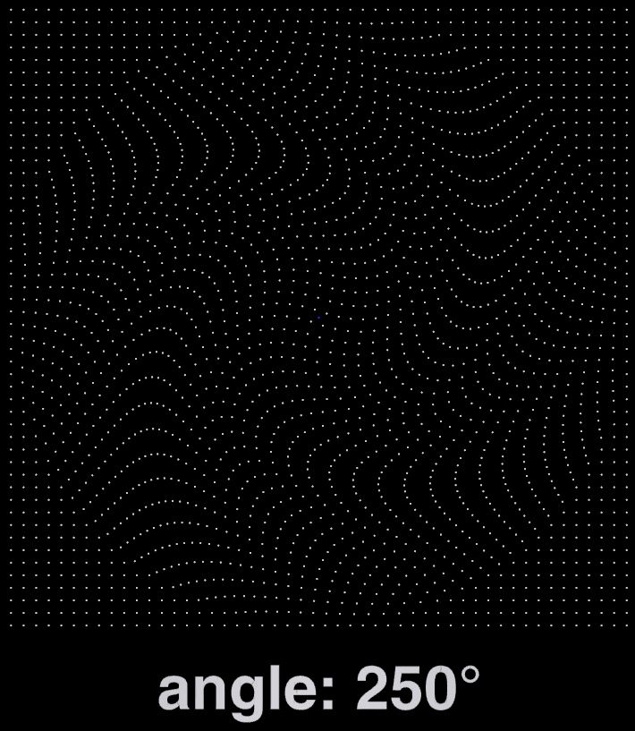
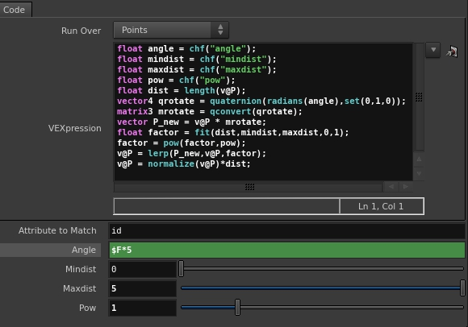
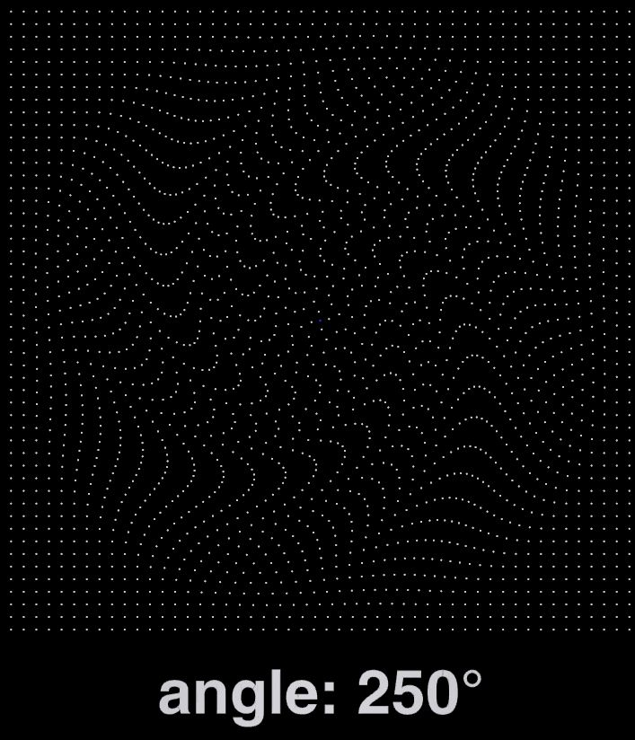
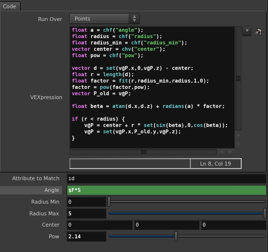
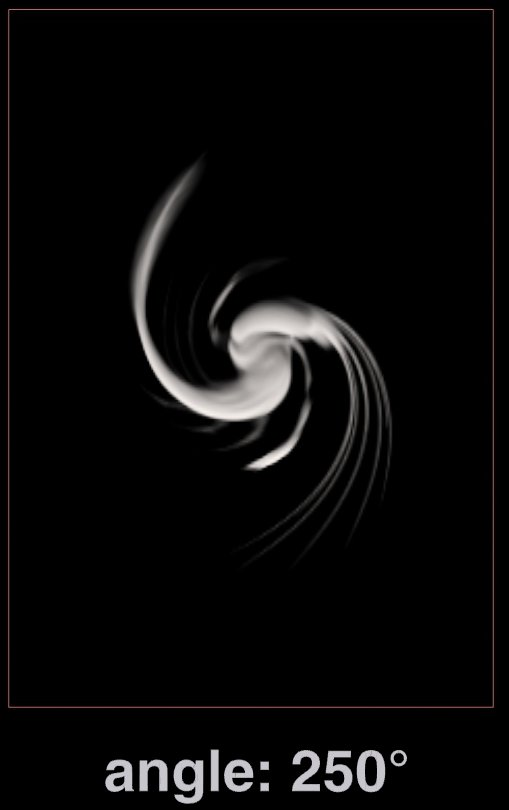

In this post I will describe how to create twirl deformer for geometry and volumes. I needed to create tornado-like motion and found it quite easy to do in Houdini. Here is my solution.

\[vimeo 146962400\]

My first idea was to create rotational matrix (3x3) which would be used to transform whole geometry and I would then blend between original and new position.

But in this soultion rotation is periodical (180°) so it isn't very useful. So after a bit of googling I found that operation that I need is in 2D called twirl. This can be easily extended to 3D as I am interested in deforming in two dimensions only. My another attempt looked like this.

And it worked quite well on geometry. So next step was to make it work on volumes as well.

This is just basic deformer that twirls volume by center of coordinate system and can be extended (control position of twirl...) It has two "modes" one is by specifying Angle and Frame End parameters to do animation, or just by setting animated Angle value and setting Frame End to 1. I also added scale option which will also "suck" or expand volume. If you want to deform multiple volumes (rest, Cd...) just replicate last line with coresponding volume name.

Also note that when deforming VDB volumes you have to first expand voxels, then perform deformation and then prune empty voxels.
