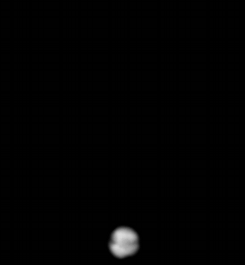
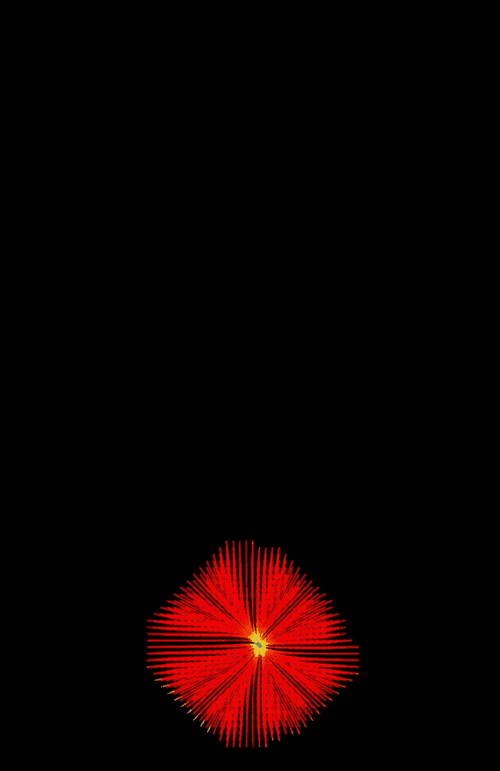
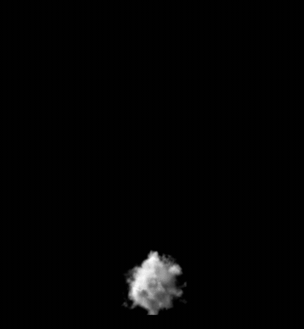
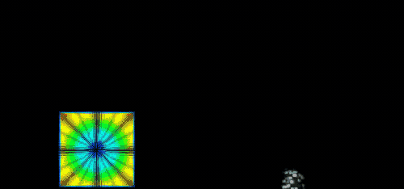
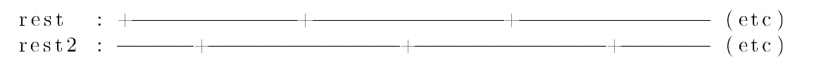
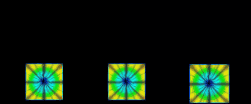
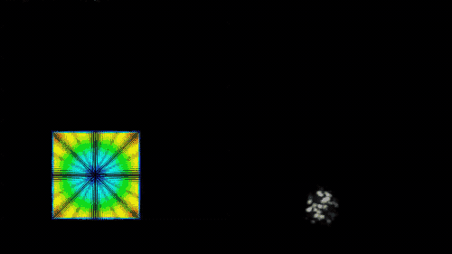
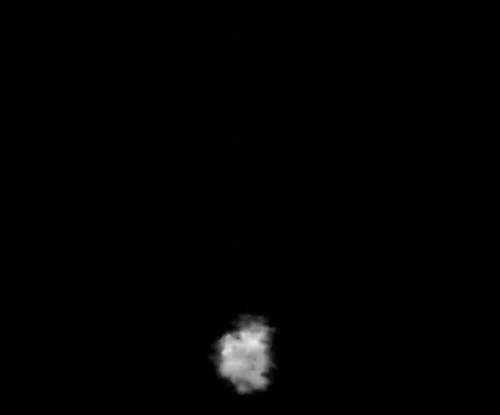
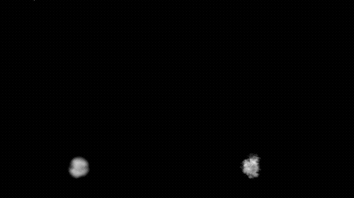

Hello everybody, in this post I will explain how I achieved rendertime displacement on moving volumes using Arnold. Project file is included (at the bottom of the post).

https://vimeo.com/183207847

This is continuation to previous post I published some time ago. So I will skip some things I explained there. You can check that post [here](https://jurajtomori.wordpress.com/2015/12/06/arnold-volume-displacement/). In this post I will not get very detailed about the setup. Rather I will try to discuss the general logic and workflow. You can find the exact way how to do it in attached file.

So at the end of the previous post I was able to displace a static volume (stanford bunny) at shader level. It enabled me to get "cloudy" look from arbitrary volume. Additionally the amount of detail is quite big and is not very dependent on input voxel grids resolution. The reason - noise displacement function is sampled at every render sample (world space), so details are not limited by voxel grid resolution.

But static volumes are rare in production scenes. I was asked to extend it and make it work with moving volumes and also to be able to control it with masking.

So here is my testing fluid simulation.

\[caption id="attachment\_787" align="alignnone" width="500"\] input low res sim\[/caption\]

Let's say that simulation is too heavy and renderfarm computers are unable to compute more details, because of time, or ram, whatever. So maybe there is a possibility to add a bit of details in shader, let's try it! :)

For any kind of displacement I think we always need direction and amount. Direction (normal) can be obtained from gradient of density field. VDB tools can quickly compute this. Then we need amount of displacement. It can be any arbitrary noise function. I chose one equipped with alShaders, which gave me satisfying look.

\[caption id="attachment\_media-4" align="alignnone" width="500"\] visualization of gradient field\[/caption\]

But noise function in this case is sampled in world position. So noise pattern looks ok, but it is static. It is not aware of fluid simulation motion.

\[caption id="attachment\_792" align="alignnone" width="500"\] density displaced by gradient and noise sampled at world space\[/caption\]

To solve that we would need some information describing motion of fluid. Luckily there is option in Houdini's pyro solver for rest fields. Rest fields are coordinate systems (vector voxel grids containing world position) which get deformed / warped (advected by velocity) by motion of fluid sim. Sounds really cool - we are warping space!

That way coordinate space is following motion of the fluid. Therefore if we sample our favorite noise function at this warped space, displacement features will follow motion of fluid.

This sounds nice and is really useful. But the thing is, that if we have a lot of motion in our fancy fluid simulation, coordinate space can get really distorted, stretched, warped. Because of limited voxel grid resolution and imperfect advection it will start looking messy after some time. This can be faked however. For example we can reset this coordinate space every X frames, for example 50. For 50 frames it will follow the motion of fluid and then it will reset to new world position and will get advected again. Again, and again...

But this will result in popping noise pattern, because on frames 50 and 51, we are sampling noise at completly different position.

\[caption id="attachment\_796" align="alignnone" width="500"\] _rest_ field visualization and testing grid pattern, notice popping (it is not visible much on this lowrez gif, make sure to check [vimeo video](https://vimeo.com/183207847))\[/caption\]

To solve this issue, we can fake even more - we can create two coordinate spaces, which will get advected for the same amount of time and they will be reset. However we can offset their phases by half of their "lifetime", or time they are reseting after. During sampling we can do simple blending (lerping) of those rest fields in this fashion - when rest1 field is being reset, sample only from rest2 field. If rest2 field is being reset, sample noise from rest1 field. It is illustrated on following graphic which I stole from great [Peter Claes' thesis](https://nccastaff.bournemouth.ac.uk/jmacey/MastersProjects/MSc09/Claes/thesis/PeterClaesThesis.pdf).

\[caption id="attachment\_797" align="alignnone" width="500"\] _rest1_, _rest2_ and _dualrest_ derived from them\[/caption\]

This rest fields technique can be also used on texturing liquids. The principle is the same - advecting UV coordinates and blending between the two of them. [Here](http://www.toadstorm.com/blog/?p=312) is awesome post explaining the process.

Using rest fields in Houdini is simple, just check _Add Rest Field_ in your _Smoke Object_. You have there option to downsample your rest field (_Rest Division Scale_) to save disk space and for a bit better performance.

Then in _Pyro Solver / Advanced / Rest Field_ tick _Enable Rest_ and _Dual Rest Fields_ checkboxes. There are following parameters: _Frames Between Solve_ - the time after which rest fields will be reset. I had the best results with using even numbers. _Frame Offset_ - I kept that on 1, it might be useful for pre-rolled simulations but I did not need to alter this. _Rest Advection Rate_ - this is multiplier used in advection stage. Smaller number will make the rest space follow fluid slower, number 1 will make it to match 1:1. I found that this number should be set depending on the scale of your sim. I needed this number much higher for high scale smokes. For this example smoke value 1 worked fine.

\[caption id="attachment\_799" align="alignnone" width="500"\] _dualrest_ field visualization and testing grid pattern\[/caption\]

Now we have everything we need - continous warped space following fluid's motion and normal direction. In Mantra render engine this would work immediately, but for Arnold we need to prepare couple of things.

I compute _dualrest_ field in SOPs, which is being exported into VDBs (I recommend using 16bit, which saves a lot of HDD space and network I/O) alongside _density_ and _grad_ fields. I also recommend to filter _grad_ (normal direction) field a bit - a bit of expansion and smoothing. It is also possible to create a _mask_ (float volume) which can be added into shading network as multiplier (for masking displacement). You can generate this _mask_ from polygons, or you can derive it from density, velocity, it's up to you. Alternatively you can blend displaced and original volumes in compositing. It depends on your needs.

Check attached file for shader and computation of _dualrest_, _grad_ fields. You will need to have Arnold installed on your computer and [alshaders](http://www.anderslanglands.com/alshaders/index.html) library to open my scene.

And here is the result :) If you dislike appearing of those bumps on leading edge of fluid simulation, you can generate a mask based on density and velocity length and direction.

\[caption id="attachment\_media-14" align="alignnone" width="500"\] result - displacement is sampled at _dualrest_ space\[/caption\]

\[caption id="attachment\_media-16" align="alignnone" width="500"\] and a comparison - I accidentaly changed camera a bit so there is slight offset :)\[/caption\]

When everything is set and working in Houdini, the whole setup can be transferred to any DCC package supporting Arnold. I tested it with Maya and it worked well. Just make sure to have the same version of Arnold and alshaders in Houdini and Maya :). More info on transferring it [here](https://support.solidangle.com/display/AFHUG/Sharing+.ass+Files+Between+Plugins).

I would like to thank Platige Image for giving me help and space for developing this one :)

If you noticed any mistakes or you know any improvements, please let me know.

And the promised scene file is [here](https://goo.gl/9o9BlU).
