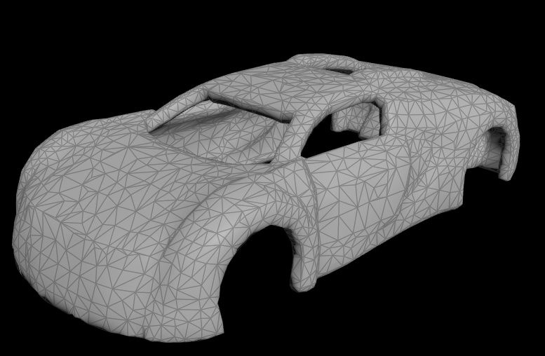
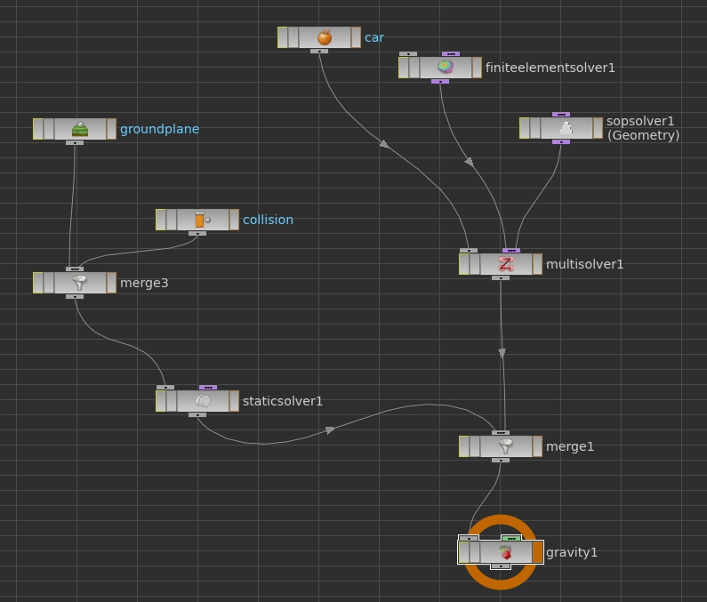

In this post I will show how I achieved plastic deformations with Houdini's FEM solver. Here is video with results.

https://vimeo.com/152023601

 

At first I recommend watching [masterclass about FEM](https://vimeo.com/86125312) and checking example files they provided. Also I'd like to thank guys on [odforce forum](http://forums.odforce.net/topic/24208-h15-cloth-plastic-deformation/) who suggested these ideas. If you found some mistakes or know better way please let me know and I will update this post :)

Fem solver supports two ways of controlling tets shape. Throught target and rest geometry. When target geometry is specified solver computes force which is assigned to tets to match their position with target position. When rest geometry is specified it tells what shape tets should return to when they are deformed. If you stretch a tetrahedron it will try to regain it's original shape. But when tetrahedron is stretched we can tell fem solver that this is his new rest shape and it can stay as it is. To determine when tetrahedron changed it's shape we can for example compare tets current volume with volume from previous simulation step. Information about current tets volume is present in primitive inrinsics, along with area and perimeter. Then we just blend vertex restP attribute with its current position based on amount of volume change.

So choose a model you would like to deform. Nice thing is that it isn't necessary to have clean topology. It is thanks to embedding workflow where simulated is tetrahedralized representation of geometry. Original geometry is then deformed by simulated tets. Conversion to tets is done with **Solid Embed** node which internally converts input geo to SDF and then back to polygons which will assure that geometry is waterproof.

\[caption id="attachment\_496" align="alignnone" width="777"\] Original geometry and it's tetrahedrons representation\[/caption\]

It is also recommended not to simulate thin tets. So dive into **Solid Embed** asset and icrease offset value in **Peak** node.

Then create basic FEM setup with shelf tools. Create **SOP Solver** and attach it with **FEM Solver** into **Multi Solver**.

\[caption id="attachment\_509" align="alignnone" width="795"\] DOP node network\[/caption\]

Inside **SOP Solver** create **Object Merge** which will fetch the same tets. It is only for initializing restP attribute.

Then create **Attribute Wrangle** in which we will blend P and restP attributes. On **Attribute Wrangle** create necessary parameters like Volume change multiplier (float) and Continous (int, 0-1). Continous parameter is basically swithcer which chooses two ways of comparing volume values. It set to 1, old volume's value is averaged over two simulation steps which has smoother results. Play with both options and choose whichever suits you more :)

\[code\] int vtxprim = vertexprim(0,@vtxnum); // prim num of current vtx float init\_vol = primintrinsic(1,"measuredvolume",vtxprim); // volume of init state float my\_vol = primintrinsic(0,"measuredvolume",vtxprim); // current volume

if (chi("continous")) f@my\_vol\_old = (f@my\_vol\_old + f@my\_vol) / 2; // assign averaged vel from prev frame else f@my\_vol\_old = f@my\_vol; float old\_vol = f@my\_vol\_old; // store in local var f@my\_vol = my\_vol; // assign current vel

float vol\_change = my\_vol / old\_vol; // compute ratio vol\_change = abs(1 - vol\_change); // compute abs difference vol\_change \*= chf("vol\_change\_mult"); // scale vol\_change = clamp(vol\_change,0,1); // clamp

if(@Frame < 3) v@restP = vertex(1,"P",@vtxnum); // take restP from init state

else v@restP = lerp(v@restP,v@P,vol\_change); // mix restP with P by change in volume

//v@Cd = set(vol\_change,0,0); f@vol\_change = vol\_change; //f@init\_vol = init\_vol; \[/code\]

 

\[caption id="attachment\_517" align="alignnone" width="738"\] Nodes inside **SOP Solver**\[/caption\]
