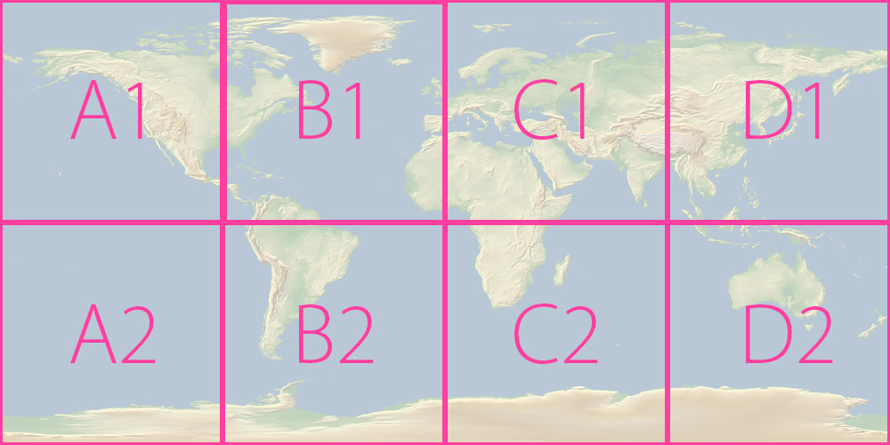
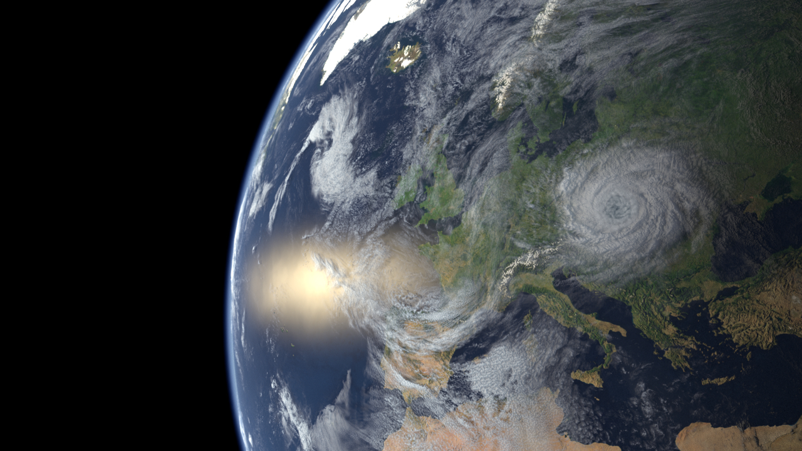

Before Christmas I was working on a shot of Earth from space. In this shot camera was dollying far from Earth to it's surface. So it was apparent from start that I will need quite high resolution textures. In this post I will show one possible way of memory efficent merging of huge textures.

\[caption id="attachment\_394" align="alignnone" width="1000"\] layout of textures\[/caption\]

Fortunately NASA offers quite high resolution textures to [download for free](http://visibleearth.nasa.gov/view_cat.php?categoryID=1484).  On their site you can select a month when photos were taken and download 8 JPG tiles 21k each. You can download aslo PNGs with same resolution but JPG's lossy compression is practical at this resolution (200 MB vs 15 MB).

So I wondered how to merge them all and possibly without using Photoshop (to save memory).

One possible solution is to use package [ImageMagick](http://www.imagemagick.org/). They offer set of great image processing tools and I find myself using them quite often (e.g. batch resize/conversion of images). So go to download page and there you will find two versions: Q8 and Q16. Number after Q means what bit depth this package uses to process images. The great thing about Q8 version is that it uses half of memory of Q16. And because we are processing 8 bit JPGs we don't need 16 bit precision.

When installed you need to execute program convert.exe over NASA textures. Because I am used to Linux environment I am using Cygwin. So navigate into directory with textures (I renamed them to A1.jpg, A2.jpg ...) and execute those commands:

\[code language="bash"\]convert A1.jpg A2.jpg -append A1A2.jpg convert B1.jpg B2.jpg -append B1B2.jpg convert C1.jpg C2.jpg -append C1C2.jpg convert D1.jpg D2.jpg -append D1D2.jpg convert A1A2.jpg B1B2.jpg C1C2.jpg D1D2.jpg +append earth.jpg \[/code\]

Those commands will merge tiles in vertical direction and then merge all vertical tiles horizontally. At least in theory. Limitation I encountered is that JPG format supports up to 65,535×65,535 pixels resoltion. Another way would be to use another format like TIF or TGA, but later I planned to mipmap my texture using maketx and that process is quite memory demanding and it wouldn't fit into my memory. So I ended up with using two tiles: A1A2B1B2.jpg and C1C2D1D2.jpg (created with similar commands). Later I set up two UV tiles to sphere and merged textures in shading.

In shading I also used following textures available from NASA: specular mask, clouds mask, land and ocean displacement. I also overlayed earth geometry with VDB volume to create atmosphere.

\[caption id="attachment\_457" align="alignnone" width="1280"\] final result\[/caption\]

<!-- Markdeep: -->

