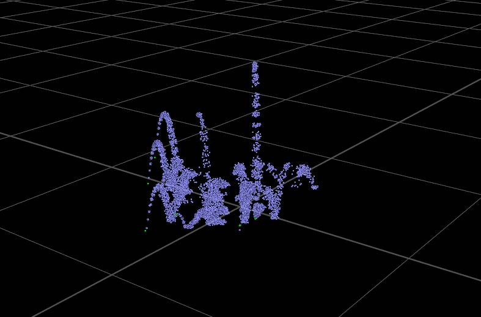
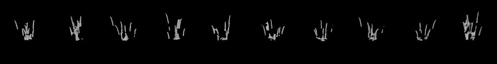
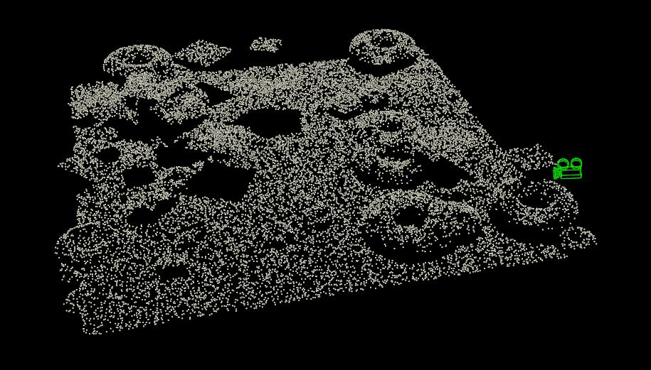
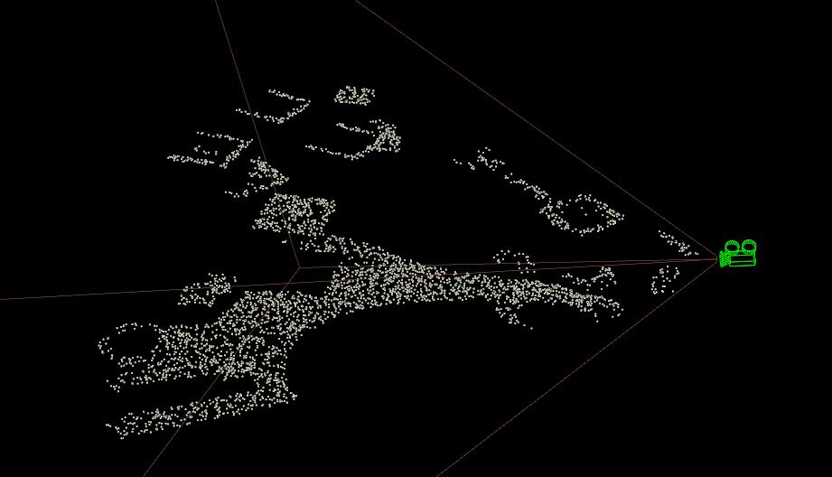
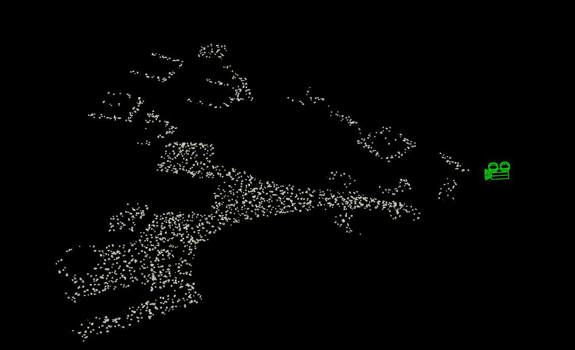
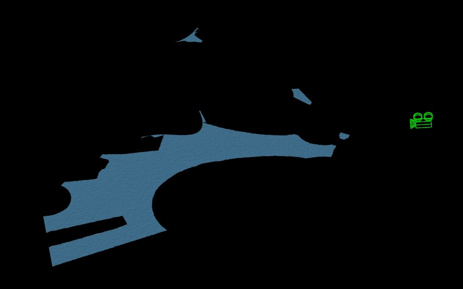

In this post I will show and explain how I created rain effects. Project file is included (at the bottom of the post).

https://vimeo.com/182284605

So I was given a task - to create a rainy environment. It should include rain splashes and rain ripples. The rest of the rainy environment (leaks, drops) was covered in shading by other guys. I also did flying rain (in air) but it is just simple particle system with particles falling down and rendering it with motion blur.

**Splashes**

I knew from the beginning that I will have to use some sort of instancing to produce that effect. The reason is simple - in scene there are thousands of those tiny rain splashes which are quite similar, there is only small variation between them. General motion and timing is almost the same. So I decided to automatically generate library of arbitrary number of rain splashes and to instantiate this library items randomly on environment geometry. To further break uniformity I am randomizing scale and rotation along normal vector of background (rotation along "up").

Generating one splash library item is simple - it is just couple particles emitted upwards and they are spawning another particles for creating trails. After that I am converting particles to VDB and I filter volumes a bit for more natural shape. At the end I convert VDBs back to polygons, reduce polygons amount and transfer velocity from particles (for motion blur).

\[caption id="attachment\_663" align="alignnone" width="787"\] simple splash - one frame of one library item\[/caption\]

After that I am using very simple Python script to automate rendering of this animation to disk and changing seed values for slightly different motion.

Automating this generation with Python is convenient thing to do - if I want to change overall look of splashes I just press one button and the whole library is updated.

\[caption id="attachment\_665" align="alignnone" width="1013"\] splashes library items\[/caption\]

So now I have whole library at hand, what can I do with it?

I decided to create a very simple particle system - just accumulating projected particles (from up) on surface, counting their _age_ and when they are "old enough" blasting them. I also keep track of particle _id_ attribute.

Later I will use their _age_ attribute for determining frame number of library item.

\[caption id="attachment\_667" align="alignnone" width="915"\] simple particle system\[/caption\]

There are several ways of instantiating splashes. It can be done on rendertime with instancing feature using _instancepath_ attribute. But for this demo I chose to use packed disk primitives and to alter path they are pointing to. Another cool feature of those packed primitives is that I can set level of detail in viewport - full geometry / bounding boxes / point cloud / centroid point.

However before instancing I try to optimize the scene as much as possible. In this demo camera is static so I can use occlusion and frustum culling - not generating particles which are not in field of view, or which are occluded by environment. I also add slight offset to preserve splashes that are close to the "being visible treshold". There are two ways of doing it - one with volumes and the second only with particles and environemt geometry. The volume way should be faster in some cases - it doesn't get much slower if increasing amount of processed points (occlusion and frustrum culling calculation is made only once). I am showing both ways in attached project file.

\[caption id="attachment\_670" align="alignnone" width="921"\] frustum and occlusion culling\[/caption\]

So at first I copy just empty packed disk primitive along those particles. Then in VEX I alter _unexpandedfilename_ primitive intrinsic which is pointing to file on the disk. For determining library item I use random function of the _id_ attribute (not _ptnum_ as point numbers are changing) multyplied by number of library items. For frame I use _age_ attribute. Beforehand I also prepared _orient_ and _pscale_ attributes for additional variation.

\[caption id="attachment\_672" align="alignnone" width="948"\] final splashes displayed as bounding boxes\[/caption\]

And that's it :) This system is very efficient also in viewport. I do not recommend to bake this down to actual geometry, it will be huge. To learn more about packed disked primitives in Houdini I recommend reading their [documentation](https://www.sidefx.com/docs/houdini/model/packed).

**Ripples**

I was always keen on trying doing this. So I gladly took my chance to do it! :)

There is also another way of possible solution - using Houdini's Ripple solver. It produces really cool results. However I concluded it unnecessary for this case - there are tons of small ripples which are getting lost in general splashy motion. It is also quite slow and requires nice topology, otherwise it will produce funky results, or will require more substeps.

So I decided to create fakey VEX solution - displacing water geometry based on sine of distance to rain particles. I am driving sine phase by age attribute and adjusting it's frequency and amplitude based on distance from rain particle. Check VEX code in attached file for more details.

I also frustum and occlusion culled ripples geometry to save computational time.

\[caption id="attachment\_673" align="alignnone" width="922"\] frustum and occlusion ripples geometry\[/caption\]

This VEX solution proved to be really fast and art-directable.

And that's it :) If you have any suggestions on how to improve this workflow or you have found mistakes / illogical decisions, please let me know. I will gladly update this.

I developed this effect during my stay at Platige Image. There are really cool guys and I thank them for giving me help and space to develop this effect!

[Download scene file.](https://drive.google.com/open?id=0B0hpa2flKntobWE4ZTlsR1Nsd28)
