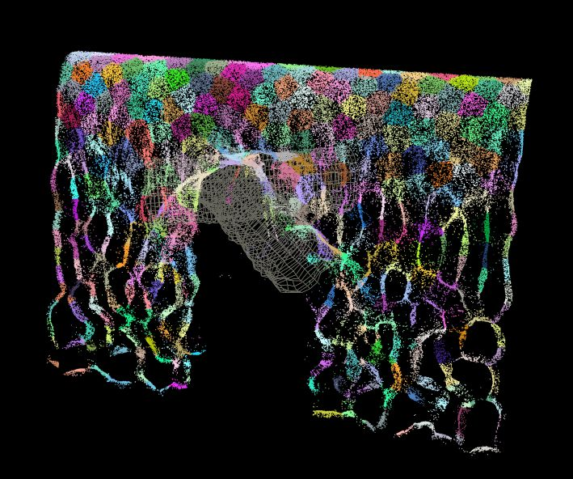
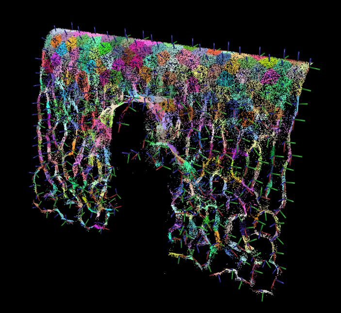

In this post I will try to explain principles behind implementation of the research paper [Shaping particle simulations with interaction forces](http://dl.acm.org/citation.cfm?id=2614121) published by DreamWorks in 2014. This technique allows us to create forces on particles which can result in variety of interesting motions, one of them resembling water behavior. This approach is more efficient than complex liquid simulations since it does not include volumetric operations (as in FLIP solvers for example) and is also easy to control and to combine with any other particle forces. I did this implementation in Houdini and VEX, but principles apply to any other software.

 

https://vimeo.com/219538251

I assume that you have read the paper and have working knowledge of Houdini. This is not a step-by-step tutorial, rather an overview about how to approach implementation of the paper.

If I understood the idea behind the paper correctly, then the implementation can be broken into the following steps.

## Step 1

Find LDNP centers, that are evenly distributed along simulated particles. Amount of those centers will determine scale of visual features that the forces will create.

In the paper they are proposing to use k-means clustering which will accurately find positions for those centers, this algorithm is however iterative. In my experience that it was rather slow and I did not find it suitable for this case, as it took biggest portion of the calculation time. Therefore I used _Fuse SOP_ which can merge particles which are closer then specified radius. This way provided me with quite good centers distribution (with _use accurate distance_ parameter enabled).

\[caption id="attachment\_837" align="alignnone" width="709"\] Particles are colored based on LDNP they belong to.\[/caption\]

## Step 2

For each LDNP center: take all particles that belong to its influence and compute local coordinate system. This task is interesting, since it might not be intuitive how to figure out coordinate system which best matches particles spatial distribution.

Luckily statistics can help us. Or to be more specific - principal component analysis (PCA). This technique is used to reduce dimensionality of data enabling us to more accurately read and evaluate them. There are loads of youtube videos explaining the concept and I found in particular those articles helpful: [1,](https://hewjunwei.wordpress.com/2013/01/26/obb-generation-via-principal-component-analysis/) [2,](http://setosa.io/ev/principal-component-analysis/) [3.](https://georgemdallas.wordpress.com/2013/10/30/principal-component-analysis-4-dummies-eigenvectors-eigenvalues-and-dimension-reduction/)

This task requires us to compute a covariance matrix on the set of points. This matrix will contain variance and covariance between world coordinates of the points. Once we have covariance matrix, we need to find its eigenvalues and corresponding eigenvectors. Eigenvalues are in our case telling us, which axis corresponding eigenvector represents. Those 3 eigenvectors (orthogonal) can define a local coordinate system of the particles. This information is really useful, for example one could compute an oriented bounding box, which might be helpful for collision detection, raytracing acceleration structures...

 

 

https://vimeo.com/200562524

In Houdini you can take advantage of NumPy Python package which is shipped with Houdini. It offers handy functions as: _numpy.cov()_, _numpy.linalg.eig()_. In my case however I took a full VEX approach, where I calculated a covariance matrix and its eigenvalues and eigenvectors myself. My first approach was to port a C++ module by [Connelly Barnes](http://barnesc.blogspot.de/2007/02/eigenvectors-of-3x3-symmetric-matrix.html) , which worked well and gave me the exact results as the Python way. However when I looked more into properties of covariance matrices I found out that those axes which we need can be found more easily. It can be done so by taking any vector and iteratively multiplying it with the covariance matrix and normalizing it afterwards. I did so until vector doesn't change its orientation and I do the same with inverted covariance matrix. The resulting vectors represent two axes of the local coordinate system and finding the third one is just a matter of calculating vector product between them.

Because of the way we calculated axes for LDNPs, they always randomly oriented (flipped). But feel free to orient them based on your own conditions (like world axes / user specified axes / axes defined by hand painted curves...)

\[caption id="attachment\_836" align="alignnone" width="703"\] Visualization of LDNP axes\[/caption\]

Now, when we have the three axes representing the spatial distribution of the particles, we can move to the next step.

## Step 3

In this step we want to calculate forces based on the axes. In the paper they described 10 of those forces: the first three forces push or pull particles along the respective axes, next three forces attract particles to them, next three cause particles to rotate around them and the last force attracts particles to the center of the LDNP. In Houdini is this task straightforward, it is a matter of summing vectors, calculating scalar and vector products. One more addition which offered me a bit more control is to scale the force influence based on the relative distance to the LDNP center, that way I can target forces to the center/border areas of LDNPs.

I found this approach very cool and fast to compute. It is definitely nice to have it in my toolset :) As the forces are calculated per-particle, with VEX this setup can easily take advantage of multi-threading.

Hope you will find this article helpful, if you find any mistakes, or have ideas for improvements, feel free to let me know.

I would like to thank [Macha](https://vimeo.com/user2308558) and [Petz](http://forums.odforce.net/profile/2942-petz/) for sharing their knowledge on odforce forums, they inspired me and helped me to do this stuff :)

[project file](http://forums.odforce.net/topic/27536-jurajs-playground/?do=findComment&comment=176233)
