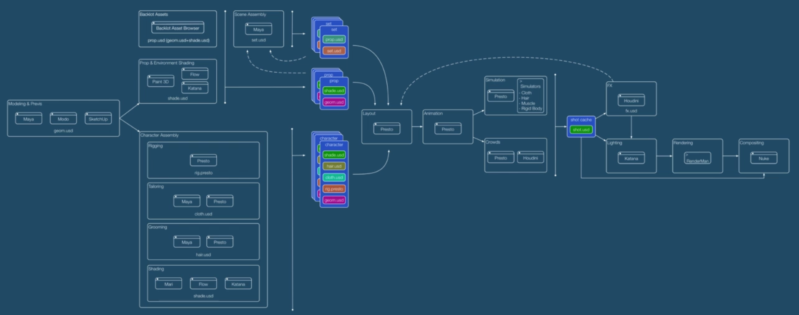
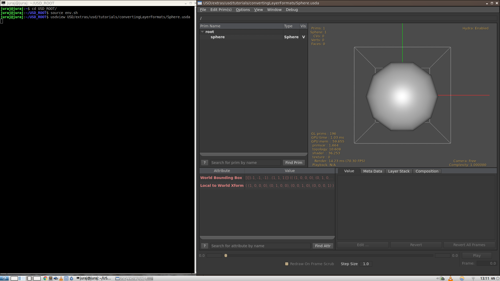
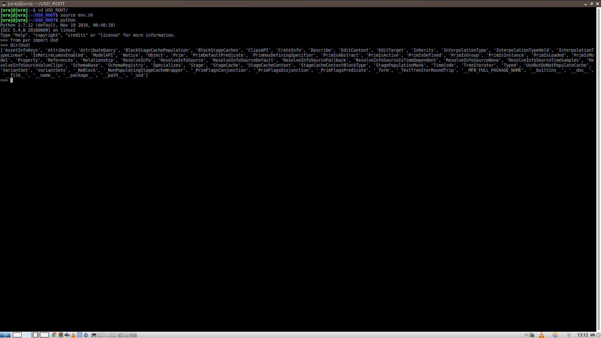
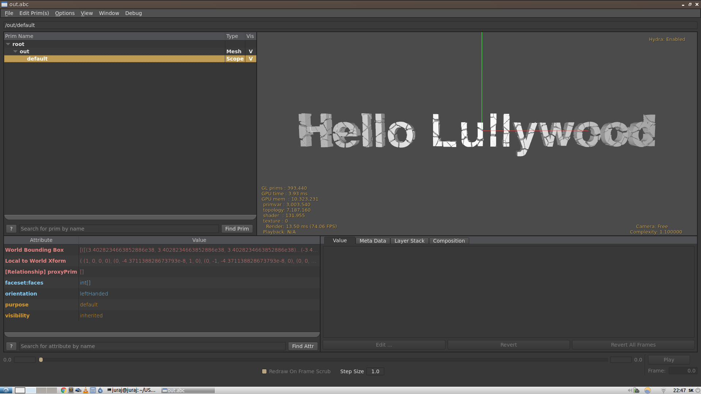
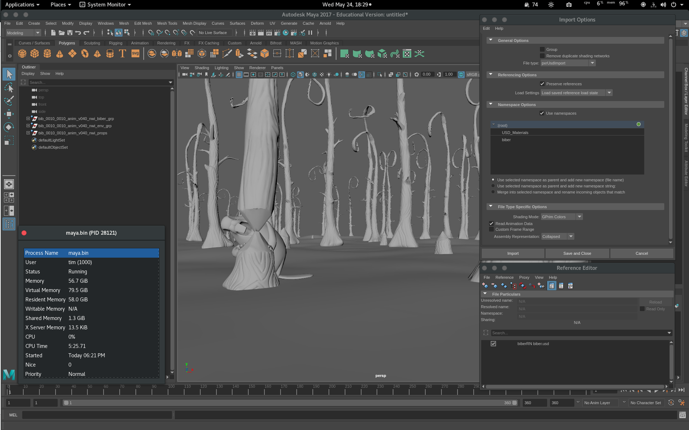
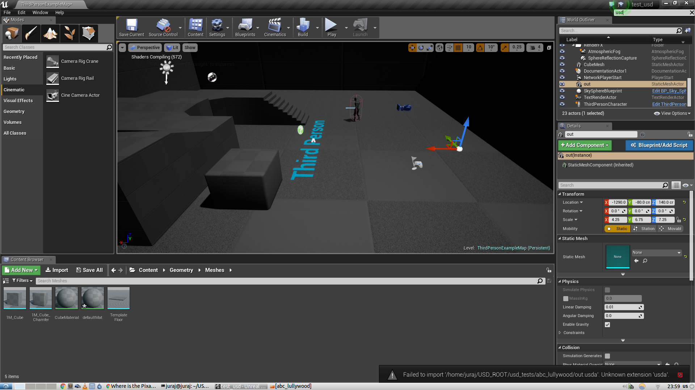

In this post I will publish summary of setting up and fiddling a bit with Universal Scene Description (USD) on Linux. It will mostly contain my understanding of the concepts behind USD and a compilation guide for Ubuntu based OS.

Originally I wrote this article for an assignment during my Technical Directing studies at Filmakademie Baden-Wuertemmberg. Parts regarding compiling Maya plugin for USD were written by Tim Lehr.

"USD is a unified system for representing both primitives and aggregate assets to enable concurrent CG workflows."

**Main features**

- set of C++ libraries and Python bindings
- USD data is stored in a size-efficient binary (usdc) or human-readable ASCII (usda) format, USD supports reading and writing alembics, and is extendible to support any other format
    - quick comparison of file sizes in different formats - Alembic: 3.8 MiB, usda: 8.2 MiB, usdc: 3.8 MiB, obj: 8.6 MiB
- USD can be extended - asset resolution, LODs, file formats, possibility to create new schemas (new concepts - data encoded in USD - hair, cloth simulation properties, materials definitions and bindings)
- variants - different variants propagated through pipeline (set up in Maya, shown in Katana, Presto, etc) - multiple versions of an asset inside one file
- powerful referencing, inheritance, overrides
- good Alembic integration - support for non-destructive overrides, all powerful USD rules apply, lazy loading of data - efficiency
- animation in USD is exported as per-frame vertex cache / rigid transforms, so that complex rigs do not need to travel through the pipeline (e.g. to the Katana)
- Includes efficient scene preview using a gpu viewer (Hydra), which is standalone, but also can be integrated into DCCs for showing proxy geometry (exact representation, but user cannot select polygons, vertices..) - useful for crowds, fx, bacground set (basically everything that is useful for artist to see but he does not need to edit)
- FX - USD import into Houdini, export - new assets, overrides, flattened geometry - useful for other departments to see FX and can animate based on that, also suitable for roundtripping
- high performance - efficient scene, attributes traversing, loading on-demand
- has scaled to Pixar’s needs for three films
- target scenes of millions of primitives, thousands of files
- will leverage multi-core machines for graph construction and data streaming
- powerful instancing, similar to Houdini, in the future it will integrate with the Houdini native format - packed primitives, but better - possible to do efficient overrides on individual instances

**Simplified workflow example**

- USD enables non destructive and collaborative workflow for multiple artists. Example case could be: a modeler works on an asset, which is positioned (rigid transformation) by a layout artist, the same asset is being shaded by a shading artist and lighting artist is working with the same asset. All changes are automatically propagated to all the artists and each of them has ability to do an override.
- Typically an asset initially consists of three files, for example a chair asset: _chair.usd_ (ASCII), _chairGeo.usd_ (binary), _chairShade.usd_. In further pipeline only _chair.usd_ is referenced only (_chair.usd_ references to geometry and shading files). _Chair.usd_ is later on referenced in layout, set, FX, lighting scenes.

**Animation, rigging capabalities**

- "Because different rigging and animation packages differ in their approaches and data-models so substantially, we do not feel confident about trying to propose/define a standard rigging data-model at this time. Therefore, the USD data-model and schemas are currently restricted to geometry and shading."
- primary directive of USD: scalable interchange of geometric and shading data between DCC's in a 3D content creation pipeline
- USD is not primarily intended for animation / rig authoring, USD is not an execution/rigging system, and there is not standard for rigging workflows and techniques, although USD could be extended to support roundtripping of rigs in particular custom application/pipeline, it is not intended for it
- USD leans more towards low-memory footprint and higher-latency data access, while rigging is more towards high-memory footprint and low-latency data access
- USD is suitable for assembling scenes, attaching flattened animation to the geometry caches and transferring this data down the pipeline
- USD handles well animation overrides, composition, variants...

**USD and Alembic integration**

- "interop between 3D apps is vital in our industry"
- standardization and open-source are key
- Alembic successfully provides this for geometry and materials
- we (Pixar) see the need for a higher level scene description standard
- USD builds on same concepts as, and integrates with, Alembic
- USD adds multi-file assembly of assets with full composition engine: references with overrides, variants, classes
- USD is designed for multiple and concurrent department workflows

**Setup process**

- "USD is currently supported on Linux platforms and has been built and tested on CentOS 7 and RHEL 7."
- Windows
    - "We are actively working on porting USD to both Windows and Mac platforms. Support for both platforms should be considered experimental at this time. Currently, the tree will build on Mac, but will not build on Windows."
    - Recommended to use dev\_win\_ip branch from USD git and to try out [helper scripts](https://github.com/vfxpro99/usd-build-club)
    - However in my case I was unable to get it working
- Mac
    - Build is possible with [helper scripts](https://github.com/vfxpro99/usd-build-club) (tested by Tim Lehr)
- Linux
    - Build process is straightforward, install [required depencencies](https://github.com/PixarAnimationStudios/USD#dependencies) from Linux distribution package repository, in my case on Ubuntu based distribution I found most of them, except Ptex and Alembic with HDF5 support. Also do not forget to download development packages.
        - In my case I installed following packages (and their dependencies fetched by package manager, in my case apt): _openexr, libilmbase12, libilmbase-dev, libopenexr22, openimageio-tools, libopenimageio1.6, libopenimageio-dev, libosd3.1, glew-utils, libglew1.13, zlib1g-dev, zlib, libpng-dev, libtiff5, libjpeg-dev, libpng12-dev, libjpeg, libboost-dev, python-opengl, qt4-make, libqt4-dev, libglew-dev, libtbb-dev, libboost-all-dev_
        - for Python I used pip for _Jinja2, pyside_
        - If some of those packages are not in the repo, [this might help](https://launchpad.net/~irie/+archive/ubuntu/blender-builddep), [and this as well](https://launchpad.net/~thomas-schiex/+archive/ubuntu/blender).
        - Third party plugins (Alembic, Katana, Maya) are not built automatically, and must be enabled [via the instructions](https://github.com/PixarAnimationStudios/USD/blob/master/BUILDING.md#third-party-plugins). In following commands I will explain how to build USD with Alembic plugin.
            - Alembic plugin requires additional dependencies: _h5utils, hdf5-tools, libhdf5-dev, libhdf5-cpp-11_. Alembic can be found in repositories, however it does not support HDF5, only Ogawa. Therefore we need to [clone and compile](https://github.com/alembic/alembic) Alembic ourselves, with _\-DUSE\_HDF5=ON_ parameter for cmake.
                - _git clone https://github.com/alembic/alembic_
                - _cmake -DUSE\_HDF5=ON -DCMAKE\_INSTALL\_PREFIX=/home/juraj/USD\_ROOT/build_
                - _make -j4_
                - _make test_
                - _make install_
    - Ptex can be built by following [readme at github](https://github.com/wdas/ptex/blob/master/README).
    - Follow steps [described on github](https://github.com/PixarAnimationStudios/USD#on-linux), exact commands may vary by linux distribution, paths and package versions, but in my case following commands worked well
        - _git clone -b master https://github.com/PixarAnimationStudios/USD_
        - _cmake -DPTEX\_BASE\_DIR=/home/juraj/USD\_ROOT/ptex -DCMAKE\_INSTALL\_PREFIX=/home/juraj/USD\_ROOT/build/ -DOPENEXR\_LIBRARY\_DIR=/usr/lib -DOPENEXR\_INCLUDE\_DIR=/usr/include -DOIIO\_LIBRARIES=/usr/lib/libOpenImageIO.so -DOIIO\_INCLUDE\_DIR=/usr/include -DOPENEXR\_Half\_LIBRARY=/usr/lib/x86\_64-linux-gnu/libHalf.so -DALEMBIC\_LIBRARIES=/usr/lib64/[libAlembic.so](http://libalembic.so/) -DALEMBIC\_LIBRARY\_DIR=/usr/lib64 -DALEMBIC\_INCLUDE\_DIR=/usr/include -DPXR\_BUILD\_ALEMBIC\_PLUGIN=TRUE_
        - _make -j4 install_
        - Only if the Alembic flags dont work: to help compiler locate Alembic files I also temporarily soft linked them to the standard location (_ALEMBIC\_LOCATION_ parameter is not working, use ALEMBIC\_INCLUDE\_DIR, ALEMBIC\_LIBRARIES, ALEMBIC\_INCLUDE\_DIR)
            - _sudo ln -s /home/juraj/USD\_ROOT/build/lib/[libAlembic.so](http://libalembic.so/) /usr/lib/[libAlembic.so](http://libalembic.so/)_
            - _sudo ln -s /home/juraj/USD\_ROOT/build/include/Alembic /usr/local/include/Alembic_
    - Build should be successful, in my case in _/home/juraj/USD\_ROOT/build_ directory. To run USD we need to set up the environment, in my case it looked like this (change it according to your paths and environment)
    - **env.sh**
        
        `#!/bin/bash`
        
        `export``PYTHONPATH=$PYTHONPATH:``/home/juraj/USD_ROOT/build/lib/python`
        
        `export` `PATH=$PATH:``/home/juraj/USD_ROOT/build/bin`
        
    - then make it executale: _chmod +x env.sh_
    - run it with: _source env.sh_
    - once everything is installed and set up, test it with following commands
        - _usdview extras/usd/tutorials/convertingLayerFormats/Sphere.usda_
        - 
        - in python console: _from pxr import Usd; dir(Usd)_
        - __ 
        

* * *

**Building the Maya plugin (tested with Maya 2017 / Linux, Fedora 25 by Tim Lehr)**

To build the Maya plugin you first need to make sure that you have the [Maya devkit](https://apps.autodesk.com/MAYA/en/Detail/Index?id=6303159649350432165&os=Linux&appLang=en) installed, which isn't bundled by default.

1. Add the following parameters to your cmake call (for building USD, check the instructions above) and make sure to set the path to your desired Maya installation:

> \-DMAYA\_LOCATION=/usr/autodesk/maya2017 -DPXR\_BUILD\_MAYA\_PLUGIN=TRUE

2\. Run **make install** again after the configuration to build the plugin together with USD.

3\. Set the correct environment variables for Maya, so it will find the plugin. _USD\_ROOT_ represents your USD installation root, which is by default /usr/local (unless you set a custom path like Juraj above using this parameter: _CMAKE\_INSTALL\_PREFIX_)

> export MAYA\_SCRIPT\_PATH=$MAYA\_SCRIPT\_PATH:$USD\_ROOT/third\_party/maya/share/usd/plugins/usdMaya/resources/ export MAYA\_PLUG\_IN\_PATH=$MAYA\_PLUG\_IN\_PATH:$USD\_ROOT/third\_party/maya/plugin/

You can put the exports in your Maya launch script if you have one or put them somewhere else (example: ~/.bashrc).

4\. Launch Maya and load the plugin via the plugin manager.

**Important note:** The tested build was not fully compatible with all Autodesk plugins yet, so if you get an error you might need to do the following:

- unload and disable the autoload for all **bifrost** plugins
- you might also need to do the same for **xgen**
- if the error is related to something like "libgfl.so: undefined symbol", you will also need to do the following
    - Get the **libPtex.so** you used for building USD from your system library (likely _/usr/lib64/libPtex.so_)
    - Replace the _libPtex.so_ inside your Maya install (example: _/usr/autodesk/maya2017/lib/libPtex.so_) with the libPtex.so you copied one step earlier. Be sure to make a backup beforehand!!
- Maya should now load the plugin without issues

If it still doesn't work, [ckeck out the usage documentation](https://graphics.pixar.com/usd/docs/Maya-USD-Plugins.html) or get in touch: Tim Lehr

**What you can do with the plugin for now ..**

You can currently use the plugin via the **Import / Export** dialogues and **reference USD files** with the reference manager.

**Bugs / issues with the Maya plugin:**

- playblack speeds in Maya are better than with Alembic, but not as great as expected
- could not import the example sphere.usda
- the export of primitives still has some consistency issues
- referencing a huge usd file can take forever (but maybe my example is just bad)
- Memory consumption can be INSANE (see screenshot, lower left)

* * *

 

**Software integration**

- Fabric Engine
    - USD is integrated into KL, enabling visual programming in canvas utilizing USD functionality
    - Fabric enables to add animation to USD scene containing many binary USD geometry parts, all visually through canvas
    - Fabric can export geometry into USD
    - variants creation and use is also supported in Fabric
    - advantage: ease of creation USD scenes - KL / Canvas - code / visual programming
- Unreal Engine
    - revealed at GDC 17
    - "We built USD to enable a flexible and unencumbered exchange of assets in diverse pipelines and to promote large-scale collaboration among artists of various disciplines. We're therefore thrilled to add Epic's incredible Unreal Engine to the expanding set of USD-compatible tools,”
    - USD - Unreal Engine testing
        - I have [set up](https://docs.unrealengine.com/latest/INT/Platforms/Linux/BeginnerLinuxDeveloper/SettingUpAnUnrealWorkflow/index.html) Unreal Engine on Linux by compiling the latest code from git.
        - at the time of writing this evaluation there seems to be no support for USD (tested with Unreal 4.15.1-0+++UE4+Release-4.15, and USD v0.7.4)
        - USD scene is not recognized by _Import_ tool and trying to import usda/usdc scene will result in error
        - 
        - UE [documentation](https://docs.unrealengine.com/latest/INT/Search/index.html?q=universal+scene+description&x=0&y=0) does not mention any USD support and it is also not mentioned in [release notes](https://docs.unrealengine.com/latest/INT/Support/Builds/ReleaseNotes/4_15/index.html)
        - based on a [discussion](https://answers.unrealengine.com/questions/573940/where-is-the-pixar-usd-support.html) and excerpt from [interview](https://uploadvr.com/epic-games-unreal-engine-april/): _...“We will increasingly use USD here. Hopefully, we will keep working with Pixar to make it awesome for every use case we can imagine. Right now we are working on USD import, but at some point we will probably be able to generate USD files as well.”_ it seems like USD support will be available in the future, but there is not any support available right now.
- Maya
    - plugin is available for Maya 2016 and can be built together with USD
    - [https://github.com/PixarAnimationStudios/USD/blob/master/BUILDING.md#maya-plugin](https://github.com/PixarAnimationStudios/USD/blob/master/BUILDING.md#maya-plugin)
- Alembic
    - plugin is available and can be built together with USD
    - [https://github.com/PixarAnimationStudios/USD/blob/master/BUILDING.md#alembic-plugin](https://github.com/PixarAnimationStudios/USD/blob/master/BUILDING.md#alembic-plugin)
    - Alembic is well integrated in USD and contains utilities for USD ↔ Alembic conversion, usdview can also directly display Alembic files and Alembic files can be leaf-node referenced in USD scenes.
- Katana
    - plugin is available and can be built together with USD
    - [https://github.com/PixarAnimationStudios/USD/blob/master/BUILDING.md#katana-plugin](https://github.com/PixarAnimationStudios/USD/blob/master/BUILDING.md#katana-plugin)
- Houdini
    - in-house only
    - there is a Houdini-Maya linkage
    - "...This system provides a loose coupling of the two packages along with interactive preview and does not require a model build. This workflow is currently in development for use in a future film."

**Conclusion**

- not out-of-a-box solution, but rather a framework to build a pipeline on
- scenes (assets) description with powerful layering, referencing and overrides
- enables unified workflow and asset distribution between departments (Maya, Katana, Houdini, Nuke, Fabric Engine, Unreal Engine)
- potential use cases for Filmakademie
    - pipeline platform for projects involving both realtime and offline rendered output formats (game, animation)
    - pipeline for collaborative projects enabling artists to work together with abilities of seamless asset sharing and referencing
- potential extensions
    - DCC viewport integration of Hydra - fast, accurate preview of USD scenes (for proxy display - not editable, in Pixar is being used in Maya and Katana)
    - DCC applications importers and exporters (Nuke, Houdini) - but official ones will probably be released
    - Houdini packed primitives and USD instancing integration - would make sense only in fully USD based pipeline
    - shader setup, material bindings interchange (Houdini - Katana)

**Sources**

- [http://graphics.pixar.com/usd/docs/index.html](http://graphics.pixar.com/usd/docs/index.html)
- [http://graphics.pixar.com/usd/workflows.html](http://graphics.pixar.com/usd/workflows.html)
- [https://www.fxguide.com/featured/the-tech-of-pixar-part-1-piper-daring-to-be-different/](https://www.fxguide.com/featured/the-tech-of-pixar-part-1-piper-daring-to-be-different/)
- [http://graphics.pixar.com/usd/files/USD\_2013\_07\_pdf.pdf](http://graphics.pixar.com/usd/files/USD_2013_07_pdf.pdf)
- [https://vimeo.com/user14728591/videos](https://vimeo.com/user14728591/videos)
- [https://vimeo.com/206272497](https://vimeo.com/206272497)
- [https://github.com/PixarAnimationStudios/USD/wiki/PointInstancer-Object-Model](https://github.com/PixarAnimationStudios/USD/wiki/PointInstancer-Object-Model)
- [https://uploadvr.com/epic-games-unreal-engine-april/](https://uploadvr.com/epic-games-unreal-engine-april/)

<!-- Markdeep: -->

