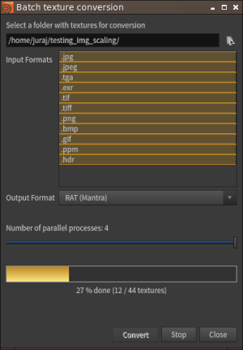

Hello, I would like to share with you my [latest tool](https://github.com/jtomori/batch_textures_convert) that I developed in my spare time. It's aim is to help you with batch pre-conversion of textures for VFX render engines. It will batch convert your textures into formats like _rat_ (for _Mantra_), _tx_ (for _PRMan_ or _Arnold_), _rstexbin_ (for _Redshift_). It works within _Houdini_, _Maya_ or as a standalone application. You can see screen capture of this tool in action [here](https://www.youtube.com/watch?v=5-p3__vsktg) :)

There are lots of scripts around the internet which help you doing that. But usually they are not very user friendly, or are tied to a DCC application. So I thought I will use this opportunity for learning some Python UI programming and make something useful (hopefully). It might be a bit of overkill for such a simple task, where couple of lines of code would do the same job, but I took it as a learning project and played with it a bit.

For UI I decided to go with _PySide2_ as it is present in all main VFX packages _(Houdini, Nuke, Maya ...)_ and is using _Qt_ which is platform independent and can run as a standalone application.

I also used _QThreads_ for spawning parallel processes and tried to make UI responsive, dynamic and simple. I also tried to make it easy to extend for other output formats and modify for user needs.

I tested the tool under _Houdini, Maya, Linux_ and _Windows_ and it looked similar in all cases and worked fine. There was a little amount of work to make it run in all of those environments. And I guess it could run from _Nuke 11, Mari, Katana_ or whatever else :) If your favorite VFX application does not have _Qt5 / PySide2_ yet, then this tool will easily run under _PySide_, or with a help of _Qt.py_. But it is probable that your app supports it as it have been recommended by _VFX Reference Platform_ for quite some time.

The tool is [hosted on GitHub](https://github.com/jtomori/batch_textures_convert) and you will find there setup and usage instructions.

Hope you will like it, I will welcome your feedback and suggestions.
