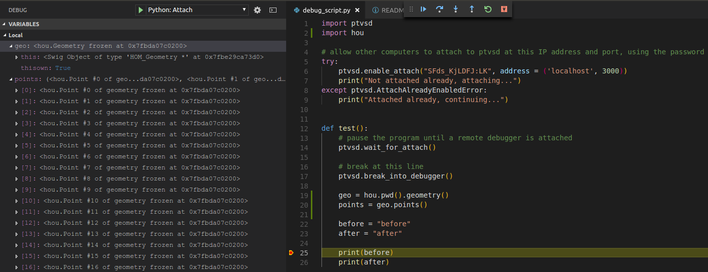
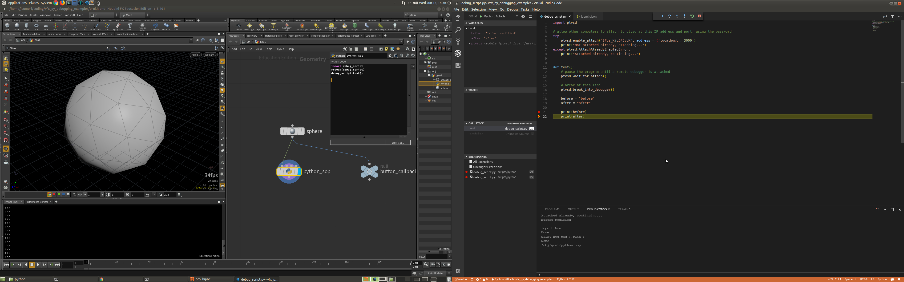

In this guide I will show you how you can debug Python scripts in various VFX DCC applications, like Houdini, Nuke, Maya and Blender. I will cover remote Python debugging from Visual Studio Code and configuration of applications.

**UPDATE 1:** added new image :), fixed typo in pip command, mentioned other ways of pointing to _ptvsd_ module, compared VSCode debugging to _pdb_.

**UPDATE 2:** mentioned Motion Builder and other packages

## Intro

In most Python IDEs you have a built-in debugger, which enables you to execute a script, set breakpoints, examine local variables, do steps in execution... It is fairly straightforward to debug an application, which is executed from an IDE. But when programming for VFX applications you might often use application APIs and your scripts are usually called from the application, not as standalone. In this case you cannot execute your scripts from IDE as they might depend on modules provided by the application (_hou_ module in Houdini, _nuke_ module in Nuke, _bpy_ in Blender...). In that case you can either use Python Debugger _(pdb)_, or remote debugging.

In this article I will focus mostly on remote debuggers, but I will also mention _pdb_. Remote debuggers enable you to debug Python scripts which are executed by a different process or even on a different computer (might be a script at renderfarm). Luckily for us Visual Studio Code has a nice support for remote debugging. It contains a set of tools for attaching its Python debugger into a remotely executed program. I tested it on couple of VFX-related applications, but the process should be the same for any other app. It is simple to setup and intuitive to visually debug flow of your script. One of other IDEs which provide this functionality is PyCharm by JetBrains, it is however available only in commercial version. You can find a list of more tools [here](https://wiki.python.org/moin/PythonDebuggingTools#Debuggers).

Also one note - I do not pretend to be a debugging expert, so if you know solutions for problems I encountered or have any suggestions, then feel free to correct me :)

 

### _pdb_

_Pdb_ is very useful [module](https://docs.python.org/3/library/pdb.html) coming with Python standard library. It enables you to set breakpoints, inspect variables and other common debugging actions. It has one advantage, that it is present in every application, which has Python, so there is no additional setup required. Disadvantage is that it does not enable you to debug scripts running in contexts, where you do not have command line access ([_remote\_pdb_](https://pypi.org/project/remote-pdb/) might help though).

Another issue is that it does not work properly from Houdini. Houdini can import _pdb_ and break into _set\_trace()_ breakpoint, but then it usually freezes after running commands from _pdb_. I tested it from Shelf Tool and Python Sop. When executing commands from Python Shell, it seemed to work fine.

In Maya _pdb_ seems to work fine, so it is equivalent option for debugging.

In Nuke I did not manage to get _pdb_ working.

In Blender _pdb_ seems to work fine. You need to launch it from terminal and at breakpoint you can type _pdb_ commands into the terminal.

So depending on your needs you can go with _pdb_, or with Visual Studio Code. I usually prefer VSCode more as it is more intuitive and visual for me to use their toolset, to add breakpoitns, inspect local variables, call stack etc., but _pdb_ is fine alternative if it works in your package.

 

## Setup

I tested it under Linux and Windows, but it should be similar for OS X.

In our setup we will have two sides - remote executing our script (e.g. in Houdini), and local - running Visual Studio Code (VSCode) which will control and examine execution of our script. In my case both sides are on the same computer. But it is possible to do the same with remote application running on a different computer and forward communication safely through SSH. You can find more about it in the links at the end of this article.

Script at the remote side needs to have imported a module called _ptvsd_, which provides remote debugging functionality with VSCode. VSCode application needs to have a Python extension installed. Both tools are from Microsoft.

### System setup

_Ptvsd_ module is available on PyPi and can be simply installed by _pip_. We need to install version 3.0.0 as newer versions [are not working yet](https://github.com/Microsoft/vscode-python/issues/133).

Nuke, Houdini and Maya use _Python 2.7_, so we can use _pip_ command. Blender is using _Python 3.5_, so run _pip3_ command instead of _pip_ on Linux (on Windows call Python 3.5 executable).

**Linux**

$ pip install ptvsd==3.0.0

**Windows**

\> python.exe -m pip install ptvsd==3.0.0

 

I will install _ptvsd_ into system's python packages site. But you can install it into your virtual environment as well.

I created a [small repository](https://github.com/jtomori/vfx_py_debugging_examples) with a simple script setup. You can use my repo or your own script. If you want to use my repo, then clone it with

$ git clone https://github.com/jtomori/vfx\_py\_debugging\_examples.git

I will debug a _test()_ function from script in _vfx\_py\_debugging\_examples/scripts/python/debug\_script.py_. Note that debugging only seems to work with external files being imported. I did not get it working with functions specified inside of the application. This script needs to be present on both local and remote PCs and needs to be identical, they need to have matching line numbers. In my case I am referring to the same script, so this condition is already met.

The _debug\_script.py_ looks like this:

https://gist.github.com/jtomori/f9c448ebce3ebc3bddca6bb288ee6983

And there are three important statemets:

- _ptvsd.enable\_attach("SFds\_KjLDFJ:LK", address = ('localhost', 3000))_
- _ptvsd.wait\_for\_attach()_
- _ptvsd.break\_into\_debugger()_

The first one starts listening at the specified address and port. The first string is a password which we will need to match in VSCode. This _enable\_attach()_ function needs to be run only once in the application (until app exits), actually it will throw an _AttachAlreadyEnabledError_ exception, so I am catching it. I am presuming that you are currently working on your script and you are constantly updating it and reloading.

The second one will pause execution of the script (and the whole host app) until a VSCode debugger is connected.

The third line sets a breakpoint. It might not be needed as you can set breakpoints in VSCode, but I got a better behavior in Houdini with putting it at the start of the debugged function.

Also one note for Houdini: I got it working only when _wait\_for\_attach()_ function was placed inside of a function, debugging did not work properly when it was directly in the module (before _test()_ function).

Now we need to setup our remote applications. They usually do not have access to _ptvsd_ installed for our system Python environment. In this article I will go with a way of adding _\*.pth_ file (containing a path to our system _site-packages)_ into applications _site-packages_ folder. There are more solutions to this, you can append a _ptvsd_ folders path to _sys.path_ or simply copy it to the applications _site-packages_. See also **Final Notes** section at the end of this article.

### Houdini setup

For Houdini, simply set _HOUDINI\_PATH_ environment variable pointing to cloned repository, for example in _houdini.env_ in your home directory.

HOUDINI\_PATH = $HOUDINI\_PATH;&;/path/to/vfx\_py\_debugging\_examples

**Linux**

Houdini on Linux is accessing system Python site packages, so it will have access to _ptvsd_ module installed by _pip_.

**Windows**

Houdini on Windows is not accessing Python site packages and we need to fix it.

Create _local.pth_ file in this folder: _C:\\Program Files\\Side Effects Software\\Houdini 16.5.473\\python27\\lib\\site-packages_ (set Houdini version to the one you are using) and in this _local.pth_ file put one line: _C:\\Python27\\Lib\\site-packages_ This line should point into _site-packages_ folder of your Python environment, where _pip_ installed _ptvsd_.

After that start Houdini and you should have _Debug Test_ shelf available with _Debug Script_ tool running our script. The tool looks like this:

import debug\_script
reload(debug\_script)
debug\_script.test()

Note that _reload()_ function will reload our script in case we changed it in VSCode.

### Nuke setup

Nuke on Linux is not accessing system Python site packages by default.

But we can point to it by simply adding a _local.pth_ text file into Nuke's Python _site-packages_ directory.

**Linux**

Create _local.pth_ in _/opt/Nuke11.0v4/lib/python2.7/site-packages_ with one line: _/usr/local/lib/python2.7/dist-packages_ (path where your pip installed _ptvsd_)

**Windows**

Create _local.pth_ in _C:\\Program Files\\Nuke11.0v4\\lib\\site-packages_ with one line: _C:\\Python27\\Lib\\site-packages_ (path where your _pip_ installed _ptvsd_)

After that Nuke will have access to _ptvsd_ module and you will be able to execute the following script in _Script Editor_:

import sys
# on linux
sys.path.append("/home/jtomori/coding/vfx\_py\_debugging\_examples/scripts/python")

# on windows
#sys.path.append(r"C:\\Users\\jtomori\\Desktop\\coding\\vfx\_py\_debugging\_examples\\scripts\\python")

import debug\_script
reload(debug\_script)
debug\_script.test()

 

### Blender setup

For blender you need to have _ptvsd_ installed for Python 3.5, with _pip3_.

**Linux**

Blender will pick up the module automatically and you can run the following script from _Text Editor_.

**Windows**

Create _local.pth_ in _C:\\Program Files\\Blender Foundation\\Blender\\2.79\\python\\lib\\site-packages_ with one line: _C:\\Python36\\Lib\\site-packages_ (path where your _pip_ installed _ptvsd_)

After that Blender will have access to _ptvsd_ module and you will be able to execute the following script in _Text Editor_:

import sys
# on linux
sys.path.append("/home/jtomori/coding/vfx\_py\_debugging\_examples/scripts/python")

# on windows
#sys.path.append(r"C:\\Users\\jtomori\\Desktop\\coding\\vfx\_py\_debugging\_examples\\scripts\\python")

import debug\_script
debug\_script.test()

 

### Maya setup

Maya on Windows is not accessing system Python site packages by default.

But we can point to it by simply adding a _local.pth_ text file into Nuke's Python _site-packages_ directory.

**Linux**

Create _local.pth_ in _/usr/autodesk/maya2017/lib/python2.7/site-packages_ with one line: _/usr/local/lib/python2.7/dist-packages_ (path where your _pip_ installed _ptvsd_)

**Windows**

Create _local.pth_ in _C:\\Program Files\\Autodesk\\Maya2017\\Python\\Lib\\site-packages_ with one line: _C:\\Python27\\Lib\\site-packages_ (path where your _pip_ installed _ptvsd_)

After that Maya will have access to _ptvsd_ module and you will be able to execute the following script in _Script Editor_:

import sys
# on linux
sys.path.append("/home/jtomori/coding/vfx\_py\_debugging\_examples/scripts/python")

# on windows
#sys.path.append(r"C:\\Users\\jtomori\\Desktop\\coding\\vfx\_py\_debugging\_examples\\scripts\\python")

import debug\_script
reload(debug\_script)
debug\_script.test()

 

### Other setups

As you might have noticed, the setup is always the same. So if you want to remotely debug your favorite application (e.g. Motion Builder or others), then replicate one of the previous steps and you should be good to go. If you are not sure about _site-packages_ directory of your application, then simply run this command in Python in the app.

import site; site.getsitepackages()

 

### VSCode debugger setup

At this point we can configure our VSCode. If we run the script in remote app, it will actually freeze until we connect to it from VSCode.

In VSCode make sure to have Python extension enabled. After that go to Debug side pane. If you are there for the first time, then click on _Add Configuration_ and select _Python_. This will generate a _.vscode/launch.json_ file in your working directory which is a configuration for the debugger. We need to configure _Python: attach_ debug mode. Set _port_, _password_ and _host_ to the same values as in your _debug\_script.py_. _LocalRoot_ and _remoteRoot_ should point to root directory of your project. In my case I am using the same file, so both can have value _${workspaceFolder}_. If you have your script on the remote pc in different location, you can set it here.

In my case it looks like this:

config
{
    "name": "Python: Attach",
    "type": "python",
    "request": "attach",
    "localRoot": "${workspaceFolder}",
    "remoteRoot": "${workspaceFolder}",
    "port": 3000,
    "secret": "SFds\_KjLDFJ:LK",
    "host": "localhost"
},

 

## Debugging

Now we should be ready to start debugging our script. Run the script from your remote application and it should freeze _(wait\_for\_attach())_. After that select _Python: Attach_ and click on the green play button, or press F5. Your status bar at the bottom should change its color to orange and you should get your script executed till the first line of _debug\_script.py_. On the left you can check your local variables and call stack of the script at specified breakpoints. You can set breakpoints by clicking on the left to the line number, or by pressing F9. You can use Continue to execute the code till next breakpoint, or Step Into to see deeply explore the call stack, you will see a lot of going on there :) You can also use Debug Console for executing commands in remote applications Python interpreter - for example when being at breakpoint and checking / changing state.

I tested debugging scripts from various contexts in applications and it worked fine on both Linux and Windows:

- Houdini: Shelf Tool, Python Sop, Node Parameter Callback Script
- Nuke: Script Editor
- Maya: Script Editor
- Blender: Text Editor

 

## Final notes

Here are couple of notes that I have discovered and you should be aware of to avoid weird behavior :)

- Houdini
    - Do not add _ptvsd.wait\_for\_attach()_ directly into a module, but into a function, otherwise it will not work - VSCode will not manage to attach
    - Executing a script in Houdini first, VSCode second: will probably miss breakpoints when run for the first time, after running the tool again (while staying connected in VSCode), it will work fine
        - Fix: add _ptvsd.break\_into\_debugger()_ at the start of your function, it acts as setting a breakpoint in VSCode - will break at this statement
    - Do not _import debug\_script_ through _Python Shell_ pane, use _Shelf Tool, Parameter Callback Script_ or _Python Sop_, otherwise it will miss breakpoints
- If your app doesn't want to start up, then it might be actually waiting for a debugger to attach (code being executed at the startup of the app), then attach your VSCode debugger
- Debugging works only with imported scripts, it does not work if you define your script in _Script Editor_ (Nuke), or in _Python SOP_, or _Shelf Tool_ (Houdini) - you will get _<undefined>_ variables in VSCode
- Run _import site; site.getsitepackages()_ in your app's Python interpreter to find out locations where it is looking for _site-packages_
- I am pointing to _ptvsd_ by setting link in _site-packages_ folder as this will enable all our packages to be imported into the app, another solution could be by setting _PYTHONPATH_. In this case I think it would have the same effect, but in other cases this would not handle module dependencies. Note, that there might be a potential for module conflicts if your system and application have different versions of a certain module.

 

Thanks for reading all the way down. I hope you will find it useful. Here I am attaching sources:

- [https://code.visualstudio.com/docs/python/debugging#\_remote-debugging](https://code.visualstudio.com/docs/python/debugging#_remote-debugging)
- [https://benoitpatra.com/2017/11/27/remote-debugging-python-with-vscode/](https://benoitpatra.com/2017/11/27/remote-debugging-python-with-vscode/)
