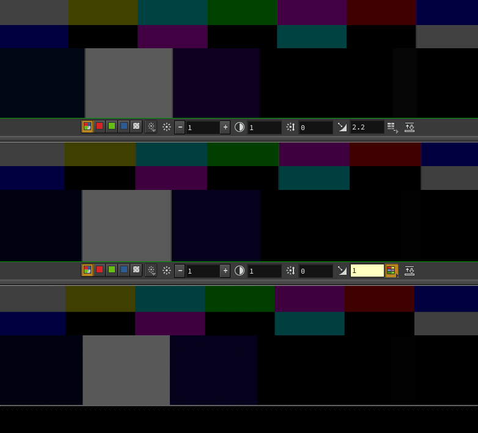

In this post I will describe a little confusion with varying brightness levels I encountered in MPlay and Nuke and how to solve it :)

\[caption id="attachment\_944" align="aligncenter" width="782"\] Bottom: Nuke, middle: MPlay with gamma 1 and linear->sRGB LUT applied, top: MPlay with gamma 2.2 and no LUT\[/caption\]

 

When comparing renders in Mplay and Nuke you might have noticed that brightness levels do not match. When viewed linear in both applications, they look same, but when switching to gamma-corrected they look different. The reason for it is, that Houdini/Mplay simply apply a gamma of 2.2 to the image, while Nuke will display image in sRGB color space. sRGB and gamma2.2 might look similar at first look, but this might lead to confusion, when we are expecting to see exactly the same result in both apps.

Solution to this is simple: configure Houdini using environment variables to use a linear->sRGB LUT. To learn more about using environment variables in Houdini check my previous [post](https://jurajtomori.wordpress.com/2018/01/15/houdini-tip-taking-advantage-of-environment-variables/).

Here is snippet of a windows batch file:

set "HOUDINI\_IMAGE\_DISPLAY\_GAMMA=1"
set "HOUDINI\_IMAGE\_DISPLAY\_LUT=path\_to\_folder\_with/linear-to-srgb\_14bit.lut"
set "HOUDINI\_IMAGE\_DISPLAY\_OVERRIDE=1"

On a linux the starting script should contain this:

export HOUDINI\_IMAGE\_DISPLAY\_GAMMA=1
export HOUDINI\_IMAGE\_DISPLAY\_LUT="path\_to\_folder\_with/linear-to-srgb\_14bit.lut"
export HOUDINI\_IMAGE\_DISPLAY\_OVERRIDE=1

You can find documentation of houdini environment variables [here](http://www.sidefx.com/docs/houdini/ref/env). And of course you can get the LUT [here](https://drive.google.com/open?id=18pZz9CBvqNfqnG_3M0zy3B-7DMkZsFsQ) ([source](https://www.sidefx.com/forum/topic/37329/?page=1#post-170199)).

<!-- Markdeep: -->

