In this post I will discuss couple of ideas about versioning of Houdini assets.

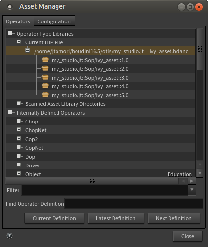

Keeping track of your changes is important in every workflow and the same applies to dealing with digital assets in Houdini _(HDA/OTL)_. Houdini enables you to have non-destructive workflows and has a nice way of managing its assets versions.

I think that those useful features might be a bit hidden, so I thought I could write something about it :)

## Asset creation and namespaces

Houdini enables you to categorize your assets into namespaces. With using it you can have a multiple assets with the same name (from different sources), or multiple versions of the same asset.

To create a company namespace, you can prefix your asset name (for example ivy generation asset) with a company name, e.g. _my\_studio::ivy\_asset_, or your initials, e.g. _jt::ivy\_asset_, or both, e.g. _my\_studio.jt::ivy\_asset_ .

To create a version namespace, add a numeric suffix after you asset name. You can use number and periods only, but you can design your own convention. For example after couple of iterations on your ivy asset you can have assets with those names:

- my\_studio.jt::ivy\_asset::1.0
- my\_studio.jt::ivy\_asset::1.1.5
- my\_studio.jt::ivy\_asset::1.2
- my\_studio.jt::ivy\_asset::2.0

As you probably noticed, Houdini uses two colons _(::)_ for separating namespaces. In file names it replaces _::_ with two underscores _(\_\_)_. When creating an asset you should use namespaces in Operator Name. For Operator Label use a descriptive name, like Ivy generator. As for a file you want to save the asset into, you can skip the version part. You can do it because you can have multiple versions of an asset in one library file _(.hda)_. Then it is not misleading if you have 10 different versions of assets in a file having first version number in its name.

So your _my\_studio.jt::ivy::2.0_ asset can be saved in _my\_studio.jt\_\_ivy\_asset.hdanc_ file.

So let's create our example asset, select a subnetwork containing your nodes, click _Create Digital Asset..._, and write down name of your new asset.

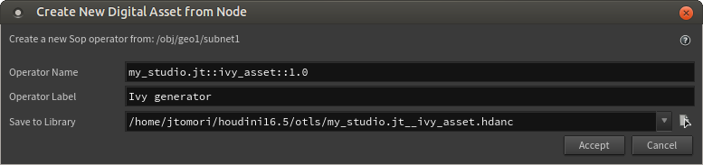

After that I added couple of controls to parameter interface and it looks like this in my case.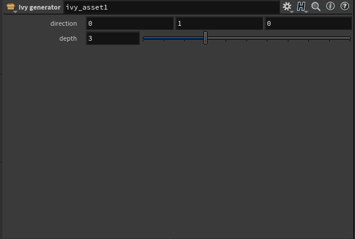

If you middle click on your node, you will see more detailed information about it.

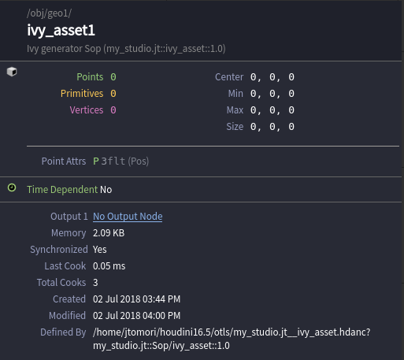

## Upversioning

After some work with our asset we might want to add new features to our asset. But we probably have already created couple of scenes using the initial version and we do not want to break them, so we can create a new version, while the old one will be still available. To do so, open _Asset Manager_ window and find your asset in it. To create a new version, we need to create a copy of our asset and set higher version in its name. For compactness we can use the same _hda_ file, Houdini will not overwrite it, but append a new asset into it. You can use both _Copy..._ or _Duplicate..._ options to create a new version.

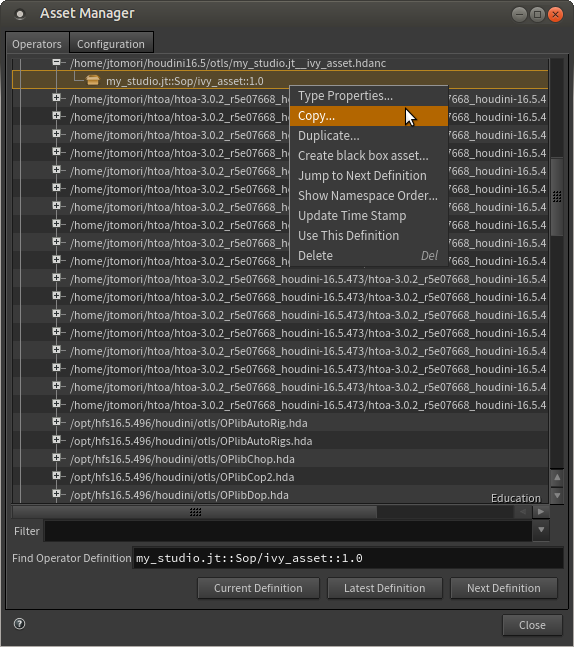

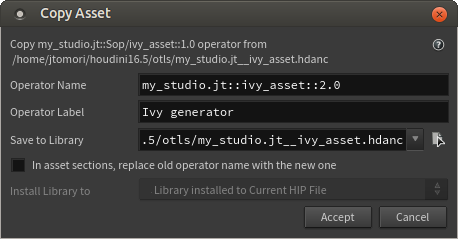

After some work I added new controls and parameters.

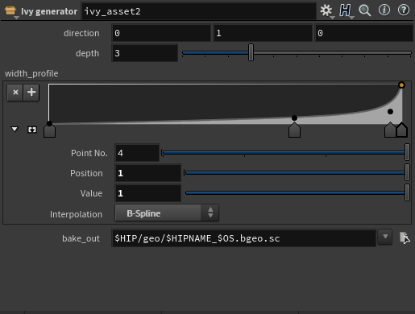

If you middle-click on the asset you can see that it is saved in the same file.

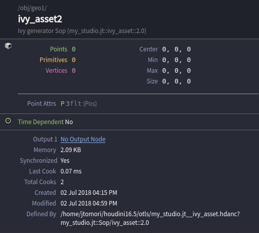

If you check _Asset Manager_, you will see that there are two versions of the asset available. When adding our Ivy asset node from _TAB Menu_, then the latest version _2.0_ will be created.

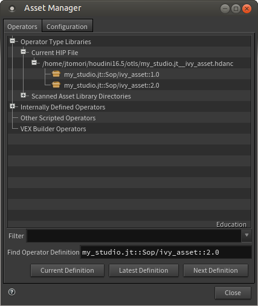

## Switching versions

Now we have two versions available. The old scenes will keep using the old version, while new scenes will use the latest version.

To manually switch versions, go to _Configuration_ tab of _Asset Manager_ and select _Display Menu of All Definitions_ in _Asset Bar_ dropdown menu. This will show a handy dropdown menu at parameter interface of each node.

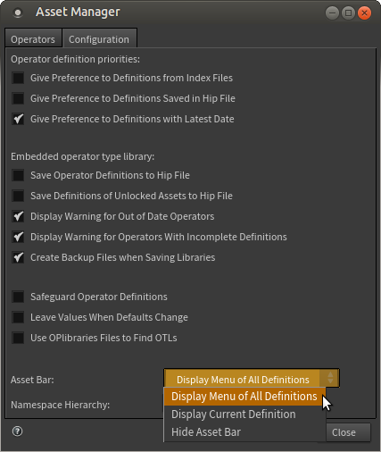

With this menu you can switch to any version.

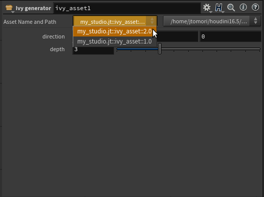

Take a look at _Asset Manager_, it provides you useful tools for managing your asset libraries. Also check [my post about using environment variables](https://jurajtomori.wordpress.com/2018/01/15/houdini-tip-taking-advantage-of-environment-variables/) if you want to learn more about how Houdini finds digital assets on your disk.

## Further ideas

If you are in a studio environment, then you will probably use some code versioning system _(git, svn...)_ for keeping track of changes in digital assets. Houdini files and assets however contain binary parts, which are hard to read, or diff - find differences between various versions. To fix that you can save your assets and scenes in text format. I have _Education_ version of Houdini, so I couldn't test it, but it seems to be useful. Especially if you want to quickly spot changes in your repository. You can find more information [about it here](http://www.sidefx.com/docs/houdini/assets/textfiles.html).

Saving _hip_ files as text seems to be easily done through _File -> Save as text_ option, or with _hou.hipFile.setSaveMode(hou.saveMode.Text)_ Python command. Digital assets need to be converted to folders and back with _hotl_ command line utility. You can chain this operation to your publishing pipeline, where assets are expanded to folders and files before committing to the repository and later converted back when pulled.

This post was inspired by a workshop by Daniel Stern, thanks for the tips :) You can find more information about asset versioning in Houdini docs: [namespaces](http://www.sidefx.com/docs/houdini/assets/namespaces.html), [versioning](http://www.sidefx.com/docs/houdini/assets/versioning_systems.html), [files as text](http://www.sidefx.com/docs/houdini/assets/textfiles.html) .

Thanks for reading :)
