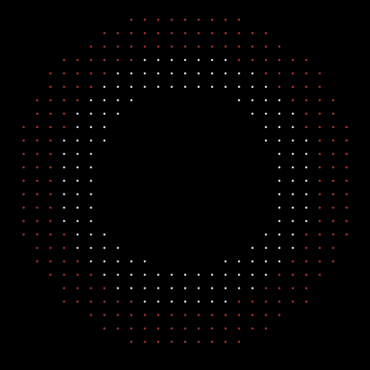
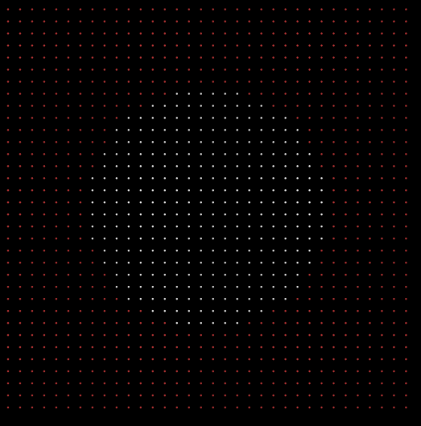
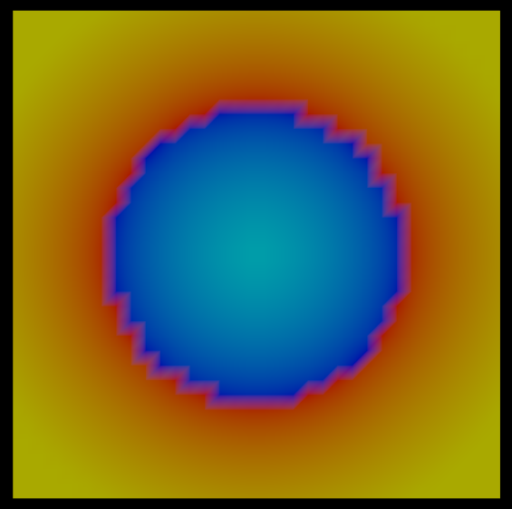
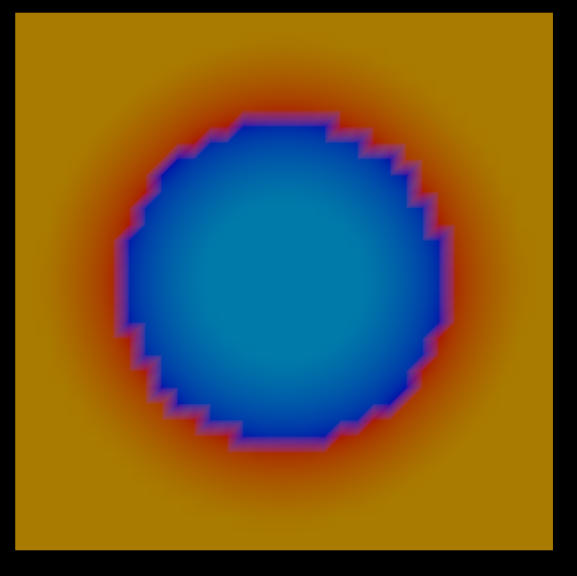
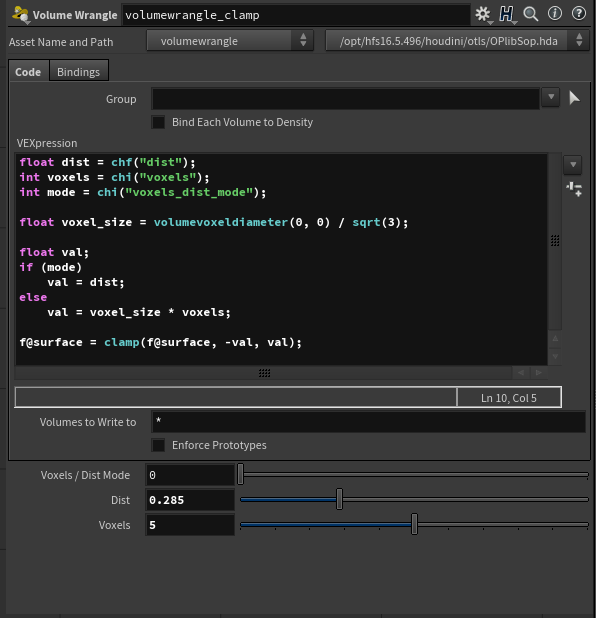
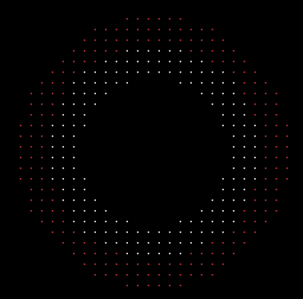

Recently I found an interesting problem while trying to convert Houdini dense (native) SDF volume into a VDB SDF volume. My primary motivation was to save space - to discard voxels, which were too far away from surface. This is one of the main reasons why VDBs are usually superior to dense volumes. Note that in this post I will not go too much into details about volumes, but will post some links at the end of the article which explain the basics. 

So the idea is that I want to have active voxels only in the close proximity to surface. I will be visualizing a slice of active voxels generated by _VDB Visualize Tree_ node. Surface is at the interface of red and white points.

This is the result that you will get if you have a polygonal mesh and you convert it to SDF with _VDB From Polygons_ node. It works fine as expected.

But let's generate SDF first with dense volume with _Isooffset_ node and then convert it to VDB with _Convert VDB_ node. The result is a VDB SDF volume, but if we visualize active voxels, it looks like this.

As you can see we did not save any space, because the VDB volume has active voxels in the whole domain, not just close to the surface.

As it turns out we need to do a small pre-processing step to have narrow-band SDF VDB volume. _Convert VDB_ node does not want to discard voxels which have correct / varying values. However if we clamp voxel values in a certain range, then VDB will discard the incorrect (clamped) voxels. We know that in SDF representation of surface our surface is in the region of voxels that have value of zero. So if we calmp our values from let's say -0.5 to 0.5, we will have correct values in voxels which have distance to surface of 0.5 units or less and the rest will be clamped to our clamping value.

Here are images visualizing values of voxels. Surface is represented by interface of yellow and blue colors. In the first image you can see a smooth gradient of colors, which represent distance to the surface. In the second one values are clamped, and you can see that gradient stops at some point.

To do so create a volume wrangle with this code:

https://gist.github.com/jtomori/69d3c4aa59a77c1270e33a301cc64225

With this node we can set band of active voxels by world space distance, or by number of voxels. After doing it, _Convert VDB_ will keep only the correct voxels. Also make sure to disable _Activate Inside Voxels_ option in _Convert VDB_ node.

You can find [project file here](https://drive.google.com/open?id=12XTnk_7INQZ4GXMiXbkFngQZQGFi-e6Y).

And you can find more information about volumes in those sites: [docs](http://www.sidefx.com/docs/houdini/model/volumes.html), [cgwiki](http://www.tokeru.com/cgwiki/index.php?title=HoudiniVolumes), [applied houdini tutorial series](https://vimeo.com/162636675).

That was all for this post, thanks for reading :)
