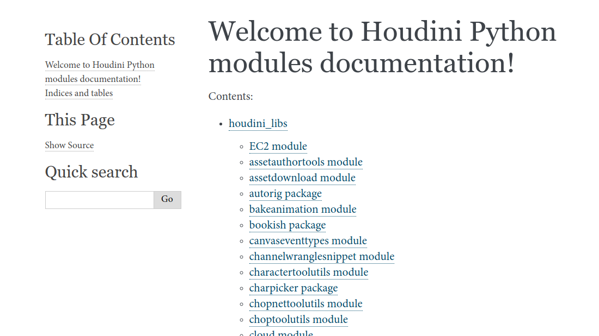

Hello, in this post I will present you a small project I did recently. If you have spent a lot of time digging in Houdini undocumented Python modules, then this might save you some time.

**UPDATE:** Now there are more modules documented and I changed my workflow, see notes in [repo](https://github.com/jtomori/houdini_additional_python_docs/tree/master#update).

[Generated documentation can be found here](https://jtomori.github.io/houdini_additional_python_docs/)

If you did some scripting in Houdini, then chances are that you have found [_toolutils_](https://jtomori.github.io/houdini_additional_python_docs/toolutils.html) module quite handy. But searching in Houdini online help is not very helpful, you will not find much information about it. Maybe some useful code snippets, but not its documentation.

As it turns out there are some handy modules coming with Houdini, but they can be a bit hidden to many users. So I decided to do a small project and auto-generate documentation from docstrings from those modules. I used [_Sphinx_](http://www.sphinx-doc.org/en/master/) for this.

I created a GitHub repository hosting the [generated docs](https://jtomori.github.io/houdini_additional_python_docs/) and written down the process of [generating them](https://github.com/jtomori/houdini_additional_python_docs/).

Happy reading :)

<!-- Markdeep: -->

