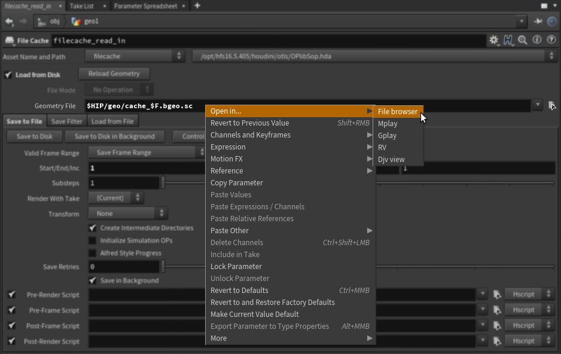

Hello, in this post I will show you a small convenience trick. It will help you with locating files in your OS file browser, opening images in _Mplay_ or any other application like _Djv\_view_, _RV..,_ directly from Houdini parameter window.

**UPDATE 1:** Fixed RV script to open folder with whole sequence instead of just one frame **UPDATE 2:** Added Photoshop menu item, updated RV, mentioned Sequence From File package **UPDATE 3:** On Linux, when opening in **File browser**, I clear _LD\_LIBRARY\_PATH_ environment variable which may cause bugs in some situations, fixed some mistakes. **UPDATE 4:** Fixed a bug, where **Mplay** opening script would incorrectly expand _$OS_ variable in file path.

In Houdini you can modify couple of UI menus. Luckily one of the menus which you can modify is the one you see after right-clicking on a node parameter. Those menu modifications are quite handy and well-controllable.

To modify parameter menu, you can create _PARMmenu.xml_ file and put it into your _$HOUDINI\_PATH_. _PARMmenu.xml_ already exists in your _$HH_ folder _(houdini\_installation\_folder/houdini)_ and has defined all the default items. What you can do is to either edit this file, or create a new complementary one.

To add **Open in...** menu items as seen in the screenshot, create an empty _PARMmenu.xml_ file and put it into houdini folder in your home directory _(Linux: ~/houdini16.5, Windows: C:\\Users\\Username\\Documents\\houdini16.5)_. You can also put it to another directory which is in your _$HOUDINI\_PATH_ variable, or you can specify _$HOUDINI\_MENU\_PATH_ variable pointing to the folder containing your file.

Put the following file into _PARMmenu.xml:_ 

https://gist.github.com/jtomori/45a58f01badd828d206a72eb12024612

After that you can start a new Houdini session and after right-clicking on any string parameter you should see the menu :)

Feel free to add your favorite tools into the menu. Note that you need to have tools executables present in your system _$PATH_ variable.

One note for **RV**: right now the menu item will open the current frame only, if you want to load the whole sequence, then enable  **Sequence From File** package in your RV settings.

The menu items can contain a script to be executed or can refer to external python file. One of nice features is that you can set a context expression for your menu items controlling whether they are visible. This way I limited them for string parameters only.

You can find more information about modifying menus in the [documentation](http://www.sidefx.com/docs/houdini/basics/config_menus.html) and you can check _$HH/PARMmenu.xml_ for good example of using it.

One note: I was experiencing Houdini crashes on Windows after setting a context expression directly on scriptItem. Setting it on subMenu worked fine (the bug should be fixed in Houdini 16.5.484).

Thanks for reading all the way down :)

<!-- Markdeep: -->

