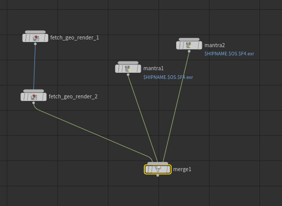

Hello, I would like to share with you a recent small script I did for more convenient local rendering from Houdini.

In some Houdini builds I had issues with background renders, and I also miss _Background render_ feature on some nodes. So I created this shelf tool, which will enable you to start a background render of a selected node or nodes. Using this tool you can render nodes with dependencies, fetch nodes, merge nodes... Just select the node and press button. It will start up a background process in terminal, where you will see progress of the rendering.

Currently it works on _Linux_ and _Windows_. Feel free to contribute to the repository and extend it for _MacOS_. Also if you encounter any issues let me know, or even better create a pull request :)

Here you can find [script repository](https://github.com/jtomori/hou_bg_render) with set-up instructions.

Happy rendering :)

<!-- Markdeep: -->

