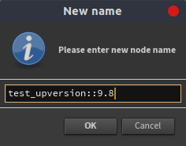
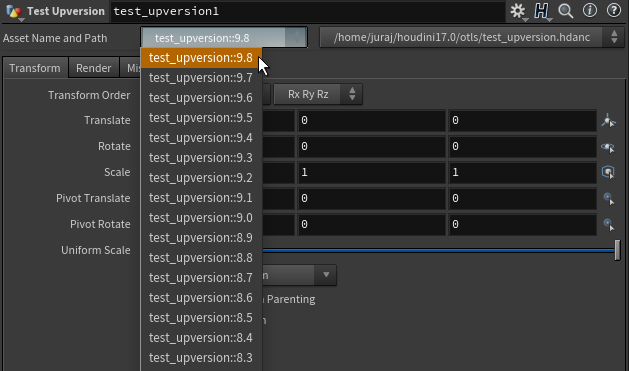

Hello, I would like to share a small convenience tool for upversioning modified (unlocked) assets.

\[caption id="attachment\_1127" align="aligncenter" width="323"\] Tool in right-click menu of an unlocked asset\[/caption\]

AFAIK the default workflow of creating new version of assets is to duplicate the asset first with a new version in its name and then do the changes.

This workflow however might be a bit counter-productive as people often do many experimental changes first and just then see if they will make it into newer version or not.

I used this workflow for some time until a friend at the university pointed it out that it of course does not make a sense and that it should be the other way around - do modification first and if satisfied, save as a new version.

This sparked my interest and as it turns out the tool to do exactly this thing can be easily and seamlessly added into Houdini with use of couple of Houdini HOM methods.

This post is quite related to a post I wrote about [asset versioning workflow](https://jurajtomori.wordpress.com/2018/07/02/houdini-tip-assets-versioning-workflow/), you can check it if interested in more info about this topic.

 

## Usage

 

To use the tool simply right-click on a unlocked asset and click on **Save as New Version** menu item.

After that enter the new name. You can use namespacing with **::** and modify version number.

\[caption id="attachment\_1128" align="aligncenter" width="236"\] Entering new version number: 9.8\[/caption\]

After confirming the tool is done. Your node will update to the new version which was just created with your changes. You can see the new version in version menu.

\[caption id="attachment\_1126" align="aligncenter" width="629"\] The latest version which was just created\[/caption\]

If you do not see **Asset Name and Path** menu, then enable it in **Asset Manager**.

\[caption id="attachment\_1033" align="aligncenter" width="427"\] Enable **Asset Bar** for easy version selection\[/caption\]

## Installation

 

To install this tool, simply create **OPmenu.xml** file somewhere with the following contents.

https://gist.github.com/jtomori/6b690e60d2399ba9198019ee7d3e9fa6

After that set directory location where this file is created in **HOUDINI\_MENU\_PATH** environment variable.

For example by adding this into your **houdini.env** file:

HOUDINI\_MENU\_PATH = /home/user/save\_as\_new\_version\_folder;&

 

That should be all :) Happy versioning.

<!-- Markdeep: -->

