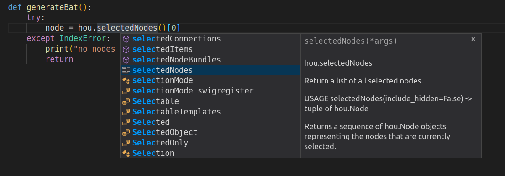

When developing Python tools for Houdini it is often more convenient to use an external IDE. However we do not want to miss Houdini's neat auto-completion. In this quick post I will show how to set-up Visual Studio Code (VSCode) auto-completion for _hou_ module.

**UPDATE 1:** Added Interpreter settings and config examples for Windows and Linux. **UPDATE 2:** Corrected the part about _hython_, added a better solution, which does not break autocompletion.

The first step is to determine _hou_ module's location on disk. This can vary between various systems and you can check it from Houdini's Python shell window by printing _hou.\_\_file\_\__:

 >>> print hou.\_\_file\_\_
 /opt/hfs16.5.473/houdini/python2.7libs/hou.pyc

On Windows the path can look like this: _C:\\Program Files\\Side Effects Software\\Houdini 16.5.473\\houdini\\python2.7libs\\hou.pyc ._

This information is needed for locating Houdini Python modules. The next thing we need to do is to configure Python in VSCode to pick up those Houdini modules. You can set it globally in _User Settings_, or just for your project in _Workspace Settings_. Add the following lines and replace the path pointing to the modules.

"python.autoComplete.extraPaths": \[ "/opt/hfs16.5.473/houdini/python2.7libs" \],
"python.autoComplete.preloadModules": \["hou"\]

The other setting should speed up loading of the _hou_ module, which can take a bit of time. Now you can press _ctrl+space_ with your cursor above a Houdini class and you will see suggestions with the corresponding documentation.

If you are also using _Pylint_ in VSCode, you need to point _Pylint_ to _hou_ module as well. You can create _.pylintrc_ file in your linux home directory with the following content:

\[MASTER\]
 init-hook='import sys; sys.path.append("/opt/hfs16.5.473/houdini/python2.7libs")'

Windows users can find how to create _.pylintrc_ file [here](https://stackoverflow.com/questions/1372295/how-to-specify-a-configuration-file-for-pylint-under-windows/15837092#15837092).

If you want to disable linting, you can use this setting:

"python.linting.pylintEnabled": false

 

Also note that VSCode's Python auto-completion will now take Houdini's licence (Houdini Batch license).

Now you should be able to see auto-completion suggestions for your code, but if you will try to run your scripts from VSCode, you will probably see this error message:

Traceback (most recent call last):
 File "/your/scripts/folder/script.py", line 1, in <module>
 import hou
ImportError: No module named hou

_(You can run your scripts from VSCode by **Ctrl+Shift+P -> Run Python File in Terminal**, or simply by selecting this command in right-click menu in the editor.)_

To fix the previous error we need to specify which Python interpreter should be used for running scripts inside of VSCode (_Python 2.7_ or _hython_ in our case). Simply add the following line into your config. Note that you might want to add this into your workspace settings and not user settings, so that it does not set Python interpreter for your other projects.

"python.pythonPath": "/opt/hfs16.5.268/bin/hython",

If you set your Python interpreter to _hython_, you do not need the _python.autoComplete.extraPaths_ setting as those modules are available in _hython_ by default. If you choose _Python 2.7_, then you need to keep it.

Originally I suggested setting _hython_ as your Python interpreter in VSCode. This would enable you to run Python scripts directly from VSCode, but would eventually break auto-completion.

A better solution is to specify environment variables for _Integrated Terminal_ in VSCode, which will point system's Python interpreter to Houdini modules.

On Linux we need to specify _PYTHONPATH_ environment variable, which Python uses for looking for modules. On Windows we need to specify _PYTHONPATH_ and append to _PATH_ variables. _PATH_ points to binaries and libraries needed by _hou_ module.

Add this to your VSCode configuration,

**Linux**

"terminal.integrated.env.linux": {
    "PYTHONPATH" : "/opt/hfs16.5.473/houdini/python2.7libs"
}

 

**Windows**

"terminal.integrated.env.windows": { 
    "PYTHONPATH" : "C:\\\\Program Files\\\\Side Effects Software\\\\Houdini 16.5.473\\\\houdini\\\\python2.7libs",
    "PATH" : "${env:PATH};C:\\\\Program Files\\\\Side Effects Software\\\\Houdini 16.5.473\\\\bin"
}

 

After that it should be pretty comfortable to code with auto-completion and run Houdini Python scripts inside of Visual Studio Code.

 

Here are full configs for both _Linux_ and _Windows_:

**Linux**

{
    "python.autoComplete.extraPaths": \[ "/opt/hfs16.5.473/houdini/python2.7libs" \],
    "python.autoComplete.preloadModules": \["hou"\],
    "terminal.integrated.env.linux": {
        "PYTHONPATH" : "/opt/hfs16.5.473/houdini/python2.7libs"
    }
}

 

**Windows**

{
    "python.autoComplete.extraPaths": \[ "C:\\\\Program Files\\\\Side Effects Software\\\\Houdini 16.5.473\\\\houdini\\\\python2.7libs" \],
    "python.autoComplete.preloadModules": \["hou"\],
    "terminal.integrated.env.windows": { 
        "PYTHONPATH" : "C:\\\\Program Files\\\\Side Effects Software\\\\Houdini 16.5.473\\\\houdini\\\\python2.7libs",
        "PATH" : "${env:PATH};C:\\\\Program Files\\\\Side Effects Software\\\\Houdini 16.5.473\\\\bin"
    }
}

 

 

That's all for this post, Happy coding :)

<!-- Markdeep: -->

