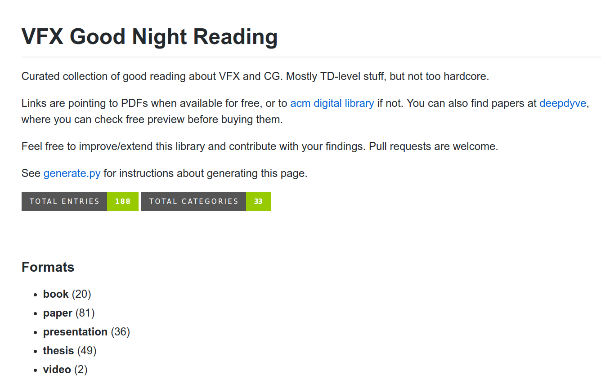

I would like to share with you a [collection of presentations, research papers and theses](https://github.com/jtomori/vfx_good_night_reading) on various topics of VFX or CG.

I am used to collecting good learning resources and keeping them around in case I will need them later. So it happened that my small list grew and I realized that I have quite interesting things collected from various places.

So I decided to create a [repository at GitHub](https://github.com/jtomori/vfx_good_night_reading) where I will continue to gather useful information which I come across. I am not trying to re-create a database of all recent cutting-edge research. It is more oriented on resources which are easier to understand, like presentations with notes and pictures :) I have been most interested in resources about FX and volumetrics, so it is missing stuff in other areas like cloth simulation etc..

And this is also one of the motivations to host it on a git: similar-minded people can contribute with their areas of interest and hopefully we will end up with a nice pool of information which we can quickly refer to when needed.

I tried to make an easy system for adding new entries - simply add them into a json library file and the page will be automatically updated. More info about that in the repo.

I hope that you will find this resource useful :)
