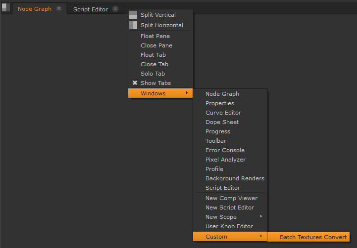

I recently started to help out with photogrammetry pipeline for a student project. I would like to do artist-friendly yet accurate and proper workflow. It should be as automatic as possible. But that I will describe more in depth in other blog posts.

One of the first steps of our workflow is to process raw images (Canon's .CR2 in our case) into something Nuke can handle well. In this quick tip I will show you a simple tool I adapted for this purpose and how you can use it directly from Nuke.

## Introduction

For this purpose I adapted my [Batch Textures Conversion](https://github.com/jtomori/batch_textures_convert/) tool to work directly from Nuke interface. With this you can select a folder full of pictures and start multithreaded conversion.

This process relies on a nice utility that can handle raw photo conversion well - [dcraw](https://www.cybercom.net/~dcoffin/dcraw/). It is quite powerful, mainly because it can output linear 16-bit tiffs without doing any color alternations (apart WB) or affecting linearity. You also have control about your output color space.

The current preset outputs linear tiffs in ACES 2065-1 color space.

## Setup

For setting it up you can either follow [installation instructions on the repository](https://github.com/jtomori/batch_textures_convert/#installation), or follow my brief summary bellow.

In order to have Nuke register and use the tool you need to modify **NUKE\_PATH** and **PYTHONPATH** environment variables.

You can do it system-wide, or do a Windows/Linux launcher which is more modular.

In case of Windows you can use something like this: _(nuke\_launcher.bat)_

set "PYTHONPATH=%PYTHONPATH%;/path/to/this/repo/scripts/python"
set "NUKE\_PATH=%NUKE\_PATH%;/path/to/this/repo/nuke"

set "PATH=C:\\Program Files\\Nuke11.2v4\\;%PATH%"
start Nuke11.2.exe --nukex "%~1"

On Linux you can source something like this before running Nuke: _(nuke\_env.sh)_

PYTHONPATH="${PYTHONPATH}:/path/to/this/repo/scripts/python"
NUKE\_PATH="${NUKE\_PATH}:/path/to/this/repo/nuke"

Now you can use the interface, but you still need dcraw's executable to be available in one of locations specified in your **PATH** environment variable.

On Linux dcraw is usually in repositories, so get it with your package manager (e.g. "_sudo apt install dcraw_").

On Windows download it e.g. from [here](http://www.centrostudiprogressofotografico.it/en/dcraw/), rename to **dcraw.exe** and include folders location in **PATH** variable by adding the following line into your Nuke launcher (but before starting Nuke):

set "PATH=C:\\path\\to\\dcraw\\directory;%PATH%"

After setting it up correctly you should have access to this new custom panel in Nuke.

Happy converting :)

