In the next couple of posts I will be describing photogrammetry workflow which I am creating for a student production. I am planning to describe here the whole process, from processing pictures to exporting game-ready assets. Game-ready assets because our production requires realtime renderings, but the process can be easily altered to produce VFX-ready assets _(but this will probably require more manual work e.g. retopo, UVs to meet stricter quality requirements)_.

I have a tight schedule for this project, so I will try to stay simple, efficient, but try to be as correct as possible.

In this post I will describe our photos processing setup and colors workflow. This will result in photos with mask in alpha channel and in linear color space, ACES in our case. After that the photos should be ready for photogrammetry software, but that is for another post :)

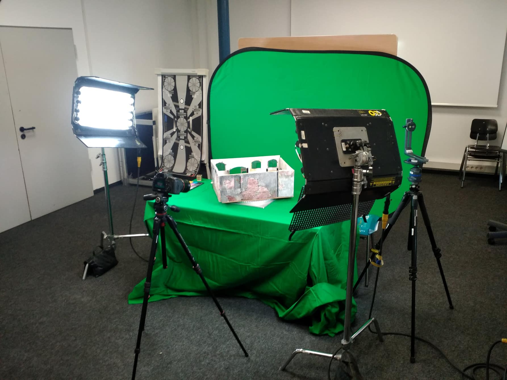

## Photography setup

 

Our shooting setup looks like in the previous picture.

We try to achieve neutral diffuse lighting. Model is on a turntable and camera is in fixed position for a given cycle _(~ 30 rotations)_. After each rotation cycle I move camera up/down to get another perspective on the model and I rotate the model again. Also after each camera height and tilt adjustment I took the model out from turntable to shoot a cleanplate, which could be potentially used in Nuke for difference key. Although I didn't end up using it later on.

Before shooting pictures of the model I switched DSLR _(Canon 5D mk III)_ to manual mode and tried to set neutral settings, disabled all image enhancements and set raw output for the most of color bit depth and set the ISO to small value like 100. Small ISO will result in longer exposure times, but less noise. Longer exposure times are fine as the camera is on a tripod and I set 2 seconds timer for taking pictures to let camera stabilize. I set white balance to match color temperature of our lights.

After that I tested various apertures for getting maximum sharpness. Here you can see effect of different apertures on photo sharpness.

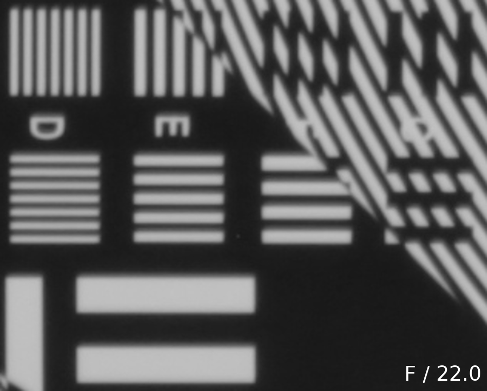

So I went with f/stop 5.6.

## Developing photos

 

After taking pictures I took them into Nuke which we will use for keying and colors processing. Note that Nuke supports reading raw .CR2 files with dcraw utility, but this input method is very slow and laggy, so is not recommended for actual use, only to get a preview.

At first I evaluated linearity of pictures. It is not easy to judge be eye, so I rather [plotted](http://www.nukepedia.com/gizmos/other/slicetool) grayscale values in the bottom row from photographed color checker.

Here you can see JPG accompanying .CR2 photos, which was generated automatically by camera.

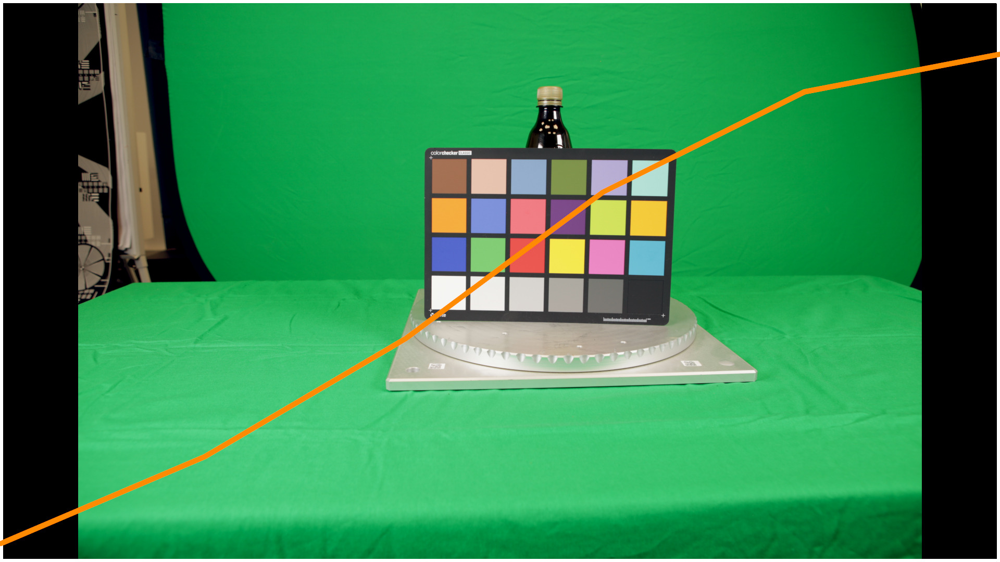

The photo overall looks fine, but let's compare it to [reference values of the color checker.](https://github.com/colour-science/colour-nuke/blob/master/colour_nuke/scripts/colour_rendition_chart.nk)

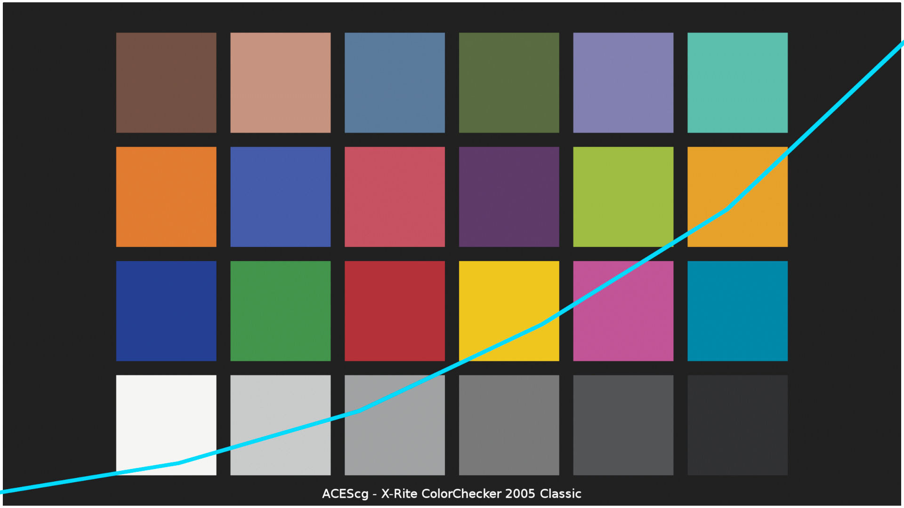

As you can see the two curves _(linearly interpolated values between 6 sampled color patches)_ are quite different, which is a result of Canon's post-process on JPG to make it easy to look at. This is exactly the reason why we want to use raw photos in our pipeline - to get as neutral colors as possible.

Note that the blue curve is not linear (straight), but only visually linear, this was a misconception I had initially.

For converting raw photos into some more common format _("developing")_ I use [dcraw](https://www.cybercom.net/~dcoffin/dcraw/) utility. This utility supports lots of raw formats from various camera manufactures and gives you a control about linearity of photos and output color space. Dcraw works just fine from command line, but I set up a small tool to help me (and fellow students working with me) with converting photos easily and efficiently.

I described how to set it up in my previous blog post: [Nuke tip | Batch conversion of raw images with dcraw](https://jurajtomori.wordpress.com/2018/11/29/nuke-tip-batch-conversion-of-raw-images-with-dcraw/).

Running this tool will convert raw photos into linear tiffs in ACES 2065-1 color space. By the way I set up Nuke's color management to ACES with working color space ACES CG and when importing converted tiffs I set their color space to the aforementioned ACES 2065-1.

After importing the converted photo I get this plot:

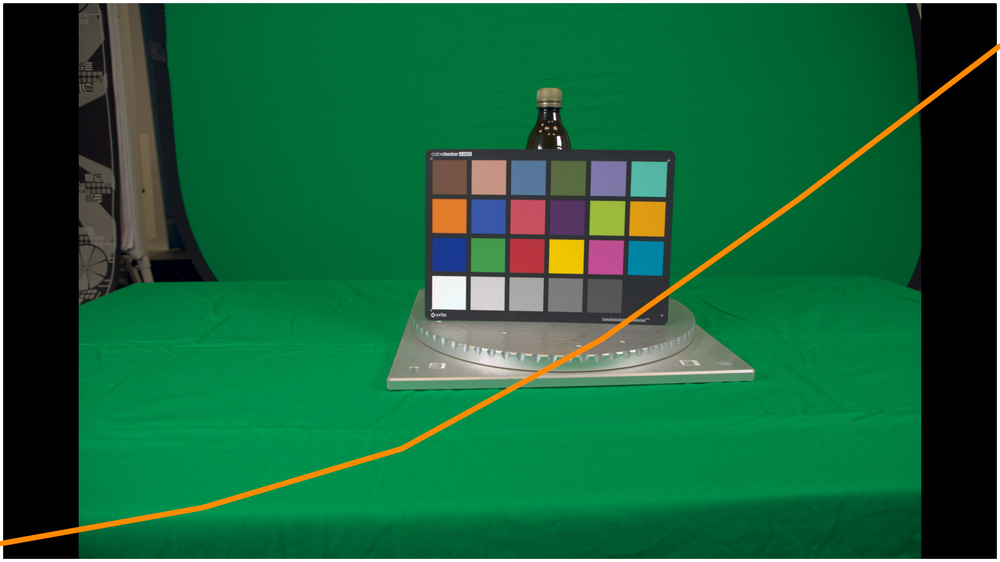

As you can see it is much closer, here you can see both plots overlaid:

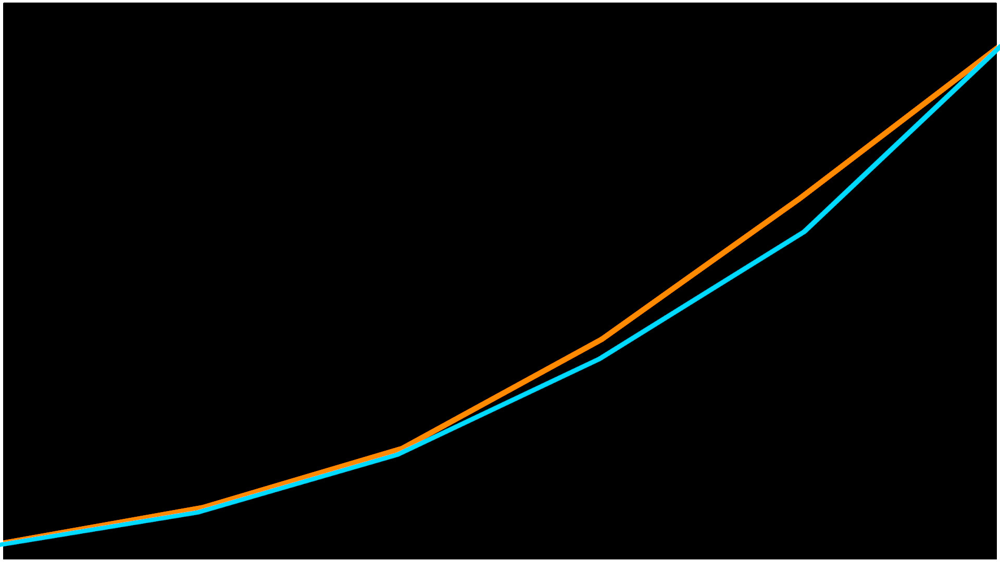

The match is not 100%, but is quite good and will do for us.

## Levels and colors aligning

 

Dcraw automatically (unless disabled) performs white balancing during conversion. It takes information from photo metadata and uses appropriate channel multipliers before debayering. It uses four coefficients for RGBG channels and scales them (gain operation) by them. Both green channels usually get the same coefficient. If you wonder why 4 channels, then take a look at [this blog post](http://www.guillermoluijk.com/tutorial/dcraw/index_en.htm).

This white balancing worked well in my case, but you can overwrite with your own coefficients if needed. Also note that it is a better idea to perform white balancing before debayering as after debayering _(e.g. in Photoshop or Nuke)_. On the next gif you can see the difference, mostly on the edges of the white patch.

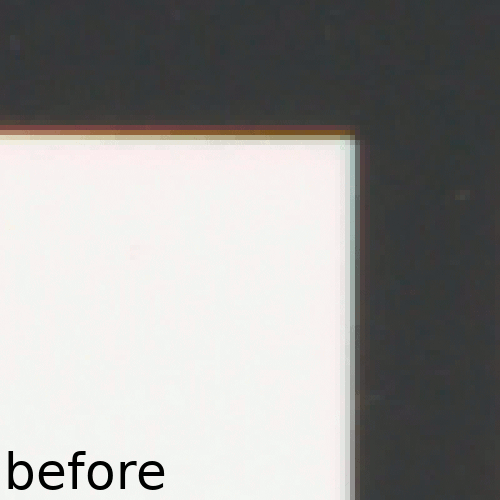

From our reference color checker we know what values should be present in color patches. Therefore it might be a good idea to align all colors based on this reference, so that some pictures do not bias colors in our textures later on.

I will do it in two steps - aligning white and black patches and applying color transformation matrix. Note that this correction needs to be performed once for a lighting setup - you need to set up values for the first picture, no need to do it for each photo if you don't change your lighting conditions or camera settings.

For the first step I will use Grade node to match whites and blacks. I will do it in this order:

1. set blackpoint to average color of the black input patch _(sample the source, not already graded image :))_
2. set whitepoint to average color of the white input patch
3. set lift to color of the black patch of the reference color checker _(set to correct working color space)_
4. set gain to color of the white patch of the reference color checker

Now our levels should match well, but we can do one more operation - use a cool [mmColorTarget gizmo from Marco Meyer](https://www.marcomeyer-vfx.de/?p=88) which tries to transform our colors so that they will match the reference values as close as possible. This transformation is reversible and basically creates an affine transformation in form of 3x3 matrix.

After applying our Grade and ColorMatrix operations we can compare our values with the reference ones:

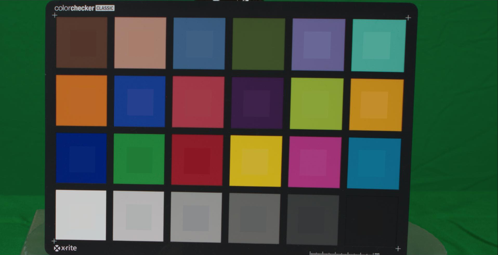

The inner patches are the ideal reference values and surrounding is our photo. The match is not perfect as our linear color transformation is not perfect and we don't have enough samples. But is quite good in our case and will work for us well :)

For setting up mmColorTarget gizmo you will need NumPy Python module available in your Nuke, which I also described in this post :) [Nuke tip | Setting up NumPy on Windows](https://jurajtomori.wordpress.com/2018/11/28/nuke-tip-installing-numpy-for-nuke-python-on-windows/).

## Vignetting

 

Vignetting is a darkening effect on the edge of frame, it is mostly visible in photos from cameras with larger sensors. I try to capture and suppress this effect.

Vignette capturing and many other of my ideas are inspired by [Lagarde, S., Lachambre, S., & Jover, C. (2016): An Artist-Friendly Workflow for Panoramic HDRI.](http://blog.selfshadow.com/publications/s2016-shading-course/unity/s2016_pbs_unity_hdri_notes.pdf) Capturing vignette using their technique is simple and fast enough. It consists of taking around 2 seconds exposure of paper filling camera frame put on a TV screen. So basically taking a white picture. Paper should be moved during the exposure to blur paper texture.

After processing the pictures in Nuke I got the following results:

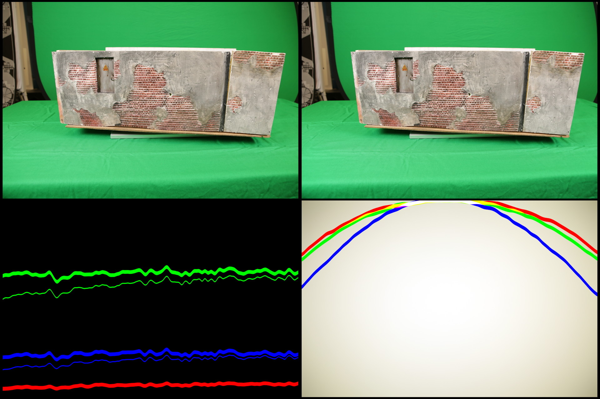

- top left - source photo
- top right - vignette removed
- bottom left - plot of colors of uniformly lit area close to the edge (where vignette is the most noticable)
    - thinner line is with vignette, thicker line is without vignette
- bottom right - captured profile with overlaid plot of horizontal section

## Image metadata

 

During this process we might easily loose our photo EXIF metadata. Dcraw's conversion transfers them all, but Nuke does not write them out by default. For checking the metadata I recommend [ExifTool](https://www.sno.phy.queensu.ca/~phil/exiftool/) which can read, modify and copy metadata in photos. Inside of Nuke you can use ViewMetaData node to preview metadata, this is how JPG looks like:

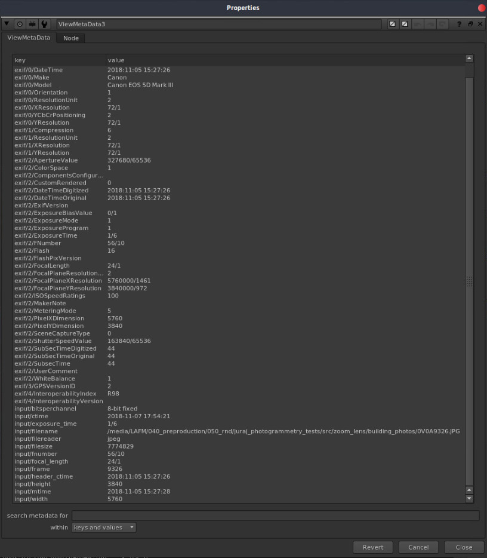

This metadata might be useful in photogrammetry software in some cases, so we need to check that they are getting through correctly if we want to keep them. Now here is the thing - Nuke's handling of EXIF metadata is limited and it cannot export them to tiffs, but [only to couple of formats](https://learn.foundry.com/nuke/8.0/content/user_guide/metadata/rendering_metadata.html): .exr, .cin, .dpx, and .jpg.

In our case I want to go with tiffs with keyed mask in alpha channel. But Nuke doesn't write the metadata to tiffs, so I found a workaround. But first I will show how to export metadata into exr: in Write node you need to set metadata to all metadata and check do not attach prefix. Attach prefix renames EXIF keys which will confuse most of the further programs. But from my tests _(in Alice Vision Meshroom)_ EXIF metadata in those EXRs were not detected and had altered names anyway. So you need to work around it anyway :) _(Maybe Agisoft Photoscan or Reality Capture handle it better, but I didn't test it)_

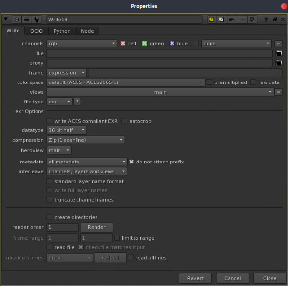

Luckily ExifTool enables us to copy metedata from one picture (source) to others _(converted TIFFs/EXRs)_. We can pick our source picture by hand, or if we use exrs we can access handy input/filename tag which points to image loaded by Read node.

Example command can look like this:

$ exiftool -tagsFromFile /path/to/source/photos/001.JPG -overwrite\_original /path/to/nuke-rendered/tiffs/\*.tiff

This could be extended in a longer command which first uses ExifTool to read input/filename metadata from exr and uses it, but in our case that worked well.

Also I am not entirely sure if this has significant impact on quality of photogrammetry. Photogtammetry softwares are approximating camera intrinsics anyway so in some cases it might not do much of a difference. From my testing in Alice Vision Meshroom it didn't really affect quality in my case, although it was showing warning when it was missing them.

If this metadata will seem being helpful for getting better results I will probably wrap it in a simple tool, so that it is more artist-friendly.

Apart from color transformations I also did a keying, but I won't go in depth into it. Having a greenscreen backdrop helped us to get accurate masks quickly. Those masks are then used by Photogrammetry softwares to reconstruct only needed  areas.

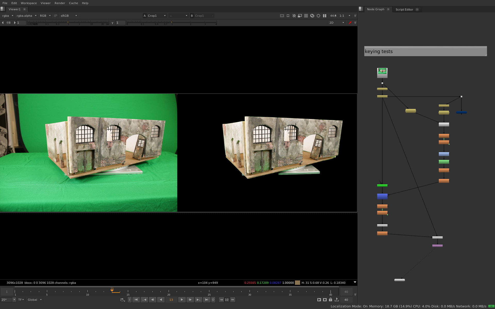

_(Although Alice Vision Meshroom [doesn't seem to use image masks](https://github.com/alicevision/meshroom/issues/188), also from my tests using masks didn't have noticable impact on quality or processing time)_

 

## Conclusion

 

So this is end of this post. After this you should have a brief understanding of our workflow. The next step will be the photogrammetry itself.

Hope you enjoyed reading it and if you spotted some mistakes or have suggestions for improving our pipeline then do not hesitate to get in touch :)

<!-- Markdeep: -->

