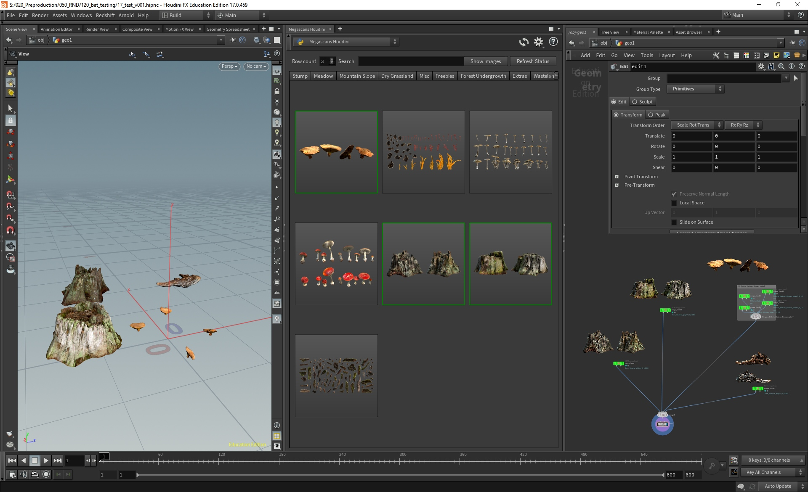
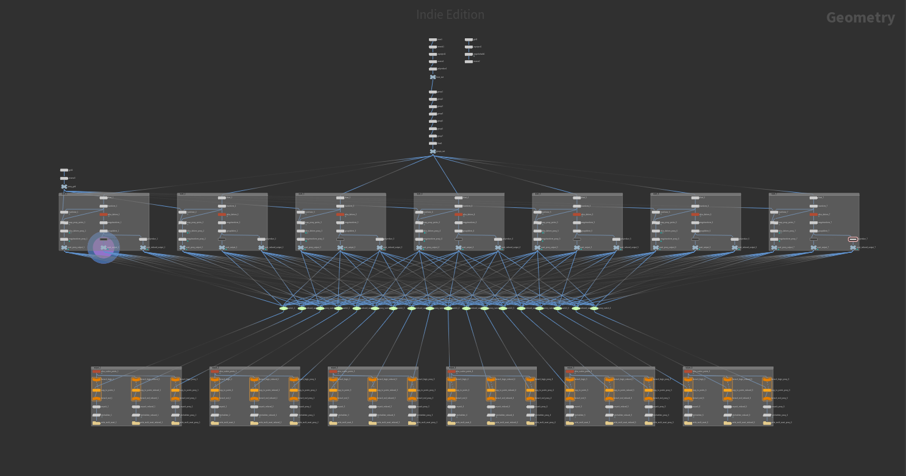
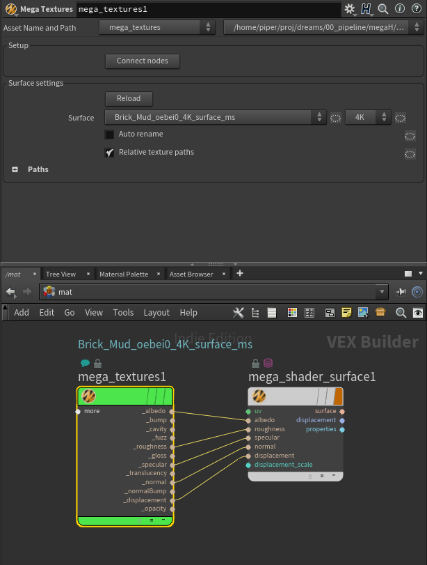

Hello, this post will introduce a project I have been developing with friends for some time: Megascans to Houdini integration, or **megaH**. This will be a high-level overview of the tools and workflows we have developed so far.

This article is written by authors of this tool: [me](https://jtomori.github.io), [Peter Trandžík](https://www.linkedin.com/in/peter-trand%C5%BE%C3%ADk-85b86484/) and [Ondrej Poláček](https://www.linkedin.com/in/ondrej-polacek-76683184/).

MegaH is currently work in progress and is being used in two student productions. It is not finished and ready for release yet. The two versions are customized to specific pipelines and needs of the corresponding productions.

It is developed and tested on Linux and Windows and with Mantra and Redshift renderer.

Also note that while we used the Megascans library, this project could be ported to include different libraries, for example VFX studios’ internal asset/setup libraries.

# Motivation

 

[Quixel Megascans](https://quixel.com/megascans) library contains a large amount of assets (models and textures) which are based on real-world measurements and 3D scanning. The library is more-or-less consistent and provides artists with many elements for their scenes.

When Megascans were first released there was no direct implementation into DCC packages (e.g. Maya, Houdini). They were still easy to use as their PBR textures could be used in one shader, but some extra work was needed to browse through them, import them into the DCC and populate scenes with the assets.

I quickly prototyped the first version of Houdini integration in a [student production](https://vimeo.com/227138644) where I was technical director. It was simple integration, but it already proved handy and time-saving. It looked like this:

https://vimeo.com/206264470

This integration took advantage of [packed disk primitives](https://www.sidefx.com/docs/houdini/model/packed.html) workflow in Houdini and enabled environment artist to quickly populate scenes with assets, to iterate quickly and render efficiently.

After that production I was part of another two student productions which had lots of nature elements in them and could benefit from the Megascans library. Therefore I refactored the Houdini integration and developed it further with the help from Ondrej and Peter.

So to sum it up, the Houdini integration provides artist with a nice UI browser of the library, enables them to easily drop the assets into scenes, get overview of used assets, scatter and render them. User doesn’t need to worry about assets, texture paths, shaders. The nodes in the scene can be displayed with preview images for quick orientation, follow a naming convention, contain all necessary information for rendering and are lightweight (they refer to the actual geometry on disk - packed disk primitives). This saves artists’ time on paths management (paths are relative, the library can be stored centrally on a network location, texture paths are stored in attributes), decreases risk of errors (incorrect shader setups, mixed/broken paths) and provides artists with nice user experience. The artists can instead focus on environment work instead of building complex/messy setups. Sold? :D If not, keep on reading.

One thing to note is that Quixel provided an [official Houdini integration](https://www.youtube.com/watch?v=8kQLkFyFG_U) in the meantime, but we decided to keep on developing our own one as it was taking a slightly different approach and was well integrated into our productions.

# Overview

 

MegaH can be divided into the following parts, which will be described below

- Assets pre-processing
- Assets indexing and storing
- Mega Load
- Library panel
- Shading
- Scattering
- Atlases
- Surfaces

## Assets pre-processing

 

Assets in the library are stored in either FBX or OBJ file format, depending on Megascans download settings. Assets are separated in folders, where each folder contains different geometry (FBX/OBJ) files of the same assets with different levels of detail (LOD):

- asset 1
    - High.fbx
    - LOD0.fbx
    - LOD1.fbx
    - LOD2.fbx
    - …
    - LOD5.fbx
    - textures (albedo, roughness, normals, etc.)
- asset 2
    - High.fbx
    - …

_(file names are simplified)_

However, each asset often contains multiple variations, e.g. mushroom asset can contain 10 different mushrooms, twigs asset can contain 50 different twigs and so on. Because of that we decided to treat assets as _asset packs_, and individual variants as _assets_.

Because of referencing geometry directly from disk (via packed disk prims) we decided to break up various asset packs into individual assets. This consisted of a one time pre-processing step where all assets are batch processed. During the processing we output them to Houdini-native _.bgeo.sc_ geometry format which gave us better performance than Alembic and took up less storage. After the pre-processing, we ended up with a folder structure like this:

- asset 1
    - 1\_High.bgeo.sc
    - 2\_High.bgeo.sc
    - 3\_High.bgeo.sc
    - 4\_High.bgeo.sc
    - …
    - 1\_LOD0.bgeo.sc
    - 2\_LOD0.bgeo.sc
    - ...
    - textures (albedo, roughness, normals, etc.)
- asset 2
    - 1\_High.bgeo.sc
    - …

For assets pre-processing we built a couple of Houdini digital assets (HDA), which automatically create lower-level HDAs for different types of Megascans assets (geometry, plants require different process) for each geometry file and one long ROP network which would process them all. During the conversion we clean-up and optimize geometry. We also fix some common problems that occur in asset packs - random detached floating polygons, inconsistent names, missing groups to name a few. Lots of hacks/fixes could be skipped if Megascans assets were more consistent. The process looks like this:

https://www.youtube.com/watch?v=fEOAU2tHhQM

After the assets were pre-processed we still needed a way to check individual packs for errors, which were not handled by our fixes, for example a missing asset in a certain LOD, or wrong order of assets between different LODs. For that a Mega Check HDA was used which provided a fast way of visually checking individual packs. Imagine having library with 100 Megascans packs. Some of these packs may contain even hundreds of assets. Each asset have multiple LODs available. Browsing through such amount of geometries is a very tedious task - even when using Mega Load HDA. Mega Check makes this process easy, allowing user to generate “grid view” of each pack. It consists of assets aligned horizontally and LODs aligned vertically for each pack in library. With such view, user is able to easily distinguish between proper and corrupt packs by judging them visually.

https://www.youtube.com/watch?v=lvjAtWIvpps

Another part of assets pre-process is texture mip-mapping, which optimizes textures for renderers and saves some time during rendering. This is also one-time process and is done with [batch conversion tool](https://jurajtomori.wordpress.com/2018/05/25/batch-textures-conversion-tool/).

This workflow worked fine in our case, but could be replaced with Alembic or USD based workflow in the future, which would be compatible with other DCCs, or renderers which often include procedurals for loading such files. The splitting could be skipped if there was a format which could be referenced from scenes and would allow for selective referencing - referencing only a part of the file (e.g. specific hierarchy in Alembic, or USD). Another extension could include saving goemtry in renderer archives, such as _.ass_ for Arnold, or _.rs_ for Redshift, for optimized render setups.

This task is quite suitable for a new Houdini 17.5 feature - _Procedural Dependency Graph_ (PDG). PDG support should be easy to implement and it would enable parallel / distributed asset pre-processing - let it be on one workstation or multiple render nodes.

## Assets indexing and storing

 

The library can contain many assets, so in order to quickly list / search through them we index them in one central json file. For that we built a tool which scans recursively through folders and stores information about assets (also from accompanying info json files from Megascans) into the json index. This step takes couple of seconds and needs to be done once, or after new assets are added to the library (after being pre-processed). In our case we didn’t need a database, but it could be switched for one if needed in the future. Index file has entries like this one:

"Debris\_Nature\_Brown\_qdzrT\_4K\_3d\_ms": {
  "3dplant": false, 
  "assets": {
    "0": {
      "High": "Sctr\_mushroom\_brown\_T\_qdzrT\_0\_High.bgeo.sc", 
      "LOD0": "Sctr\_mushroom\_brown\_T\_qdzrT\_0\_LOD0.bgeo.sc", 
      "LOD1": "Sctr\_mushroom\_brown\_T\_qdzrT\_0\_LOD1.bgeo.sc", 
      "LOD2": "Sctr\_mushroom\_brown\_T\_qdzrT\_0\_LOD2.bgeo.sc", 
      "LOD3": "Sctr\_mushroom\_brown\_T\_qdzrT\_0\_LOD3.bgeo.sc", 
      "LOD4": "Sctr\_mushroom\_brown\_T\_qdzrT\_0\_LOD4.bgeo.sc", 
      "LOD5": "Sctr\_mushroom\_brown\_T\_qdzrT\_0\_LOD5.bgeo.sc"
    }, 
    "1": {
      "High": "Sctr\_mushroom\_brown\_T\_qdzrT\_1\_High.bgeo.sc", 
      "LOD0": "Sctr\_mushroom\_brown\_T\_qdzrT\_1\_LOD0.bgeo.sc", 
      "LOD1": "Sctr\_mushroom\_brown\_T\_qdzrT\_1\_LOD1.bgeo.sc", 
      "LOD2": "Sctr\_mushroom\_brown\_T\_qdzrT\_1\_LOD2.bgeo.sc", 
      "LOD3": "Sctr\_mushroom\_brown\_T\_qdzrT\_1\_LOD3.bgeo.sc", 
      "LOD4": "Sctr\_mushroom\_brown\_T\_qdzrT\_1\_LOD4.bgeo.sc", 
      "LOD5": "Sctr\_mushroom\_brown\_T\_qdzrT\_1\_LOD5.bgeo.sc"
    }, 
    "2": {
      "High": "Sctr\_mushroom\_brown\_T\_qdzrT\_2\_High.bgeo.sc", 
      "LOD0": "Sctr\_mushroom\_brown\_T\_qdzrT\_2\_LOD0.bgeo.sc", 
      "LOD1": "Sctr\_mushroom\_brown\_T\_qdzrT\_2\_LOD1.bgeo.sc", 
      "LOD2": "Sctr\_mushroom\_brown\_T\_qdzrT\_2\_LOD2.bgeo.sc", 
      "LOD3": "Sctr\_mushroom\_brown\_T\_qdzrT\_2\_LOD3.bgeo.sc", 
      "LOD4": "Sctr\_mushroom\_brown\_T\_qdzrT\_2\_LOD4.bgeo.sc", 
      "LOD5": "Sctr\_mushroom\_brown\_T\_qdzrT\_2\_LOD5.bgeo.sc"
    }, 
    "3": {
      "High": "Sctr\_mushroom\_brown\_T\_qdzrT\_3\_High.bgeo.sc", 
      "LOD0": "Sctr\_mushroom\_brown\_T\_qdzrT\_3\_LOD0.bgeo.sc", 
      "LOD1": "Sctr\_mushroom\_brown\_T\_qdzrT\_3\_LOD1.bgeo.sc", 
      "LOD2": "Sctr\_mushroom\_brown\_T\_qdzrT\_3\_LOD2.bgeo.sc", 
      "LOD3": "Sctr\_mushroom\_brown\_T\_qdzrT\_3\_LOD3.bgeo.sc", 
      "LOD4": "Sctr\_mushroom\_brown\_T\_qdzrT\_3\_LOD4.bgeo.sc", 
      "LOD5": "Sctr\_mushroom\_brown\_T\_qdzrT\_3\_LOD5.bgeo.sc"
    }
  }, 
  "environment": {
    "biome": "temperate-forest", 
    "region": "Oceania"
  }, 
  "path": "$MEGA\_LIB/3d/Debris\_Nature\_Brown\_qdzrT\_4K\_3d\_ms", 
  "preview\_image": "Debris\_Nature\_Brown\_qdzrT\_3d\_Preview.png", 
  "surface": false, 
  "tags": \[
    "Flat", 
    "Fungi", 
    "organic"
  \], 
  "textures": {
    "4K": {
      "albedo": "Sctr\_mushroom\_brown\_T\_qdzrT\_4K\_Albedo.jpg", 
      "bump": "Sctr\_mushroom\_brown\_T\_qdzrT\_4K\_Bump.jpg", 
      "cavity": "Sctr\_mushroom\_brown\_T\_qdzrT\_4K\_Cavity.jpg", 
      "displacement": "Sctr\_mushroom\_brown\_T\_qdzrT\_4K\_Displacement.exr", 
      "fuzz": "", 
      "gloss": "Sctr\_mushroom\_brown\_T\_qdzrT\_4K\_Gloss.jpg", 
      "normal": {
        "LOD0": "Sctr\_mushroom\_brown\_T\_qdzrT\_4K\_Normal\_LOD0.jpg", 
        "LOD1": "Sctr\_mushroom\_brown\_T\_qdzrT\_4K\_Normal\_LOD1.jpg", 
        "LOD2": "Sctr\_mushroom\_brown\_T\_qdzrT\_4K\_Normal\_LOD2.jpg", 
        "LOD3": "Sctr\_mushroom\_brown\_T\_qdzrT\_4K\_Normal\_LOD3.jpg", 
        "LOD4": "Sctr\_mushroom\_brown\_T\_qdzrT\_4K\_Normal\_LOD4.jpg", 
        "LOD5": "Sctr\_mushroom\_brown\_T\_qdzrT\_4K\_Normal\_LOD5.jpg"
      }, 
      "normalBump": "Sctr\_mushroom\_brown\_T\_qdzrT\_4K\_NormalBump.jpg", 
      "opacity": "", 
      "roughness": "Sctr\_mushroom\_brown\_T\_qdzrT\_4K\_Roughness.jpg", 
      "specular": "Sctr\_mushroom\_brown\_T\_qdzrT\_4K\_Specular.jpg", 
      "translucency": ""
    }
  }
}

As you can see it has useful information which is later used in Houdini, like different assets, LODs, texture sets in various resolutions, tags, whether it is a plant or not and so on.

[Megascans website](https://quixel.com/megascans/library) has handy categorization of biotopes which is unfortunately not stored in downloaded assets. Because of that we decided to implement a support for custom categorization in another json file which is later used in the library UI.

## Mega Load

 

Mega Load is a HDA which plays an important role in the Houdini integration. It is a SOP operator which manages assets importing. It contains various menus for customizing asset selection. User can easily choose between packs (groups of assets), assets, LODs and texture resolution. It also contains display settings - such as viewport overrides (for lower viewport LOD and better performance), scale and scattering settings. Under the hood it sets multiple parameters with paths to textures (relative or absolute), which are stored in primitive attributes. It can also store an instance of universal Megascans shader, which can have per-asset overrides and modifications if needed.

Geometry is loaded as packed disk primitives, which is a lightweight and efficient representation. The actual geometry is not stored in the Houdini scene file, but only a reference to asset’s location on drive is stored.

https://www.youtube.com/watch?v=djxvVcirSF0

In one production this node has an OBJ wrapper which further integrates it with Redshift-based workflow and has additional options for managing _.rs_ caches.

## Library panel

 

MegaH includes also a UI for browsing through the library. It is integrated directly to Houdini and can be opened as a Houdini panel. Library UI shows preview image for each asset or group of assets (packs). It also groups them into custom categories (for example biotopes) and lets users search through the library. User interface keeps overview of assets used in current scene (highlighting them with green border). When an asset is selected, it will drop one or more (in case of packs) Mega Load nodes into the scene. Once more assets are added to scene, one can quickly lose track of which asset is which. Therefore it is possible to show preview images next to assets / packs directly in Network view.

The goal of this panel is to provide good user experience for artists and to let them quickly find needed assets, without leaving the DCC.

https://www.youtube.com/watch?v=rzgKMLI91AE

## Shading

 

Our integration includes a shader which is using provided textures. It is based on Megascans texturing logic and uses correct textures based on the selected LOD. The purpose of the pre-made shader is to provide artists with physically plausible setup out of the box, thus reducing possibilities of errors. Special shader with translucency setup was created for thin objects such as atlases.

Mantra and Redshift versions of the shader are provided, but additional renderers could be easily added, following the same logic.

In the future a reference MaterialX shader implementation could be provided.

## Scattering

 

MegaH includes also a set of tools for efficient and controlled scattering of assets in the scene. Example workflow can be seen in the following screencast.

https://www.youtube.com/watch?v=ACtH7uofgtA

Mega Copy is "our version" of Houdini copy node, designed to work with packed primitives. We paid special attention to make it as similar as possible to the default copy node, which means that we can control the placement of the resulting geometry with the same attributes as copy node does - for example _orient, pscale, scale, N, up, v, rot, P, trans, pivot, transform_ etc. It is also capable of transferring user-defined attributes from source points to scattered geometry, the same way as the default Houdini copy node does. We tried to make it intuitive for artists familiar with standard Houdini tools without the need to learn how this node works. Moreover, it contains one additional feature - every of our assets gets a user-defined weight attribute in its loader - controlling probability of its occurrence in the the resulting scattered geometry. Mega Copy reads this attribute and places these objects in the resulting scattered geometry accordingly - objects with lower weight have lower occurrence, while objects with higher weight have higher occurrence, giving the artists much finer control over the distribution of input objects.

Mega Overlaps Fix is a tool, designed to fix overlaps resulting from scatters or even from incorrect hand-placement of assets from megascans library. It tries to detect where the geometry overlaps occur and to fix it using one of 3 approaches, users can choose from:

1. downscale overlaps - pieces of overlapping geometry are downscaled, until no overlaps occur
2. delete overlaps - pieces of overlapping geometry are deleted, until no overlaps occur
3. relax overlaps - pieces of overlapping geometry are pushed from each other, until no overlaps occur

User also can control a bias of this tool, which means that it becomes more tolerant of small overlaps, leaving them uncorrected

## Atlases

 

Megascans provide a specific type of assets in form of multiple textures called atlases. One production working with megaH was using Mantra as their main renderer and encountered decreased rendering performance when using opacity masks to cut-out atlases from planes. Therefore a tool was developed which provided easy conversion from atlas assets to geometry assets. It significantly reduces time required for such conversion. It is designed to create whole node tree, setup paths and generate user defined amount of variations for actual geometry assets. Certain nodes are supposed to be tweaked by user in order to get required look of assets.

One atlas usually contains multiple elements (for example grass atlas is made out of few groups of grass blades). These elements are first converted to planar geometry and afterwards are deformed and bend to look more natural. They are finally randomly grouped and oriented in order to form realistic geometry asset.

\[gallery ids="1245,1248" type="rectangular"\]

## 

## Surfaces

 

Megascans also provide textures for various surface types. Since it would be time consuming and error prone to create shaders by manually defining texture paths, we decided to support surfaces in the megaH project. Loader similar to Mega Load (called Mega Textures) is providing all textures for selected surface. User can easily choose between indexed surfaces and their resolutions without worrying about paths. Same as Mega Load, Mega Textures provide relative or absolute paths. Mega Textures loader is not bound to any renderer as it outputs only string values containing texture paths that can be wired to any shader. Library UI also shows surfaces and allows user to add them into scene the same way as geometry assets.

<!-- Markdeep: -->

