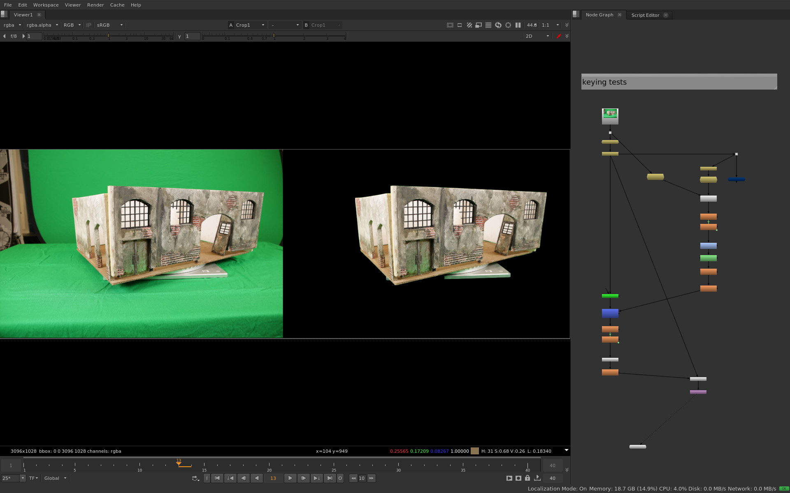
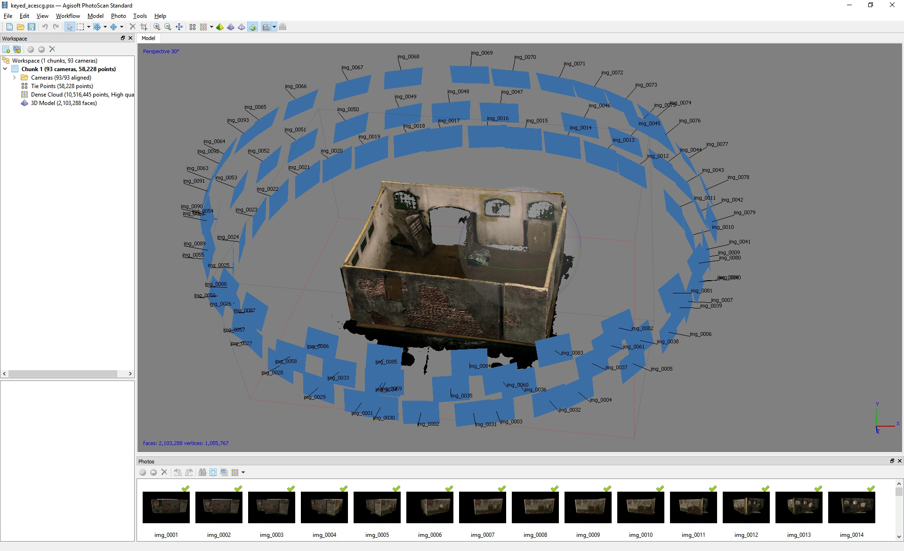
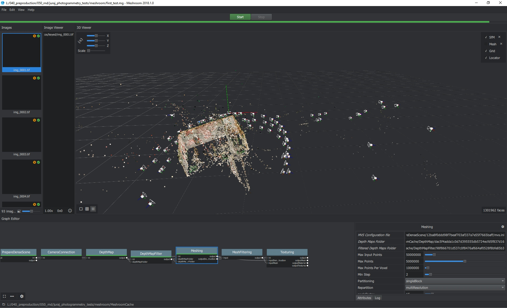
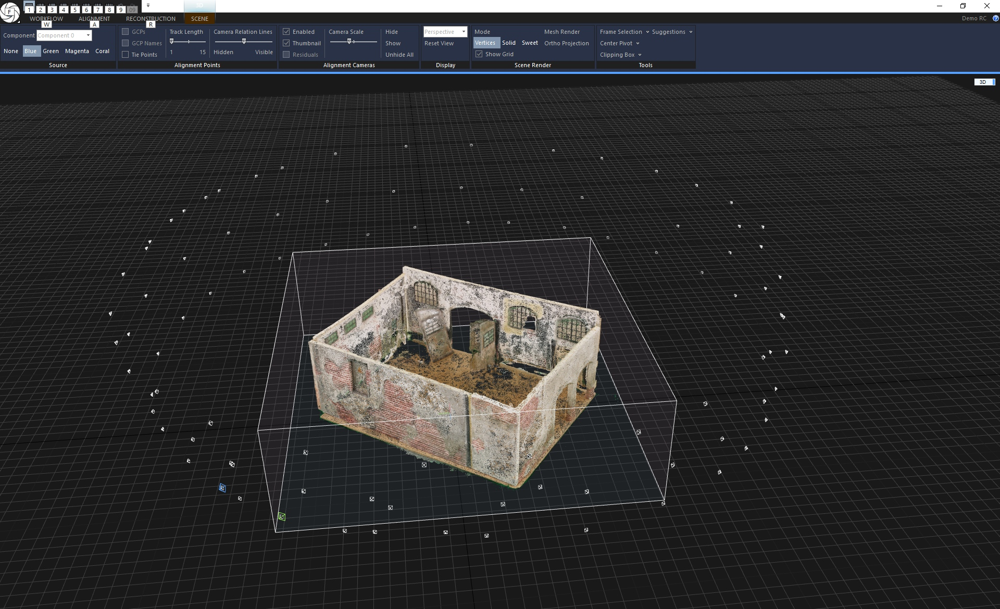
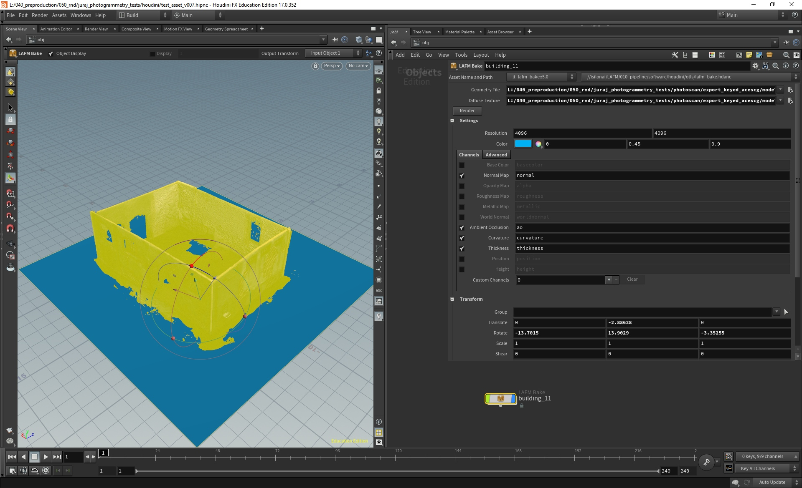
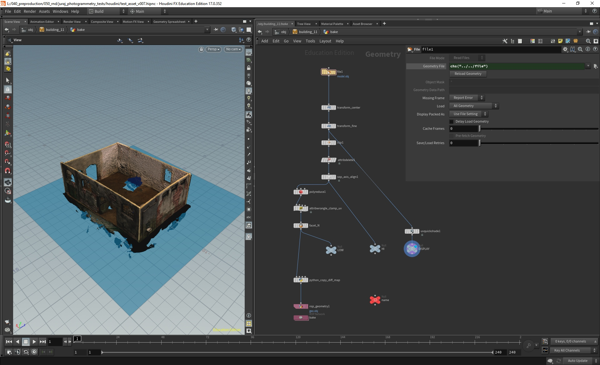
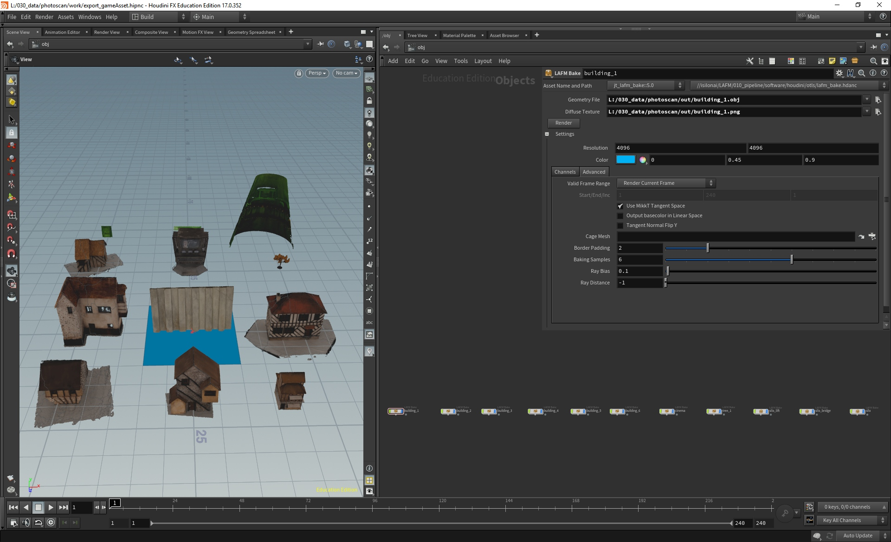

This is the second article describing our photogrammetry workflow which I developed for a student production. You can find the [first article here](https://jurajtomori.wordpress.com/2018/11/30/photogrammetry-photos-and-colors/).

In this article I will go over our attempts on reconstruction of photos in various applications and our semi-automatic post processing workflow based on Houdini. _(Houdini asset can be downloaded at the bottom of the page.)_

After going through the first part of our pipeline - image processing, we ended up with keyed pictures with alpha channel: opaque where the model is present and transparent everywhere else.

We need the alpha channel because we were rotating the miniature and camera was static. If we tried to reconstruct the photos with the background present, it would produce more noise in the reconstruction or wouldn't estimate camera positions correctly. Now that we keyed out the background, the reconstruction software will calculate virtual camera positions, assuming that the model is static. It will represent the same relative transformation in regards of cameras and model - like if we were running with the camera around the static model, even though we did it inversed to speed up the shooting process.

 

# Reconstruction

 

At the beginning of the production I wasn't sure which application to choose. So I did an initial tests in the three applications: **Agisoft Photoscan**, **Reality Capture** and **AliceVision**. The purpose of those tests wasn't a full and proper comparison of the applications, but rather what can get us results quickly with little parameter tweaking as we didn't have much time for RnD. Another factor was how automatic the process would be - we wanted to make the process quick to prepare the assets on time :)

 

## Agisoft Photoscan

 

I started with this application as I used it in the past and had really liked it.

The result was quite good: cameras are aligned properly and geometry looks fine, even with middle quality settings. The processing took a bit of time, but it wasn't too bad.

A very nice feature of Photoscan is _Batch Process_ workflow which enables you to set a stack of operations which will be executed automatically. In this way you can find good reconstruction settings on a testing scene and apply them to all assets. This will do a good job on most of the assets and you won't have to wait for the individual steps to be finished, just to trigger the next step.

Photoscan also includes a [Python API](https://www.agisoft.com/pdf/photoscan_python_api_1_4_0.pdf) which could be easily integrated into Houdini, but we didn't have Professional Edition avaliable for this project.

 

## AliceVision

 

I was really looking forward to play around with this tool. I've seen its presentation first at FMX 18 and followed its development since.

I really like that this application is open source and built in a such way that makes it easy to customize and [integrate into a pipeline](http://filmicworlds.com/blog/command-line-photogrammetry-with-alicevision/).

The results in our case however weren't usable. I did a lot of parameter tweaking, also with a help from AliceVision engineer, but we didn't manage to produce good results. The problem was at _Structure from Motion_ step which couldn't align cameras properly.

Nevertheless I will follow this app and hope to use it in some project :). I also had an idea of integrating it into Houdini, but [Paul Ambrosiussen was quicker and did a great job there :)](https://www.sidefx.com/tutorials/alicevision-plugin/).

 

## Reality Capture

 

I was curious about this application as it seemed popular for large-scale projects and also is developed in Slovakia, where I am coming from :) . Interesting was its [beta Houdini integration](https://www.sidefx.com/tutorials/reality-capture-plugin-open-beta/), which seemed like the fastest way for us, since we planned to do the geometry post processing in Houdini.

This reconstruction was really fast, much faster than the precious tests. Cameras were properly solved and even the building was nicely aligned. So we were planning to go with this app.

However I was already in time constraints and had issues with licensing Houdini plugin behind university proxy. This couldn't be resolved for couple of days, so I gave up and went with Photoscan instead. Reality Capture could work very well, but unfortunately the beta version didn't work out in our case.

 

## Post processing

 

So we went with Agisoft Photoscan, which provided us with high-res model and diffuse texture, but we needed to post process it and prepare for Unity game engine, which was required by our project. Luckily Houdini has [Game Development Toolset](https://www.sidefx.com/tutorials/game-development-toolset-overview/) with some neat tools.

For that purpose I created a HDA which would process input geometry and texture and output game-ready package with additional textures.

I tried to make the post processing as automatic as possible, but it still required one manual step - alignment of the model. This could be improved in the future with an initial guess.

The post processing included the following steps:

1. Transform input model into the center (based on models bounding box)
2. Manually transform the model to align it properly - this step was displayed to the user for fast interaction, the rest of the steps were triggered with Render button
3. Clip everything bellow the ground plane - this is used for removing noise bellow the objects and in the screenshot you can see the blue plane for reference
4. Make it unit size - this scales the object so that X axis of model's bounding box is one unit long. This aligns all objects roughly to the same size, models will be later rescaled in the game engine
5. Reduce polygon count to a certain number - based on output requirements, we went with 50k
6. Clamp UVs to 0-1 range - _PolyReduce SOP_ moves UVs a little bit which results in some UV points in a different UDIM. UVs coming from Photoscan are normalized, but if UVs are stretching into another UDIM then texture baking will output multiple UDIMs, which is not needed, because the new UDIMs will have information only in a couple of pixels on the edges.
7. Copy the source diffuse map to the output folder - we are not modifying the input diffuse texture, but it is used for viewport shading and this copies it to the folder where low-res model will be saved along with baked textures
8. Save low-res geometry and bake additional textures

Texture baking is done with _GameDev Games Baker ROP_ which outputs additional maps, in our case we used normal, AO, curvature and thickness maps.

During the production we had one Houdini scene with all assets in it. After they all had been aligned they were batch-exported, which triggered the slower operations - polyreducing, baking...

 

# Conclusion

 

So this is how our setup looked like. Hope you found it helpful and let me know if you have ideas for improvements :)

You can download the [Houdini Digital Asset here](https://drive.google.com/open?id=1tmEmc-Jk2u52NLpAqKa-ES1L35mi6AST).
