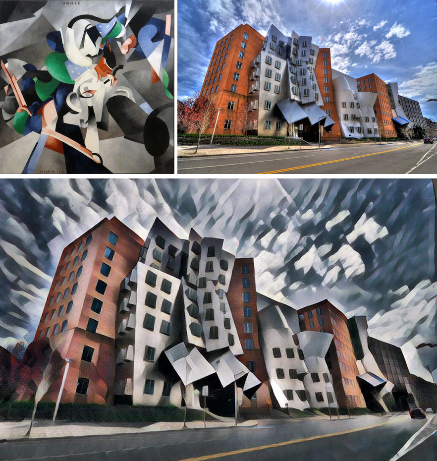

I would like to share with you a small setup I did for artistic style transfer. I won't go too much into technical details, rather I will describe my motivations and what problems I tried to solve.

Style transfer example taken from [fast-style-transfer](https://github.com/lengstrom/fast-style-transfer).

Style transfer can easily produce quite interesting results unlike filters we already know from e.g. Adobe Photoshop. While style transfer might be cumbersome to set up and control, it is definitely an interesting image processing technique to experiment with and which can produce novel looks.

I already described setup process [in my previous blog post](https://jurajtomori.wordpress.com/2017/07/18/artistic-style-transfer-setup-guide/) for three open-source implementations I found on GitHub. However that was some time ago and all needed libraries changed their versions since _(e.g. CUDA, cuDNN, Chainer...)_. The code became incompatible with current versions of those libraries and it is not as easy to set it up as it was at the time.

In the meanwhile I have read a lot about containers, or Docker specifically and I hoped for an opportunity to give it a try. So when my friend recently asked me to help him with setting it up I decided to build Docker containers for environments with prepared style transfer applications.

Benefits of Docker really solve problems with those setups. I can prepare a style transfer environment once in a Docker container and it should run forever on any host linux distribution supporting Docker and having Nvidia GPU in the future. Docker enables me to create a virtual environment which is independent from host environment and this way we can easily have two different versions of needed libraries installed (one in a container and one in host system - without any clashes).

An important extension to Docker that makes it possible is nvidia-docker. This enables container to use host system's GPU and even to run graphical applications. Style transfer usually has GPU implementation, which really speeds things up and nvidia-docker is critical in running those apps from containers.

So to enter prepared environment all you need to run is this command:

$ docker run -ti --rm --runtime=nvidia jtomori/neural-fast-style-transfer bash

You will enter container with all the libraries you need and style transfer repositories prepared. Much easier than manually setting up all those things, right?

You can check more details on [my repository](https://github.com/jtomori/style_transfer_docker/).

<!-- Markdeep: -->

