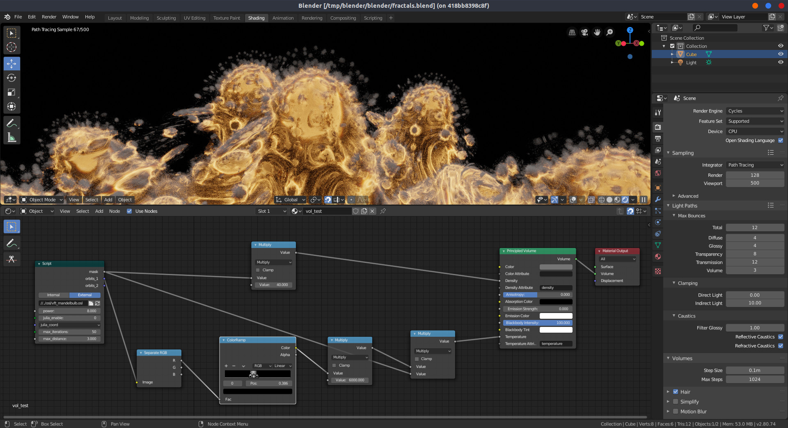

For my graduation project [VFX Fractal Toolkit (VFT)](https://github.com/jtomori/vft) I developed a couple of [Open Shading Language (OSL)](https://github.com/jtomori/vft/tree/master/osl) shaders to render volumetric fractals. I produced with them the following animations.

https://www.youtube.com/watch?v=E8n6chN2Txw

As a renderer I used Arnold and was pretty satisfied with the workflow. However I was wondering how difficult would it be to use the same OSL shaders in another renderer, e.g. Blender's Cycles. Especially because I was trying to mimick OpenCL's syntax in OSL (not the best idea, but helped me port OpenCL shaders which I built first), included couple of header files etc..

As it turned out it was a pretty quick process and everything worked out of the box, requiring only minimal changes. The only thing I had to change was to properly set up multiple node outputs. Arnold [doesn't support multiple outputs](https://docs.arnoldrenderer.com/display/A5AFHUG/OSL) for an OSL node so I worked around it by outputting a 4x4 matrix type with encoded values in it and [extracting them afterwards](https://github.com/jtomori/vft/blob/master/osl/vft_get_matrix_element.osl). This makes Blender's shaders nicer and more readable, you can [check the diff here](https://github.com/jtomori/vft/compare/blender#diff-41e76f7339cecb5f140eccba220c6feb).

The shading setup in Blender looks pretty similar to the one used in Arnold and also outputs similar results.

For the testing I used Blender 2.80 beta running in [a Docker container](https://github.com/jtomori/docker_blender_gpu/).

Keep in mind that rendering such volumes is pretty slow and neither Arnold nor Cycles support OSL on GPU. I included the changes in [blender branch](https://github.com/jtomori/vft/tree/blender) of the repository (not for all OSL shaders yet, but you get the idea :)).

<!-- Markdeep: -->

