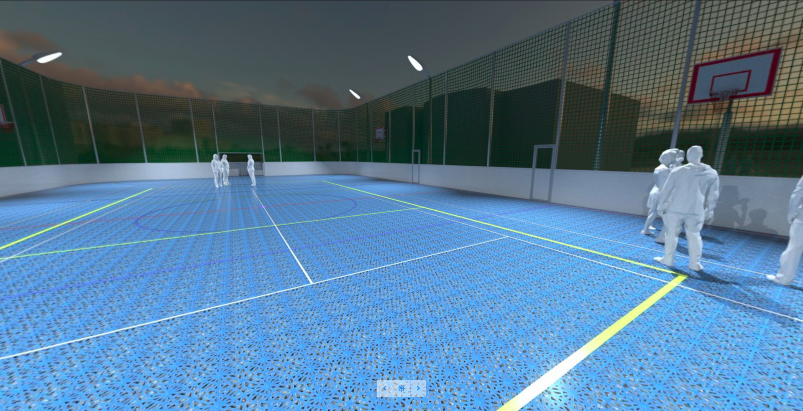

Recently I got interested in web technologies. I was surprised to learn how much is possible to do in a web browser. I found out about new interesting APIs and a huge ecosystem of libraries, many of which are from areas of my interest.

So I decided to learn some basic JavaScript and to build small experiments in my spare time. I am collecting them in one [repository](https://github.com/jtomori/web_experiments) for now. You can fork the repo and host them locally or visit them [here](https://jtomori.github.io/web_experiments/).

Some of the benefits I like are portability and cross-platform compatibility. Most of the tests run fine in major web browsers on all operating systems. They run also fine on mobile devices, some of them are even intended for mobile devices, like the AR tests. I found it being a really convenient (and **free**) platform for building prototypes and tests.

Here I will describe some of the projects.

# [Panorama viewer](https://jtomori.github.io/web_experiments/sdb_he/)

 

My first endeavor into JavaScript and three.js. The application is simple - a viewer of set of lat-long panorama images under two lighting conditions. I produced the images, they are based on CAD drawings, modeled in Houdini and rendered with Redshift.

It is done with help of three.js. Images are mapped to a sphere, which we are viewing from inside. One of the problems was pole pinching, which is caused by mip-mapping. This issue was also present in official [example](https://threejs.org/examples/webgl_panorama_equirectangular.html), which I [reported](https://github.com/mrdoob/three.js/issues/15892) in the GitHub repository.

 

# Raymarching & AR

 

https://www.youtube.com/watch?v=8uCMsEFp6Sc

https://www.youtube.com/watch?v=Gu4kYWxIHRw

I was playing with fractals during my Technical Directing studies which involved raymarching and shader writing. Most of my work was done in Houdini and OpenCL, but I wanted to give a try realtime version. I was considering to do it in multiple platforms (Unity / Unreal / Touch Designer / OpenGL...), but decided to do it in a web browser, because of portability and simplicity of testing / setting it up.

The projects were done in three.js and A-Frame:

- [Simple AR](https://jtomori.github.io/web_experiments/simple_ar/) - Initial test, based on [this article](https://aframe.io/blog/arjs/). I was surprised by simplicity of this project and was glad to play around with A-Frame (I also used A-Frame in [Houdini2VR](https://jurajtomori.wordpress.com/2019/03/23/houdini-2-vr/) tool). You can test it by visiting the page and displaying/printing this [marker](https://github.com/jtomori/web_experiments/blob/master/simple_ar/hiro.pdf).
- [AR Fractals](https://jtomori.github.io/web_experiments/ar_fractals/) - This is the AR thingy shown on the previous video. The performance is quite poor for now, but could be improved by optimizing shader and downsampling rendered canvas. (It would be interesting to compare it with native application.) It was tested on Chrome on Android. What I find the most cool is that it does not require any application or plugin to make it work. Also ability to access camera video through JavaScript is very promising. Marker can be found [here](https://github.com/jtomori/web_experiments/blob/master/ar_fractals/ar_marker.png).
- [Raymarching Mandelbulb](https://jtomori.github.io/web_experiments/raymarching_mandelbulb/) - Test of raymarching Mandelbulb fractal in a fragment shader.
- [Raymarching Sphere](https://jtomori.github.io/web_experiments/raymarching_sphere/) - Further tests improving the shader and JS setup.

Those tests could be improved by rendering something more interesting than the default Mandelbulb, also the shading could be better than the greyscale phong model, also orbit traps could add some colorful patterns :)

So this is it for now. I plan to use this as a platform for prototyping and hope to make some more interesting things run in my web browser!
